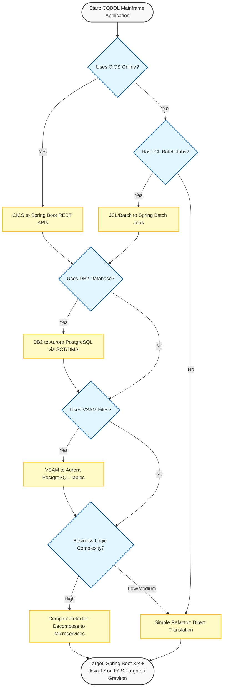
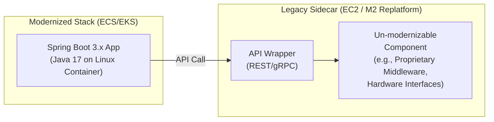
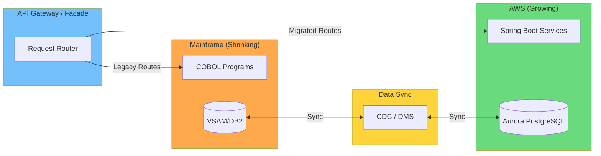
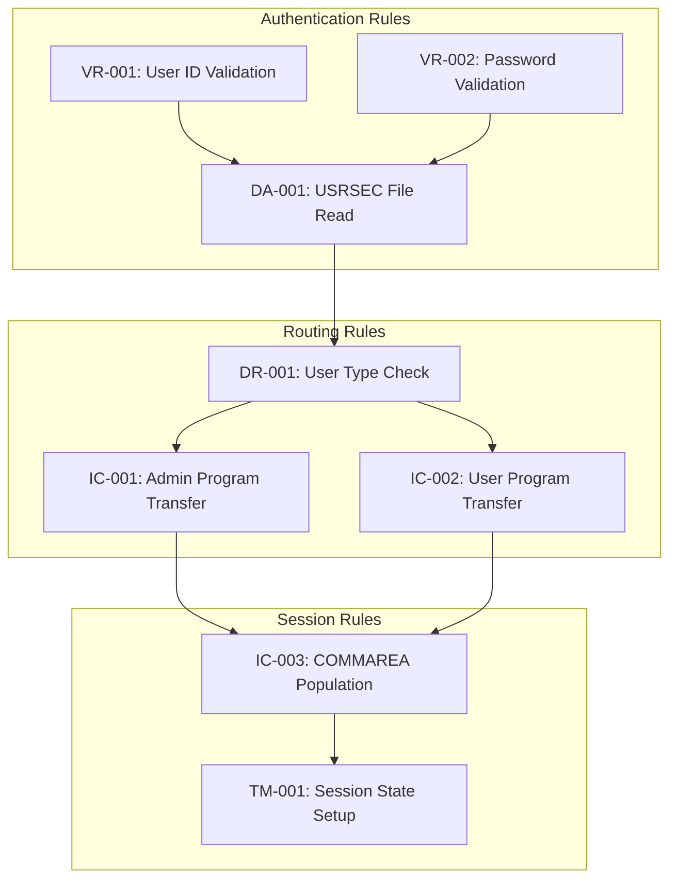

# COBOL Mainframe to Java Spring Boot Modernization

## Objective

Migrate IBM Mainframe COBOL applications (CICS online, batch, DB2, VSAM) to Java 17+ with Spring Boot 3.x, targeting AWS container-based deployments optimized for Graviton processors.

## Platform Detection

### COBOL/Mainframe-Specific Files

- `*.cbl` / `*.cob` - COBOL source programs
- `*.cpy` / `*.CPY` - COBOL copybooks (shared data structures)
- `*.bms` / `*.BMS` - BMS map definitions (CICS screen layouts)
- `*.jcl` / `*.JCL` - Job Control Language (batch scheduling)
- `*.proc` - JCL procedures
- `*.sql` - DB2 SQL DDL and DML scripts
- `*.csd` - CICS resource definitions (CSD)

### COBOL-Specific Code Patterns

- `EXEC CICS` - CICS online transaction processing
- `EXEC SQL` - Embedded DB2 SQL
- `COPY` statements - Copybook inclusions
- `CALL` / `EXEC CICS XCTL` / `EXEC CICS LINK` - Inter-program communication
- `EXEC CICS READ` / `WRITE` / `REWRITE` / `DELETE` - VSAM file I/O
- `EXEC CICS SEND MAP` / `RECEIVE MAP` - BMS screen handling
- `EXEC CICS RETURN TRANSID` - Pseudo-conversational control
- `PERFORM` / `PERFORM UNTIL` / `PERFORM VARYING` - Control flow
- `EVALUATE` / `IF` / `WHEN` - Decision logic
- `STRING` / `UNSTRING` / `INSPECT` - String manipulation
- `SORT` / `MERGE` - Data sorting
- `REDEFINES` - Memory overlay / union types

### COBOL Program Type Classification

| Indicator | Program Type | Migration Target |
|-----------|-------------|-----------------|
| `EXEC CICS SEND MAP` + `RECEIVE MAP` | CICS Online (Screen) | Spring Boot REST Controller + Web UI |
| `EXEC CICS READ/WRITE` only | CICS Online (Data) | Spring Boot @Service + JPA Repository |
| `EXEC SQL` + no CICS | Batch DB2 | Spring Batch Job + JPA/JDBC |
| JCL with SORT/MERGE utilities | Batch File Processing | Spring Batch Job + FlatFileItemReader |
| `CALL` subroutines only | Utility/Library | Spring @Component / @Service |
| `EXEC CICS XCTL` routing | Menu/Navigation | Spring Boot Controller routing |


## COBOL Modernization Decision Tree



### Decision Tree Mapping Instructions

When generating the modernization report, include a Decision Tree Findings Map:

| Decision Node | What We Scanned | What We Found | Result |
|---------------|-----------------|---------------|--------|
| Uses CICS Online? | `EXEC CICS` commands in .cbl files | _(e.g., "15 CICS programs with SEND/RECEIVE MAP")_ | Yes/No |
| Uses DB2 Database? | `EXEC SQL` statements, SQL DDL files | _(e.g., "8 programs with embedded SQL, 12 tables")_ | Yes/No |
| Uses VSAM Files? | `EXEC CICS READ/WRITE`, VSAM DD statements | _(e.g., "5 VSAM KSDS files identified")_ | Yes/No |
| Has JCL Batch Jobs? | .jcl files, SORT/MERGE utilities | _(e.g., "20 JCL jobs with 45 steps")_ | Yes/No |
| Business Logic Complexity? | Cyclomatic complexity, inter-program calls | _(e.g., "High: 50+ programs, deep call chains")_ | Low/Medium/High |


## Migration Strategy Bank

### Data Type Mapping: COBOL to Java

| COBOL Type | PIC Clause | Java Type | Notes |
|------------|-----------|-----------|-------|
| Alphanumeric | `PIC X(n)` | `String` | Trim trailing spaces |
| Numeric Display (small) | `PIC 9(1-4)` | `int` | Or `short` for optimization |
| Numeric Display (medium) | `PIC 9(5-9)` | `int` | Standard integer |
| Numeric Display (large) | `PIC 9(10-18)` | `long` | Long integer |
| Signed Binary | `PIC S9(1-9) COMP` | `int` | Binary/COMP/COMP-4 |
| Signed Binary (large) | `PIC S9(10-18) COMP` | `long` | Binary/COMP/COMP-4 |
| Packed Decimal | `PIC S9(n)V9(m) COMP-3` | `BigDecimal` | Critical for financial data |
| Implied Decimal | `PIC 9(n)V9(m)` | `BigDecimal` | Explicit decimal in Java |
| Single Float | `COMP-1` | `float` | Rarely used in business |
| Double Float | `COMP-2` | `double` | Avoid for financial calcs |
| Condition Name | `88 level` | `enum` or `boolean` | Map to Java enums |
| Group Item | `01`/`05` levels | POJO/DTO class | Nested structure to class |
| REDEFINES | Memory overlay | Inheritance/Composition | Analyze actual usage |
| OCCURS | Array/table | `List<T>` or `T[]` | With optional DEPENDING ON |

### Program Structure Mapping

| COBOL Construct | Java/Spring Boot Equivalent |
|----------------|---------------------------|
| COBOL Program (.cbl) | Java Class (`@Service` or `@Component`) |
| Paragraph | Java method (camelCase naming) |
| Section | Java class or package grouping |
| WORKING-STORAGE | Instance variables / local variables |
| LINKAGE SECTION | Method parameters / DTOs |
| Copybook (.cpy) | Shared Java class (POJO/DTO) in common package |
| PERFORM paragraph | Method invocation |
| PERFORM UNTIL | `while` / `do-while` loop |
| PERFORM VARYING | `for` loop |
| CALL program | Spring DI + method call on injected service |
| XCTL (transfer control) | Delegate to service, return result |
| EVALUATE / WHEN | `switch` expression (Java 17+) or `if-else` |
| STRING | `StringBuilder.append()` |
| UNSTRING | `String.split()` / regex |
| INSPECT TALLYING | String counting methods |
| INSPECT REPLACING | `String.replace()` / `String.replaceAll()` |
| SORT | `Collections.sort()` / `Stream.sorted()` / SQL `ORDER BY` |
| MOVE | Variable assignment |
| COMPUTE | Arithmetic expression |


### CICS to Spring Boot Web

| CICS Construct | Spring Boot Equivalent |
|---------------|----------------------|
| CICS Transaction (TRANSID) | REST API endpoint (`@RestController`) |
| BMS Map (SEND MAP) | JSON response / HTML template |
| BMS Map (RECEIVE MAP) | `@RequestBody` / `@RequestParam` |
| EXEC CICS READ | JPA `findById()` / Spring Data query |
| EXEC CICS WRITE | JPA `save()` (insert) |
| EXEC CICS REWRITE | JPA `save()` (update) |
| EXEC CICS DELETE | JPA `deleteById()` |
| EXEC CICS STARTBR / READNEXT | JPA paginated query / `findAll(Pageable)` |
| EIBAID (PF keys) | HTTP methods (GET/POST/PUT/DELETE) or action params |
| COMMAREA | DTO / Spring Session / Redis |
| EXEC CICS RETURN TRANSID | Stateless REST (no pseudo-conversational needed) |
| EXEC CICS XCTL | Controller redirect / service delegation |
| EXEC CICS LINK | Service method call (synchronous) |
| RESP / RESP2 codes | Java exceptions + `@ExceptionHandler` |
| DFHCOMMAREA | Request/Response DTO |
| CICS Temporary Storage | Redis / ElastiCache |
| CICS Transient Data | Amazon SQS queue |

### Data Access Migration

| COBOL/Mainframe Data | Java/AWS Target | Migration Approach |
|---------------------|----------------|-------------------|
| VSAM KSDS | Aurora PostgreSQL table (PK) | Record layout to JPA @Entity; key to PK |
| VSAM ESDS | Aurora PostgreSQL table (auto-ID) | Sequential to auto-increment ID |
| VSAM RRDS | Aurora PostgreSQL table (int PK) | Relative record to integer PK |
| DB2 Tables | Aurora PostgreSQL | AWS SCT for schema, DMS for data |
| DB2 Stored Procedures | JPA Repository methods / native SQL | Rewrite in Java or PostgreSQL functions |
| DB2 SQLCA | Spring exception handling | Map SQLCODE to Java exceptions |
| Sequential Files | S3 objects / Spring Batch flat files | FlatFileItemReader/Writer |
| GDG (Generation Data Groups) | S3 versioned objects | S3 versioning or timestamped keys |
| EBCDIC encoding | UTF-8 | Charset conversion (CP037 to UTF-8) |

### Batch Processing Migration

| JCL/COBOL Batch | Spring Batch / AWS Equivalent |
|----------------|------------------------------|
| JCL Job | Spring Batch `Job` |
| JCL Job Step | Spring Batch `Step` |
| JCL COND parameter | Spring Batch flow decisions (`on()`/`to()`) |
| JCL DD statement | Spring resource config (`application.yml`) |
| JCL SORT utility | SQL `ORDER BY` / Java `Collections.sort()` |
| JCL IEBGENER (copy) | Spring Batch copy step / S3 copy |
| JCL IDCAMS (VSAM utility) | Database DDL / Flyway migrations |
| Checkpoint/Restart | Spring Batch chunk processing + restart |
| COBOL Report Writer | JasperReports / Apache POI |
| CA-7 / TWS Scheduling | AWS Step Functions / EventBridge Scheduler |
| ABEND handling | Spring Batch `SkipPolicy` / `RetryPolicy` |

### Security Migration

| Mainframe Security | Spring Boot / AWS Equivalent |
|-------------------|----------------------------|
| RACF | Spring Security + AWS Cognito |
| ACF2 | Spring Security + AWS Cognito |
| Top Secret | Spring Security + AWS Cognito |
| CICS Security (CESN) | Spring Security authentication |
| User ID / Password | Cognito User Pools / OAuth 2.0 |
| Security Groups/Roles | Spring `@PreAuthorize` / Cognito Groups |
| Resource-level security | Spring method security / IAM policies |
| Audit logging | CloudWatch Logs / CloudTrail |


## Hybrid Modernization: EC2 Legacy Sidecar Pattern

In some cases, certain mainframe components cannot be directly migrated to Java. This includes proprietary middleware, hardware-specific interfaces, or third-party mainframe software with no Java equivalent.



When this pattern applies, include in the report:
- List of specific components requiring the legacy sidecar
- Justification for why each component cannot be modernized
- API wrapper design recommendations
- Cost implications of maintaining the EC2/M2 sidecar
- Long-term plan to retire the sidecar

## COBOL-Specific Risks

### Proprietary Dependencies

| Risk | Mitigation |
|------|------------|
| CICS pseudo-conversational model | Replace with stateless REST APIs |
| BMS screen maps | Replace with modern web UI or API-only |
| VSAM file access patterns | Migrate to relational database with JPA |
| DB2 embedded SQL (EXEC SQL) | Convert to Spring Data JPA / native PostgreSQL |
| JCL job scheduling dependencies | Map to Spring Batch + Step Functions |
| EBCDIC character encoding | Convert all data to UTF-8 during migration |
| Packed decimal (COMP-3) precision | Use `BigDecimal` exclusively for financial data |
| COBOL REDEFINES (memory overlays) | Redesign as Java inheritance/composition |
| Mainframe security (RACF/ACF2) | Replace with Spring Security + Cognito |
| Inter-program COMMAREA coupling | Redesign as service interfaces with DTOs |

### Data Migration Risks

| Risk | Impact | Mitigation |
|------|--------|------------|
| EBCDIC to UTF-8 data corruption | Data integrity loss | Use validated charset conversion with CP037 codepage |
| Packed decimal precision loss | Financial calculation errors | Map all COMP-3 to BigDecimal, never float/double |
| VSAM key structure mismatch | Query performance degradation | Analyze key patterns, create proper indexes |
| DB2-specific SQL syntax | Query failures on PostgreSQL | Use AWS SCT for automated conversion |
| Implicit decimal points (PIC V) | Calculation errors | Make all decimals explicit in Java |
| REDEFINES data interpretation | Data corruption | Analyze actual usage, create proper Java types |
| GDG versioning semantics | Data loss | Map to S3 versioning or timestamped naming |


## Implementation Phases

### Phase 0: Discovery and Assessment
1. Inventory all COBOL programs, copybooks, JCL jobs, BMS maps
2. Classify programs by type (CICS online, batch, utility, subroutine)
3. Map inter-program dependencies (CALL, XCTL, LINK chains)
4. Identify VSAM files, DB2 tables, and data access patterns
5. Extract and document all business rules (see Business Logic Extraction Framework)
6. Calculate complexity metrics (LOC, cyclomatic complexity, dependency depth)
7. Identify dead code and unused programs for elimination

### Phase 1: Foundation and Infrastructure
1. Set up Spring Boot 3.x project structure with Java 17
2. Configure Aurora PostgreSQL database
3. Set up Spring Security with AWS Cognito
4. Create CI/CD pipeline (CodePipeline, CodeBuild)
5. Configure container infrastructure (ECS Fargate, Graviton)
6. Set up Spring Batch infrastructure for batch jobs
7. Create shared DTO/POJO classes from copybooks

### Phase 2: Data Migration
1. Convert VSAM record layouts to JPA entity classes
2. Generate PostgreSQL schema from VSAM/DB2 structures
3. Use AWS SCT for DB2 to PostgreSQL schema conversion
4. Use AWS DMS for data migration with minimal downtime
5. Convert EBCDIC data to UTF-8
6. Validate data integrity post-migration
7. Create Flyway migration scripts for schema versioning

### Phase 3: CICS Online Program Migration
1. Convert BMS maps to REST API endpoint definitions
2. Migrate CICS transaction programs to Spring Boot controllers
3. Convert CICS file I/O to JPA repository operations
4. Replace COMMAREA with DTOs and service interfaces
5. Implement Spring Security for authentication/authorization
6. Replace pseudo-conversational model with stateless REST

### Phase 4: Batch Job Migration
1. Convert JCL jobs to Spring Batch job definitions
2. Migrate batch COBOL programs to Spring Batch steps
3. Replace JCL SORT/MERGE with Java/SQL equivalents
4. Configure Spring Batch chunk processing for checkpoint/restart
5. Set up AWS Step Functions for job orchestration
6. Configure EventBridge for scheduling

### Phase 5: Integration and Testing
1. Integration testing of all migrated services
2. Data validation (compare mainframe output vs Java output)
3. Performance testing and optimization
4. Security testing and penetration testing
5. User acceptance testing
6. Parallel run: mainframe and Java side-by-side

### Phase 6: Cutover and Decommission
1. Production deployment to ECS Fargate
2. DNS/routing cutover
3. Monitor and stabilize
4. Decommission mainframe resources
5. Knowledge transfer and documentation


## Code Migration Examples

### COBOL Copybook to Java Entity

**Before (COBOL Copybook):**
```cobol
       01  SEC-USER-DATA.
           05  SEC-USR-ID            PIC X(08).
           05  SEC-USR-FNAME         PIC X(20).
           05  SEC-USR-LNAME         PIC X(20).
           05  SEC-USR-PWD           PIC X(08).
           05  SEC-USR-TYPE          PIC X(01).
           05  SEC-USR-FILLER        PIC X(23).
```

**After (Java JPA Entity):**
```java
@Entity
@Table(name = "sec_user")
public class SecUser {
    @Id
    @Column(name = "usr_id", length = 8)
    private String userId;

    @Column(name = "usr_fname", length = 20)
    private String firstName;

    @Column(name = "usr_lname", length = 20)
    private String lastName;

    @Column(name = "usr_pwd", length = 8)
    private String password;

    @Column(name = "usr_type", length = 1)
    private String userType;
}
```

### CICS Transaction to REST Controller

**Before (COBOL CICS Sign-on):**
```cobol
       VALIDATE-USER.
           EXEC CICS READ FILE('USRSEC')
                INTO(SEC-USER-DATA)
                RIDFLD(WS-USER-ID)
                RESP(WS-RESP-CD)
           END-EXEC.
           IF WS-RESP-CD = DFHRESP(NORMAL)
               IF SEC-USR-PWD = WS-PASSWORD
                   PERFORM ROUTE-USER
               ELSE
                   MOVE 'Invalid password' TO WS-MESSAGE
               END-IF
           ELSE
               MOVE 'User not found' TO WS-MESSAGE
           END-IF.
```

**After (Spring Boot):**
```java
@RestController
@RequestMapping("/api/auth")
public class SignOnController {
    private final AuthenticationService authService;

    public SignOnController(AuthenticationService authService) {
        this.authService = authService;
    }

    @PostMapping("/login")
    public ResponseEntity<LoginResponse> login(@RequestBody LoginRequest request) {
        return ResponseEntity.ok(
            authService.authenticate(request.getUserId(), request.getPassword()));
    }
}
```

### JCL Batch Job to Spring Batch

**Before (JCL):**
```jcl
//DAILYRPT JOB (ACCT),'DAILY REPORT',CLASS=A
//STEP01   EXEC PGM=RPTPGM
//INPUT    DD DSN=PROD.TRANS.DAILY,DISP=SHR
//OUTPUT   DD DSN=PROD.REPORT.DAILY,DISP=(NEW,CATLG)
```

**After (Spring Batch):**
```java
@Configuration
public class DailyReportJobConfig {
    @Bean
    public Job dailyReportJob(JobRepository jobRepository, Step processStep) {
        return new JobBuilder("dailyReportJob", jobRepository)
            .start(processStep).build();
    }

    @Bean
    public Step processStep(JobRepository repo, PlatformTransactionManager tx) {
        return new StepBuilder("processTransactions", repo)
            .<Transaction, ReportLine>chunk(100, tx)
            .reader(transactionReader())
            .processor(reportProcessor())
            .writer(reportWriter())
            .build();
    }
}
```


## AWS Target Architecture

```mermaid
graph TB
    subgraph "Current State: Mainframe"
        MF[IBM Mainframe z/OS]
        CICS[CICS Transaction Server]
        COBOL[COBOL Programs]
        DB2[(DB2 Database)]
        VSAM[(VSAM Files)]
        JCL[JCL Batch Jobs]
        RACF[RACF Security]
        BMS[BMS Screens]
    end

    subgraph "Target State: AWS"
        ECS[Amazon ECS Fargate / Graviton]
        SB[Spring Boot 3.x / Java 17]
        RDS[(Amazon Aurora PostgreSQL)]
        BATCH[Spring Batch on ECS]
        SF[AWS Step Functions]
        COG[Amazon Cognito]
        S3[(Amazon S3)]
        SQS[Amazon SQS]
        CW[Amazon CloudWatch]
        ALB[Application Load Balancer]
    end

    MF --> ECS
    CICS --> SB
    COBOL --> SB
    DB2 --> RDS
    VSAM --> RDS
    JCL --> BATCH
    JCL --> SF
    RACF --> COG
    BMS --> ALB

    style MF fill:#ff6b6b
    style CICS fill:#ff6b6b
    style COBOL fill:#ff6b6b
    style DB2 fill:#ffa94d
    style VSAM fill:#ffa94d
    style JCL fill:#ff6b6b
    style RACF fill:#ffa94d
    style BMS fill:#ff6b6b
    style ECS fill:#69db7c
    style SB fill:#69db7c
    style RDS fill:#74c0fc
    style BATCH fill:#69db7c
    style SF fill:#74c0fc
    style COG fill:#74c0fc
    style S3 fill:#74c0fc
    style SQS fill:#74c0fc
    style CW fill:#74c0fc
    style ALB fill:#74c0fc
```



## Validation Criteria

1. Zero COBOL/CICS/JCL dependencies in final Java build
2. All VSAM data migrated to Aurora PostgreSQL with integrity verified
3. All DB2 data migrated to Aurora PostgreSQL via SCT + DMS
4. All CICS transactions converted to REST API endpoints
5. All batch jobs converted to Spring Batch with Step Functions orchestration
6. Spring Security + Cognito replaces RACF/ACF2 authentication
7. All financial calculations use `BigDecimal` (never float/double)
8. All data converted from EBCDIC to UTF-8
9. Container runs on both x86_64 and ARM64 (Graviton)
10. Comprehensive test coverage: unit, integration, regression, performance
11. Parallel run validation: mainframe output matches Java output

## Recommended Tools

| Tool | Purpose | Priority |
|------|---------|----------|
| AWS Transform for Mainframe | End-to-end COBOL to Java refactoring with AI agents | 1st |
| AWS Mainframe Modernization (Blu Age) | Automated COBOL to Java code transformation | 2nd |
| AWS Mainframe Modernization (Micro Focus / Rocket) | Replatform: run COBOL on AWS without rewriting | Alternative |
| AWS Schema Conversion Tool (SCT) | DB2 to PostgreSQL schema conversion | For DB migration |
| AWS Database Migration Service (DMS) | Data migration with minimal downtime | For DB migration |
| Kiro | AI-assisted code migration, refactoring, test generation | Throughout all phases |
| Spring Batch | Batch job framework replacing JCL/COBOL batch | Core framework |
| AWS Step Functions | Batch job orchestration replacing mainframe schedulers | Orchestration |
| Amazon EventBridge Scheduler | Cron-based job scheduling replacing CA-7/TWS | Scheduling |

**Tool Selection Guidance:**
- For full AI-driven refactoring (COBOL to Java): Use AWS Transform for Mainframe
- For automated code transformation: Use AWS Mainframe Modernization (Blu Age)
- For replatforming without rewrite: Use AWS Mainframe Modernization (Micro Focus/Rocket)
- For database migration (DB2 to Aurora PostgreSQL): Use SCT + DMS
- For incremental migration with AI assistance: Use Kiro throughout


## COBOL-Specific Evaluation Areas (Beyond Standard Framework)

The standard evaluation framework (evaluation-framework.md) covers universal areas. The following are COBOL/mainframe-specific evaluation areas that MUST be assessed in addition to provide modernization specialists with the evidence they need to plan effectively.

### Reverse Engineering Readiness

Successful COBOL modernization has two halves: reverse engineering (understanding what exists) and forward engineering (building the new system). Thorough reverse engineering is the foundation for a well-planned modernization. Assess:

- Are all COBOL programs, copybooks, JCL jobs, and BMS maps inventoried?
- Are inter-program dependencies (CALL, XCTL, LINK chains) fully mapped?
- Are all implicit dependencies (copybooks, shared files, JCL orchestration) resolved?
- Is there a deterministic model of the application landscape?
- Has dead code been identified for elimination (typically 20-40% of codebase)?

### Platform-Specific Compiler Behavior

The same COBOL source code behaves differently depending on the compiler and runtime. These behaviors are NOT in the source code and must be documented for modernization specialists:

| Behavior | Consideration | Specialist Guidance |
|----------|--------------|-------------------|
| Number rounding rules | Financial calculation accuracy depends on compiler-specific rounding | Document compiler-specific rounding; replicate in Java |
| EBCDIC collating sequence | Sort/comparison logic may produce different results in ASCII/UTF-8 | Test all comparison and sort logic explicitly |
| Memory layout (COMP, COMP-3) | Data interpretation depends on platform-specific storage format | Map all data types precisely to Java equivalents |
| Packed decimal handling | Precision in financial data requires exact mapping | Use BigDecimal exclusively; validate at boundary values |
| REDEFINES memory overlays | Multiple interpretations of same memory area | Analyze actual usage patterns; create proper Java types |

### Undocumented Business Rules (Tribal Knowledge)

Business logic embedded in COBOL programs is often the most valuable asset in the system. Modernization specialists need a clear picture of how well this logic is documented:

- Are subject matter experts (SMEs) available who understand the business rules?
- Can business rules be extracted and validated before migration?
- Is there a business rule traceability matrix?
- What percentage of business logic is documented vs undocumented?
- Are there retired or soon-to-retire staff whose knowledge should be captured?

### Regulatory Compliance Considerations

Modernization specialists need to understand the compliance landscape to plan the migration approach:

| Regulation | Consideration | What Specialists Need |
|------------|--------------|---------------------|
| SOX (Sarbanes-Oxley) | Audit trails, access controls, change management | Current audit logging patterns and how to preserve them |
| PCI DSS | Encryption, monitoring, vulnerability management | Payment data flows and current security controls |
| GDPR / Privacy | Data sovereignty, PII protection | PII field inventory and data residency requirements |
| HIPAA | PHI protection, access controls | PHI data flows and encryption requirements |
| Industry-specific | Banking (GLBA), Insurance, Government (FISMA) | Current compliance control mappings |

### Performance and Operational Baseline

Establishing the current performance baseline gives modernization specialists the targets they need to design the right architecture:

| Metric | What to Capture | Why It Matters |
|--------|----------------|---------------|
| Transaction latency | Current response times for key transactions | Sets the performance target for the Java system |
| Transaction throughput | Peak and average TPS | Determines infrastructure sizing |
| Batch window | Current batch completion times and deadlines | Defines parallelization requirements for Spring Batch |
| Checkpoint/restart | Current restart granularity | Determines Spring Batch chunk sizing |
| Availability SLA | Current uptime requirements | Drives multi-AZ and DR architecture decisions |

### Coexistence and Migration Strategy Considerations

For large mainframe portfolios, modernization specialists will need to design a coexistence architecture. Provide evidence on:

- Can the application be decomposed into independently migratable modules?
- What downstream systems consume mainframe data (file feeds, MQ, APIs)?
- What upstream systems feed data into the mainframe?
- What integration patterns exist (CICS Transaction Gateway, MQ, ESB, file transfers)?
- Is there a natural decomposition boundary for incremental migration?




### Mainframe Cost Baseline

Establishing the current cost baseline enables modernization specialists to build accurate ROI models:

| Cost Component | Description | Typical Impact |
|---------------|-------------|---------------|
| MIPS/MSU consumption | IBM processor-based licensing | Very High — escalates with workload growth |
| z/OS licensing | Operating system license fees | High — tied to MIPS |
| CICS licensing | Transaction server license | High — per-MIPS pricing |
| DB2 licensing | Database license fees | High — per-MIPS pricing |
| ISV software | Third-party tools (monitoring, middleware) | Medium to High — often MIPS-based |
| Hardware maintenance | IBM hardware support contracts | High — increases with age |
| Facility costs | Power, cooling, floor space | Medium — significant if last mainframe workload |
| DR costs | Secondary mainframe or DR contract | High — often 50-70% of primary cost |
| Staff costs | Specialized mainframe operators and programmers | High — premium salaries, shrinking talent pool |

### Organizational Readiness Assessment

Modernization specialists need to understand the team landscape to recommend the right approach and timeline:

| Factor | Evidence to Capture |
|--------|-------------------|
| COBOL expertise | Number of COBOL-skilled staff, retirement timeline, knowledge documentation status |
| Java/Spring Boot skills | Current Java team size, training plans, hiring pipeline |
| Dual-skilled resources | Staff who understand both COBOL and Java (bridge resources) |
| Operations team | Current monitoring/ops practices, cloud-native readiness |
| Business stakeholder availability | SME availability for business rule validation and UAT |
| Executive sponsorship | Funding model, multi-year commitment, organizational priority |
| Change management | Existing change management processes and readiness |

### Testing Strategy Considerations (COBOL-Specific)

Modernization specialists need to understand the testing landscape to plan validation:

| Test Type | Purpose | Approach |
|-----------|---------|----------|
| Output equivalence | Prove Java output matches mainframe | Automated field-by-field comparison |
| EBCDIC sort order | Validate comparison/sort logic | Test all >, <, >=, <= operations |
| Numeric boundary | Validate data type conversions | Test at PIC clause boundaries, signed/unsigned |
| Financial precision | Validate decimal/rounding accuracy | Compare every financial calculation to penny |
| Batch chain | Validate multi-step job sequences | End-to-end batch chain with restart scenarios |
| Performance/stress | Validate throughput under load | Production-equivalent volume testing |
| Parallel run | Final validation before cutover | Run both systems simultaneously, compare outputs |
| Test data capture | Enable all above testing | Capture production data and scenarios from day one |


## Business Logic Extraction Framework

This section defines how to exhaustively extract, categorize, and document ALL business logic from COBOL programs. This is the most critical input to the modernization report — without a complete business logic inventory, modernization specialists cannot plan effectively.

### Extraction Approach

For EVERY COBOL program in scope, analyze the PROCEDURE DIVISION line by line and extract business rules into the categories below. Each rule must reference the specific paragraph name and code location where it is implemented.

### Category 1: Input Validation Rules

Extract ALL data validation logic — every field check, format validation, and required-field enforcement.

| Rule ID | Field Name | Validation Type | Condition | Error Action | Source Location |
|---------|-----------|----------------|-----------|-------------|-----------------|
| VR-nnn | Field being validated | Required / Format / Range / Cross-field / Referential | Exact condition from code | Error message and recovery action | Paragraph name |

Look for: required field checks (spaces, low-values, zeros), numeric range validation, format validation (date formats, alphanumeric patterns), cross-field validation, referential validation, length validation, character set validation, business constraint validation.

### Category 2: Calculation and Processing Rules

Extract ALL business calculations, formulas, data transformations, and processing logic.

| Rule ID | Rule Description | Formula/Logic | Input Fields | Output Fields | Rounding/Precision | Source Location |
|---------|-----------------|---------------|-------------|--------------|-------------------|-----------------|
| PR-nnn | What the calculation does | Exact formula or COMPUTE statement | Fields used as input | Fields that receive results | Rounding rules if any | Paragraph name |

Look for: arithmetic (COMPUTE, ADD, SUBTRACT, MULTIPLY, DIVIDE), rounding rules (ROUNDED keyword), accumulation logic, data transformation, date calculations, rate calculations, proration/allocation, currency formatting.

### Category 3: Decision and Routing Rules

Extract ALL conditional logic that determines program flow, user routing, or business outcomes.

| Rule ID | Condition | True Action | False Action | Business Meaning | Source Location |
|---------|-----------|-------------|-------------|-----------------|-----------------|
| DR-nnn | Exact condition from EVALUATE/IF | Action when true | Action when false | Business interpretation | Paragraph name |

Look for: EVALUATE statements (all WHEN clauses), IF/ELSE chains (every branch), 88-level condition name usage, EIBAID processing (every PF key), user type routing, status-based branching, threshold-based decisions, priority/precedence logic.

### Category 4: Data Access Rules

Extract ALL file/database access patterns, including keys, access modes, and business context.

| Rule ID | Resource | Operation | Key/Criteria | Success Logic | Failure Logic | Business Purpose | Source Location |
|---------|----------|-----------|-------------|--------------|--------------|-----------------|-----------------|
| DA-nnn | File or table name | READ/WRITE/REWRITE/DELETE/STARTBR | Key field(s) | What happens on success | What happens on error | Why this access exists | Paragraph name |

Look for: VSAM KSDS reads, browse operations (STARTBR/READNEXT/READPREV), writes, rewrites, deletes, DB2 SELECT/INSERT/UPDATE/DELETE, cursor processing, sequential file I/O, file status code handling.

### Category 5: Inter-Program Communication Rules

Extract ALL data passed between programs and the business rules governing that communication.

| Rule ID | Source Program | Target Program | Transfer Method | Data Passed | Business Purpose | Conditions | Source Location |
|---------|---------------|---------------|----------------|------------|-----------------|-----------|-----------------|
| IC-nnn | Calling program | Called program | CALL/XCTL/LINK | COMMAREA fields or parameters | Why this transfer occurs | When this transfer happens | Paragraph name |

Look for: COMMAREA field population/consumption, program routing logic, return code handling, session/context propagation, error propagation between programs.


### Category 6: Error Handling and Recovery Rules

Extract ALL error conditions, error messages, and recovery procedures.

| Rule ID | Error Condition | Error Source | User Message | Recovery Action | Severity | Source Location |
|---------|----------------|-------------|-------------|----------------|----------|-----------------|
| EH-nnn | What triggers the error | CICS RESP / FILE STATUS / business condition | Exact message text | What the program does to recover | Critical/Warning/Info | Paragraph name |

Look for: CICS RESP/RESP2 handling, FILE STATUS handling, DB2 SQLCODE handling, business rule violations, resource unavailable errors, ABEND handling, error message literals, cursor positioning on error, error flag setting.

### Category 7: Screen/Interface Rules (CICS Programs)

Extract ALL screen interaction logic for BMS-based CICS programs.

| Rule ID | Map/Field | Direction | Business Rule | Attribute Control | Source Location |
|---------|----------|-----------|--------------|-------------------|-----------------|
| SR-nnn | Map name and field name | Input/Output | What the field does and its constraints | Color, protection, cursor positioning | Paragraph name |

Look for: initial screen display logic, field population logic, field attribute manipulation, cursor positioning, screen clearing, message area population, PF key labeling, screen flow sequences.

### Category 8: Batch Processing Rules (Batch Programs)

Extract ALL batch-specific business logic for JCL/batch COBOL programs.

| Rule ID | Job/Step | Rule Description | Input | Output | Condition | Source Location |
|---------|---------|-----------------|-------|--------|-----------|-----------------|
| BR-nnn | JCL job and step name | What the batch rule does | Input files/parameters | Output files/reports | When this rule applies | Paragraph name |

Look for: record selection criteria, sort/merge criteria, control break logic, report formatting rules, checkpoint/restart logic, file matching logic, accumulation/summarization, date-based processing, conditional step execution, return code propagation.

### Category 9: Security and Authorization Rules

Extract ALL security-related business logic.

| Rule ID | Security Function | Mechanism | Condition | Action | Source Location |
|---------|------------------|-----------|-----------|--------|-----------------|
| SEC-nnn | What security function | How it is implemented | When it applies | What happens | Paragraph name |

Look for: user authentication logic, user authorization logic, resource-level security, password validation rules, session management, audit trail generation, data masking/redaction, encryption/decryption.

### Category 10: Temporal and State Management Rules

Extract ALL time-based logic and state management patterns.

| Rule ID | Rule Description | Time/State Element | Condition | Action | Source Location |
|---------|-----------------|-------------------|-----------|--------|-----------------|
| TM-nnn | What the rule does | Date field, status field, or state flag | When it triggers | What happens | Paragraph name |

Look for: date-based business rules, status transitions, aging calculations, scheduling logic, pseudo-conversational state management, flag-based state tracking, counter-based logic.

### Extraction Completeness Checklist

For each COBOL program analyzed, verify:
- [ ] Every EVALUATE statement has ALL WHEN clauses documented
- [ ] Every IF/ELSE chain has ALL branches documented (including ELSE)
- [ ] Every 88-level condition name usage is documented with business meaning
- [ ] Every EXEC CICS command is documented with its business purpose
- [ ] Every EXEC SQL statement is documented with its business purpose
- [ ] Every PERFORM target paragraph has its business logic extracted
- [ ] Every file READ/WRITE/REWRITE/DELETE has success AND failure paths documented
- [ ] Every error message literal is captured exactly as coded
- [ ] Every COMMAREA field has its population and consumption logic documented
- [ ] Every CALL/XCTL/LINK has its conditions and data passing documented
- [ ] Every COMPUTE/ADD/SUBTRACT/MULTIPLY/DIVIDE has its formula documented
- [ ] Every MOVE that transforms data (not just copies) is documented
- [ ] Every STRING/UNSTRING operation is documented
- [ ] Every INSPECT operation is documented
- [ ] Dead code paths are identified and marked as candidates for elimination


### Business Logic Summary Table (Per Program)

After extraction, produce a summary for each program:

| Category | Rule Count | Critical | High | Medium | Low |
|----------|-----------|----------|------|--------|-----|
| Input Validation | [count] | [count] | [count] | [count] | [count] |
| Calculation/Processing | [count] | [count] | [count] | [count] | [count] |
| Decision/Routing | [count] | [count] | [count] | [count] | [count] |
| Data Access | [count] | [count] | [count] | [count] | [count] |
| Inter-Program Communication | [count] | [count] | [count] | [count] | [count] |
| Error Handling | [count] | [count] | [count] | [count] | [count] |
| Screen/Interface | [count] | [count] | [count] | [count] | [count] |
| Batch Processing | [count] | [count] | [count] | [count] | [count] |
| Security/Authorization | [count] | [count] | [count] | [count] | [count] |
| Temporal/State Management | [count] | [count] | [count] | [count] | [count] |
| **Total** | **[total]** | **[total]** | **[total]** | **[total]** | **[total]** |

Criticality levels:
- Critical: Rule failure causes data corruption, financial loss, or security breach
- High: Rule failure causes incorrect business outcomes or user-facing errors
- Medium: Rule failure causes degraded functionality or workaround needed
- Low: Rule failure causes cosmetic issues or minor inconvenience

### Business Logic Dependency Map

After extracting all rules, produce a cross-program dependency map showing which business rules span multiple programs:



This diagram must be generated from actual extracted rules, showing the real dependency chain of business logic across the application.

### Migration Impact Assessment Per Business Rule

For each extracted business rule, assess migration impact to help modernization specialists prioritize:

| Rule ID | Rule Description | Migration Complexity | Java Pattern | Specialist Attention | Notes |
|---------|-----------------|---------------------|-------------|---------------------|-------|
| VR-001 | User ID required | Low | Bean Validation `@NotBlank` | Standard | Direct mapping |
| PR-001 | Interest calculation | High | `BigDecimal` with specific rounding | Precision validation required | Must validate rounding behavior |
| DR-001 | User type routing | Medium | Spring Security roles | Role model design | May require role model redesign |
| DA-001 | VSAM key read | Medium | JPA `findById()` | Key structure review | Key structure may change |
| EH-001 | RESP code 13 handling | Low | `@ExceptionHandler` | Standard | Direct mapping |

This table connects business logic extraction directly to migration planning, making it actionable for the modernization team.
