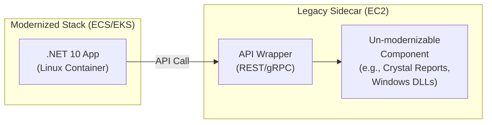

# .NET Framework to .NET 10 + AWS Modernization

## Analyzer Mission: Risk Surfacing for the .NET Runtime Migration

This steering file is loaded when the user has committed to migrating .NET Framework to **.NET 10** on AWS. The analyzer's job is to surface every item in the codebase that needs attention before migration begins.

**Focus on these outputs:**

1. **Automation-eligible items** — what AWS Transform for .NET / Windows Full Stack can handle (.NET Framework → modern .NET porting, EF6 → EF Core)
2. **Manual-effort items** — what requires human refactoring, redesign, or decision-making (e.g., WCF services, Web Forms pages, Active Directory auth)
3. **Critical blockers** — APIs removed in modern .NET that have no direct port (AppDomains, Remoting, CAS, Workflow Foundation, WCF server-side, Web Forms)
4. **Platform risks** — Windows-only features that block Linux/Graviton deployment (COM, GDI+ limited support, Registry, Windows services)
5. **Upfront remediation** — changes that should be made in the .NET Framework codebase BEFORE porting starts (removing dead code, extracting platform-specific logic, writing missing tests)

Every finding in the report should answer: "What does the team need to know or do BEFORE they start the port, so the migration doesn't get stuck?"

## Target Runtime: .NET 10

**The target is .NET 10.** There is no runtime choice to present, and the report should not imply
one exists.

| Runtime | Position |
|---------|----------|
| **.NET 10 (LTS)** | The target. Released November 2025, supported for approximately three years to **November 2028** |
| **.NET 8 (LTS)** | **Not a target.** End of support **10 November 2026** |
| **.NET 9 (STS)** | Not a target. End of support **10 November 2026** |
| **.NET 12 (LTS)** | The next LTS, expected approximately **November 2027** |

**Why .NET 8 is excluded rather than offered as an option.** A programme that lands on .NET 8
inherits a second upgrade almost immediately, and for anything but the shortest effort the runtime
is out of support before cutover completes. Presenting it alongside .NET 10 as a two-column
comparison would imply two viable answers when there is one.

### Where .NET 8 still appears in the analysis

It remains relevant in three specific ways, none of them as a target:

1. **As a detected current state.** Projects already on .NET 8 or .NET 9 are **partially
   modernized** and still need work: report them in the findings matrix as requiring their own
   upgrade to .NET 10 before 10 November 2026. That is a version bump rather than a modernization
   path — it shares none of the Windows lock-in, Web Forms or WCF analysis — so it belongs in the
   findings, not as a separate pathway.
2. **As a tooling trap.** AWS Transform for .NET offers **both** .NET 8 and .NET 10 as target
   versions. Instruct the team explicitly to select **.NET 10**. Choosing .NET 8 in the tool is an
   easy, silent way to land on an expiring runtime.
3. **As a dependency constraint.** A commercial library whose newest build targets .NET 8 will
   usually run on .NET 10, but confirm rather than assume — particularly for native-interop and
   licence-bound packages. Where a dependency genuinely caps at .NET 8, that is a finding for
   section 5, not a reason to change the target.

### Support window versus programme duration

State this wherever the target is named. .NET 10's support runs to approximately November 2028
and the next LTS arrives approximately November 2027. A programme finishing in 2028 or later
should plan its own follow-on upgrade to .NET 12 as part of the roadmap rather than discovering it
afterwards. Report it as a planning input, never as a reason to hesitate.

## Upgrade Path Modelling

Detect the exact Framework version per project and model the path explicitly. A solution with
mixed project versions may need more than one path in parallel.

| Detected version | Path to model | Notes |
|------------------|---------------|-------|
| 4.6.1 – 4.8 | `4 → 10` | The most direct path. 4.6.1+ ports far more readily than earlier 4.x because of the wider .NET Standard 2.0 surface |
| 4.0 – 4.5 | `4 → 10` | Direct, but expect more API gaps than 4.6.1+ and more manual remediation |
| 3.5 | `3.5 → 10` — **verify** | AWS Transform documents .NET Framework **3.5+** as a supported source, so a direct transformation may be available. See the pre-step note below before assuming a hop is required |
| 3.0 and earlier | `3 → 4 → 10` | Below AWS Transform's documented source floor. A 3 → 4 pre-upgrade step is needed first |
| Already on .NET 8 / 9 | `8 → 10` or `9 → 10` | A version bump, not a modernization path. Report in the findings matrix with the 10 November 2026 deadline attached |

**There is no `4 → 8 → 10` two-step.** AWS Transform targets .NET 10 directly from .NET Framework,
so introducing .NET 8 as an intermediate stage adds a validation and regression cycle for no
benefit. Do not model one.

### The 3.x pre-step: verify, do not assume

Two sources disagree here, and the honest treatment is to say so rather than pick one:

- **AWS Transform documentation** lists supported sources as .NET Framework **3.5+**, .NET Core 3.1,
  .NET 5.x+ and .NET 8 — which implies 3.5 can be transformed directly, with no 3 → 4 hop.
- **Customer qualification material** commonly assumes .NET Framework 3.x requires a 3 → 4
  pre-upgrade step (AWS Transform Custom) before the main transformation.

Both can be true: the assumption may reflect an earlier tool version, or a 3.0 codebase that
genuinely sits below the floor. So:

- For **3.5**, state that a direct path is documented and instruct the team to **confirm against
  the tool version they will actually use** before planning a pre-step. Do not assert the hop is
  required.
- For **3.0 and earlier**, the pre-step is required — that is below the documented floor.
- Either way, report the exact per-project version, because the answer differs at the 3.0/3.5
  boundary.

**Each hop adds transformation-defect surface.** Every transformation stage produces its own crop
of tool-generated and AI-generated defects that must be caught and corrected, so a `3 → 4 → 10`
path carries two defect-capture cycles rather than one. Surface this as a finding wherever a
pre-step applies — it is a material planning input, not a footnote. Report it as additional
validation and remediation surface, never as an hour or day figure.

**Report guidance.** Name the paths using this notation (`4→10`, `3.5→10`, `3→4→10`, `8→10`) so the
reader can see at a glance which projects take the longer route, and state the count of projects on
each path.

## Containerization Hops: Windows Containers as an Interim Step

Containerization is not a single decision. Distinguish two destinations, because they carry very
different prerequisites, and the report must not collapse them into one:

| Hop | Prerequisite | What it achieves | What it does not achieve |
|-----|--------------|------------------|--------------------------|
| **Windows containers** (ECS/EKS on Windows nodes) | Modern .NET on Windows, or even .NET Framework via Windows Server Core base images. Windows-only dependencies may **remain in place** | Container orchestration, CI/CD integration, horizontal scaling, data-centre exit | No Linux cost profile, no Graviton, larger images, Windows node licensing continues |
| **Linux containers**, optionally on Graviton/ARM64 | **Complete removal** of every Windows-specific dependency — COM/COM+, P/Invoke into Windows APIs, registry access, Windows Auth, `System.Drawing` on GDI+, Windows-only commercial libraries, 32-bit-only components | Full Linux and Graviton cost and density profile | Requires every item in the Windows lock-in cluster to be resolved first |

**Windows containers are the lower-risk interim hop.** Where the Windows lock-in cluster is
large, they let a programme reach orchestration, pipeline integration and data-centre exit without
first resolving every Windows dependency, and then move to Linux later as those dependencies are
retired. Where the lock-in cluster is empty or trivial, the interim hop adds a stage for no
benefit.

**Report guidance.** Tie this directly to the Windows lock-in findings: list what specifically
must be removed before a Linux target is reachable, and present Windows containers as an available
interim state with its consequences stated. Do not present either as the recommended answer — the
hosting decision belongs to the customer and their modernization specialists.

## Platform Detection

### .NET-Specific Files to Detect

- `.sln` - Solution files
- `.csproj` / `.vbproj` - Project files
- `web.config` / `app.config` - Configuration files
- `packages.config` - Legacy NuGet packages
- `appsettings.json` - Modern configuration
- `Global.asax` - ASP.NET application file

### .NET-Specific Dependencies

- `System.Web.*` - ASP.NET Web Forms
- `System.Data.SqlClient` / `Microsoft.Data.SqlClient` - SQL Server
- `System.ServiceModel.*` - WCF
- `EntityFramework` / `Microsoft.EntityFrameworkCore` - ORM
- `System.DirectoryServices` / `System.DirectoryServices.AccountManagement` - Active Directory (⛔ Critical Blocker)

### Active Directory / SSO Detection

Scan `web.config` for authentication mode:
- `<authentication mode="Windows" />` → Windows SSO scenario (Critical Blocker - Complete Rewrite)
- `<authentication mode="Forms">` with `ValidateUser` or `PrincipalContext` in code → Forms Auth against AD (Remote Auth approach)

Scan source code for:
- `User.IsInRole()`, `WindowsIdentity`, `WindowsPrincipal` → Windows SSO
- `Membership.ValidateUser()`, `PrincipalContext`, `FormsAuthentication.SetAuthCookie()` → Forms Auth against AD

### Target Framework Detection

**Report the exact version per project, not a range.** The distinction between 3.5, 4.0, 4.6.1
and 4.8 changes the upgrade path (see Upgrade Path Modelling above), so "legacy .NET Framework" is
not an acceptable finding.

Extract from `.csproj` / `.vbproj`:
- `<TargetFrameworkVersion>v3.5</TargetFrameworkVersion>` — .NET Framework 3.5 (**needs the 3 → 4 pre-step**)
- `<TargetFrameworkVersion>v4.0</TargetFrameworkVersion>` through `v4.5.2` — early 4.x
- `<TargetFrameworkVersion>v4.6.1</TargetFrameworkVersion>` through `v4.8.1` — late 4.x, ports most readily
- `<TargetFramework>net48</TargetFramework>` — .NET Framework 4.8 (SDK-style project)
- `<TargetFramework>net6.0</TargetFramework>` — .NET 6
- `<TargetFramework>net8.0</TargetFramework>` — .NET 8 (**already partially modernized**, but out of support 10 Nov 2026 — report as needing its own upgrade)
- `<TargetFramework>net10.0</TargetFramework>` — .NET 10
- `<TargetFrameworks>` (plural) — multi-targeting; list every framework moniker

Also check `web.config` `<compilation targetFramework="...">` and `<httpRuntime targetFramework="...">`,
which sometimes disagree with the project file. Where they disagree, report both — it is a sign the
build and runtime targets have drifted.

**Produce a per-project version table** and use it to drive the upgrade-path modelling. A mixed-version
solution is a finding in its own right.

## .NET Modernization Decision Tree

The following decision tree defines the base logic for determining the modernization approach. When generating the report, walk through each decision node and map the actual findings from the codebase scan to show readers exactly which attributes were extracted and how they led to the recommended approach.

```mermaid
flowchart TD
    %% Nodes
    Start([Start: .NET Framework 4.8 App])

    %% Phase 1: Feasibility Check
    CheckTech{Uses Unsupported Tech?<br/>(AppDomains, Remoting, CAS,<br/>WF, COM+, WebForms, WCF-Server)}
    Redesign[Must Redesign/Replace<br/>Unsupported Components]
    StayFramework1[Stay on .NET Framework<br/>(Legacy Mode)]

    CheckPlatform{Tied to Platform?<br/>(SharePoint, BizTalk, etc.)}
    MigratePlatform[Migrate Platform First]
    StayFramework2[Stay on .NET Framework<br/>(Platform Constraint)]

    CheckLibs{Critical 3rd-Party Libs<br/>Lack Modern .NET Version?}
    ReplaceLibs[Replace/Port Libraries]
    StayFramework3[Stay on .NET Framework<br/>(Dependency Hell)]

    CheckOS{Target OS Supported<br/>by Modern .NET?}
    UpgradeOS[Upgrade OS]
    StayFramework4[Stay on .NET Framework<br/>(OS Constraint)]

    %% Phase 2: Platform Selection
    MoveModern([Move to .NET 10<br/>LTS, supported to ~Nov 2028])

    CheckWinFeat{Needs Windows-Only Features?<br/>(WPF/WinForms, GDI+, Registry,<br/>Win-Specific P/Invoke)}
    TargetWinX86[Target: Windows x86/x64<br/>(No Graviton)]

    CheckWinDeps{Has Windows-Only Native Deps?<br/>(COM, win-x64 DLLs)}
    TargetLinuxCap([Linux Capable])

    %% Phase 3: Architecture Selection
    CheckArmSupport{All Libs/Agents Support<br/>linux-arm64?}
    TargetLinuxX86[Target: Linux x86-64<br/>(Step 1)]

    CheckWorkload{CPU-Bound / High Scale?<br/>(Crypto, API, Batch)}
    TargetGraviton[Target: AWS Graviton / ARM64<br/>(Best Performance/Cost)]
    TargetLinuxChoice[Choice: Linux x86 OR Graviton<br/>(Based on Ops Preference)]

    %% Edges / Logic Flow
    Start --> CheckTech
    CheckTech -- Yes --> Redesign
    Redesign --> CheckTech
    CheckTech -- Cannot Fix --> StayFramework1
    CheckTech -- No --> CheckPlatform

    CheckPlatform -- Yes --> MigratePlatform
    MigratePlatform --> CheckPlatform
    CheckPlatform -- Cannot Fix --> StayFramework2
    CheckPlatform -- No --> CheckLibs

    CheckLibs -- Yes --> ReplaceLibs
    ReplaceLibs --> CheckLibs
    CheckLibs -- Cannot Fix --> StayFramework3
    CheckLibs -- No --> CheckOS

    CheckOS -- No --> UpgradeOS
    UpgradeOS --> CheckOS
    CheckOS -- Cannot Upgrade --> StayFramework4
    CheckOS -- Yes --> MoveModern

    MoveModern --> CheckWinFeat
    CheckWinFeat -- Yes --> TargetWinX86
    CheckWinFeat -- No --> CheckWinDeps
    CheckWinDeps -- Yes --> TargetWinX86
    CheckWinDeps -- No --> TargetLinuxCap

    TargetLinuxCap --> CheckArmSupport
    CheckArmSupport -- No --> TargetLinuxX86
    CheckArmSupport -- Yes --> CheckWorkload
    CheckWorkload -- Yes --> TargetGraviton
    CheckWorkload -- No --> TargetLinuxChoice

    %% Styling
    classDef termination fill:#f9f9f9,stroke:#333,stroke-width:2px;
    classDef decision fill:#e1f5fe,stroke:#01579b,stroke-width:2px;
    classDef process fill:#fff9c4,stroke:#fbc02d,stroke-width:2px;
    classDef success fill:#e8f5e9,stroke:#2e7d32,stroke-width:4px;
    classDef failure fill:#ffebee,stroke:#c62828,stroke-width:2px;

    class Start,MoveModern,TargetLinuxCap termination;
    class CheckTech,CheckPlatform,CheckLibs,CheckOS,CheckWinFeat,CheckWinDeps,CheckArmSupport,CheckWorkload decision;
    class Redesign,MigratePlatform,ReplaceLibs,UpgradeOS process;
    class TargetGraviton,TargetWinX86,TargetLinuxX86,TargetLinuxChoice success;
    class StayFramework1,StayFramework2,StayFramework3,StayFramework4 failure;
```

### Decision Tree Mapping Instructions

When generating the modernization report, include a **Decision Tree Findings Map** section that walks through each node and shows:

| Decision Node | What We Scanned | What We Found | Result |
|---------------|-----------------|---------------|--------|
| Unsupported Tech? | `.csproj` refs, `Global.asax`, code patterns | _(e.g., "WebForms detected: 12 .aspx pages")_ | Yes/No |
| Tied to Platform? | Project refs, NuGet packages | _(e.g., "No SharePoint/BizTalk dependencies")_ | Yes/No |
| Critical Libs Missing? | `packages.config`, `.csproj` PackageReference | _(e.g., "All packages have versions compatible with the selected target runtime")_ | Yes/No |
| Target OS Supported? | Runtime dependencies, P/Invoke calls | _(e.g., "No OS-specific constraints")_ | Yes/No |
| Windows-Only Features? | WPF/WinForms refs, GDI+, Registry calls | _(e.g., "No Windows-only UI frameworks")_ | Yes/No |
| Windows-Only Native Deps? | COM references, native DLL imports | _(e.g., "No COM interop detected")_ | Yes/No |
| ARM64 Support? | NuGet native packages, agent dependencies | _(e.g., "All deps support linux-arm64")_ | Yes/No |
| CPU-Bound / High Scale? | Application profile, workload patterns | _(e.g., "API-heavy, high request volume")_ | Yes/No |

Highlight the path taken through the decision tree by marking the actual route with ✅ and dead-end branches with ❌. This gives readers full transparency into why a specific target platform and architecture was recommended.

When writing the section up, work node by node:

1. **At each decision node**, state what was scanned and what was found — or explicitly not found
2. **Highlight the path taken** through the tree, based on that evidence
3. **For blocker nodes** (red in the diagram), explain specifically what was detected and why it blocks, rather than only marking the branch as taken
4. **For the final target node** (green in the diagram), explain how the cumulative findings led to that target

The result should give the reader full traceability from codebase evidence → decision logic → recommended target platform and architecture.

## Migration Strategy Bank

### API & Library Modernization

| Current | Target | Notes |
|---------|--------|-------|
| EF6 | EF Core 8 | Modern ORM with better performance |
| Web Forms | ASP.NET Core MVC/Razor | Modern web framework |
| WCF | gRPC or REST APIs | Cloud-native communication |
| ADO.NET | Dapper or EF Core | Simplified data access |
| ASP.NET MVC 5 | ASP.NET Core MVC | Cross-platform MVC |
| Web API 2 | ASP.NET Core Web API | Modern REST APIs |

### Architecture Transformation

| Current | Target | Notes |
|---------|--------|-------|
| Monolith | Microservices | Containerized, independently deployable |
| IIS-hosted | Docker/ECS/EKS | Linux containers on AWS |
| Traditional MVC | API + SPA | Modern frontend separation |
| x86 | ARM (Graviton) | Cost optimization |
| Windows Server | Linux | Cost savings, better container support |

### Database Modernization — Scope Must Be Confirmed First

**⛔ Do NOT recommend a database engine change by default.** Many .NET modernization programmes
deliberately exclude database migration and keep their applications on SQL Server, with the target
design **deliberately avoiding database change** so that the application migration is the only
variable. Recommending Aurora PostgreSQL into that scope contradicts the customer's own stated
boundary and undermines the rest of the report.

**Required sequence:**

1. **Report the SQL Server footprint** — engine version and edition, stored-procedure / function /
   trigger / SSIS-package counts, and the data access technology and version (see SQL Server
   Footprint above). This is useful regardless of scope, because logic held in the database limits
   what can be extracted into a service.
2. **State the scope question explicitly** as an open item requiring customer confirmation: *is
   database migration in scope now, or explicitly deferred?* Never infer the answer from the
   presence of a commercial engine.
3. **Then, and only then:**
   - **If the customer confirms migration is OUT of scope** — keep the application on SQL Server.
     Target Amazon RDS for SQL Server or SQL Server on EC2, and design the target so the data layer
     is unchanged. Report the licensing position as context, not as a reason to override the scope
     decision. Do not include a database migration workstream in any of the three pathways.
   - **If the customer confirms migration is IN scope** — then engine options apply, and the
     conversion becomes a workstream of its own with its own sizing.

| Current | Target | Applies when |
|---------|--------|--------------|
| SQL Server | Amazon RDS for SQL Server | Database migration out of scope — managed service, no engine change, no application data-layer rework |
| SQL Server | SQL Server on EC2 | Database migration out of scope and RDS feature gaps or licensing arrangements require it |
| SQL Server | Aurora PostgreSQL | **Only when the customer has confirmed database migration is in scope.** Removes commercial licensing, but adds T-SQL → PostgreSQL conversion, data access rework and a data migration workstream |
| LINQ to SQL | EF Core | Always — LINQ to SQL has no modern .NET support, independent of engine choice |
| Stored Procedures | Application code | Only where the customer wants domain logic moved out of the database. Report the volume; the decision is theirs |

### Messaging & Integration

| Current | Target | Notes |
|---------|--------|-------|
| MSMQ | Amazon SQS/SNS | Cloud-native messaging |
| Azure Service Bus | Amazon SQS/EventBridge | AWS event-driven |
| NServiceBus | MassTransit | Modern service bus |
| SignalR | SignalR on AWS | Real-time communication |

### Security Modernization

| Current | Target | Notes |
|---------|--------|-------|
| Windows Auth | AWS Cognito | OAuth 2.0/OIDC |
| ASP.NET Membership | ASP.NET Core Identity | Modern identity |
| Forms Auth | JWT/OAuth2 | Token-based auth |
| Machine Keys | AWS KMS | Key management |

### ⛔ Critical Blocker: Active Directory / Windows SSO Authentication

This is a **critical modernization blocker** that MUST be detected and reported. Scan `web.config` and source code to determine which AD authentication scenario applies.

#### Scenario 1: Windows SSO with Active Directory (Complete Rewrite Required)

**Detection Indicators:**
- `<authentication mode="Windows" />` in `web.config`
- NO login screen (transparent SSO via browser/Kerberos)
- Code uses `User.IsInRole()` directly
- References to `WindowsIdentity`, `WindowsPrincipal`
- IIS Windows Authentication enabled

**Modernization Approach — Complete Rewrite to Native Core:**

| Action | Required | Notes |
|--------|----------|-------|
| Implement new middleware in `Program.cs` | ✅ Yes | New auth pipeline setup |
| Configure Windows Authentication packages / IIS settings | ✅ Yes | `Microsoft.AspNetCore.Authentication.Negotiate` |
| Write new LDAP / DirectoryServices code | ✅ Yes | Replace implicit Windows identity resolution |
| Refactor code using `HttpContext` | ✅ Yes | `System.Web.HttpContext` → `Microsoft.AspNetCore.Http.HttpContext` |
| Configure System.Web Adapters | ❌ No | Not applicable for native rewrite |
| Set up Data Protection / Ring Keys | ❌ No | Not required |

**Risk if Not Modernized:** Windows SSO is tightly coupled to on-premises Active Directory and IIS. It cannot run on Linux containers or AWS ECS/EKS without a complete rewrite of the authentication layer. This blocks any containerization or cloud migration.

#### Scenario 2: Forms Authentication against Active Directory (Remote Auth via System.Web Adapters)

**Detection Indicators:**
- `<authentication mode="Forms">` or `<authentication mode="None">` in `web.config`
- YES login screen (custom login page)
- Code uses `Membership.ValidateUser()` or `PrincipalContext`
- References to `System.DirectoryServices`, `System.DirectoryServices.AccountManagement`
- `FormsAuthentication.SetAuthCookie()` usage

**Modernization Approach — Remote Authentication using System.Web Adapters:**

| Action | Required | Notes |
|--------|----------|-------|
| Implement new middleware in `Program.cs` | ✅ Yes | Configure remote auth middleware |
| Configure System.Web Adapters | ✅ Yes | Bridge between .NET Core and Framework app |
| Refactor code using `HttpContext` | ⚠️ Minimal | Less refactoring than full rewrite |
| Write new LDAP / DirectoryServices code | ❌ No | Leverages existing Framework app for AD validation |
| Set up Data Protection / Ring Keys | ❌ No | Not required |
| Configure Windows Auth packages / IIS settings | ❌ No | Not applicable for remote auth setup |

**Risk if Not Modernized:** Forms Auth against AD is less tightly coupled than Windows SSO, but still relies on legacy `System.Web` membership providers. The System.Web Adapters approach allows incremental migration while keeping the existing AD integration intact during transition.

#### Detection Priority

When scanning a .NET codebase, check for AD/SSO indicators **early** in the analysis as this is a critical blocker that significantly impacts migration pathway selection, effort estimates, and timeline.

### Cloud-Native Patterns

| Current | Target | Notes |
|---------|--------|-------|
| web.config | AWS Parameter Store | Centralized config |
| File storage | Amazon S3 | Scalable object storage |
| Session State | ElastiCache/DynamoDB | Distributed sessions |
| Logging | AWS CloudWatch | Centralized logging |
| Caching | ElastiCache | Distributed caching |

## Hybrid Modernization: EC2 Legacy Sidecar Pattern

In some cases, certain libraries or components are tightly coupled to the original architecture and have no modern equivalent for the target platform. For .NET, this includes dependencies on Windows-specific system DLLs, .NET Framework-only libraries, or components like Crystal Reports that have no Linux-compatible version.

When these un-modernizable components are identified, recommend a hybrid approach:

### Pattern: Modernize + Legacy Sidecar

1. Modernize everything possible to the target architecture (.NET 10 / Linux / containers)
2. Isolate the un-modernizable components into a dedicated EC2 instance running the original platform (e.g., Windows Server with .NET Framework / IIS)
3. Build API wrappers (REST or gRPC) around the legacy components on the EC2 instance
4. Have the modernized application interface with the legacy sidecar through these wrappers



### When to Recommend This Pattern

- A critical library has no .NET 10 or Linux-compatible version
- A component depends on Windows-specific system APIs (GDI+, COM, Registry) that cannot be abstracted
- Rewriting the component is not feasible within the migration timeline
- The component is stable and rarely changes (low maintenance burden)

### Report Guidance

When this pattern applies, include it as an additional pathway or as a variant of the primary pathway, with:
- List of specific components that require the legacy sidecar
- Justification for why each component cannot be modernized
- API wrapper design recommendations
- Cost implications of maintaining the EC2 sidecar instance
- Long-term plan to eventually retire the sidecar (if feasible)

## .NET-Specific Evaluation Areas

These areas sit on top of the universal criteria in `evaluation-framework.md`, which every path
must cover. The ones below are the .NET-specific depth, and they are not optional: each is a
question a modernization specialist will otherwise have to go back to the customer for.

### Platform & Framework Assessment

- **Target Framework Version**: exact version per project (see Target Framework Detection above)
- **Windows-Only Dependencies**: Identify Windows-specific APIs — see the Windows Lock-In cluster below
- **32-bit vs 64-bit**: Architecture compatibility, and any `<PlatformTarget>x86</PlatformTarget>` or 32-bit-only components
- **Framework EOL Status**: Support lifecycle assessment

### Application Type Inventory — the Dominant Effort Driver

**Application type dominates migration effort more than size does.** A 200,000-line Web API ports
more readily than a 50,000-line Web Forms application. Inventory every project by type and report
the mix, because a solution frequently contains several.

| Application type | Detection signals | Migration character |
|------------------|-------------------|---------------------|
| **ASP.NET Web Forms** | `.aspx`, `.ascx`, `.master`, `Global.asax`, `System.Web.UI`, ViewState usage | **Hardest.** No forward port exists — every page is a rewrite (Razor Pages, MVC, Blazor or a SPA). Logic in code-behind must be extracted first |
| **WCF (server-side)** | `System.ServiceModel`, `[ServiceContract]`, `[OperationContract]`, `.svc` files, `<system.serviceModel>` | **Hardest.** Server-side WCF is not supported on modern .NET. Contracts must be re-expressed as REST or gRPC; CoreWCF covers a limited subset |
| **ASP.NET MVC 5** | `System.Web.Mvc`, `Controllers/`, `Views/`, `RouteConfig.cs` | **Easiest.** Concepts map closely onto ASP.NET Core MVC |
| **ASP.NET Web API 2** | `System.Web.Http`, `ApiController`, `WebApiConfig.cs` | **Easiest.** Maps closely onto ASP.NET Core Web API |
| **WinForms** | `System.Windows.Forms`, `.Designer.cs`, `Form1.cs` | Runs on modern .NET but **Windows-only** — blocks Linux and Graviton entirely |
| **WPF** | `System.Xaml`, `.xaml`, `PresentationFramework` | Runs on modern .NET but **Windows-only** — same constraint |
| **Windows Service** | `ServiceBase`, `System.ServiceProcess`, installer classes | Re-hosts as a `BackgroundService` / worker; Windows-specific service plumbing is replaced |
| **Console application** | `Main()` entry point, `OutputType Exe` | Usually the simplest to port |
| **Scheduled jobs / batch** | Windows Task Scheduler entries, `.bat`/`.cmd` wrappers, `Quartz.NET`, timer loops | The scheduling mechanism itself needs a target (EventBridge Scheduler, ECS scheduled tasks, Kubernetes CronJob) — easy to overlook because it lives outside the codebase |

**Report guidance.** Give per-type counts (e.g. `.aspx` page count, `[ServiceContract]` count) as
**inventory**, and surface the mix in section 3 (Visual Architecture State) and section 4 (Critical
Findings Matrix). Never convert these counts into an effort figure.

### Primary Language and the VB.NET Split

Detect the language of every project and report the split:

- `.csproj` → C#
- `.vbproj` → VB.NET
- `.fsproj` → F#
- Mixed solutions are common, especially where an older VB.NET module survives inside a C# solution

**VB.NET adds material friction, and this is documented rather than inferred.** AWS Transform for
.NET lists **C# only** among its fully supported project types; **VB.NET is a preview feature** that
may not transform as completely as supported types. The same applies to WinForms, WPF and Xamarin
projects. On top of that tooling position, training data and community migration examples are
thinner than for C#, and VB-specific constructs (`On Error Resume Next`, late binding, default
properties, `My.*` namespace, implicit conversions) have no clean C# or modern-.NET equivalent.

Note that a documented VB.NET → .NET 10 path does exist, so do **not** report VB.NET as
unsupported or as having no tooling route. Report it accurately: a preview capability with lower
completeness, which means more review and correction per module. Where VB.NET is found:

- Name the specific projects and the approximate share of the codebase they represent
- Flag it as a distinct finding in section 4, not as a language footnote in section 3
- Note whether the programme intends to keep VB.NET or convert to C# as part of the migration — a
  scope question for the customer, not an analyzer decision

### Windows Lock-In — a First-Class Findings Cluster

**This is the single biggest obstacle to a Linux or Graviton target**, and it decides whether the
Windows-container interim hop is needed. Treat it as its own findings cluster in section 4, with
each item named, located and assessed — not as one summary line. Commercial libraries within the
cluster also belong in section 5 (Proprietary Dependency Analysis).

Scan exhaustively for:

| Category | Detection signals | Consequence |
|----------|-------------------|-------------|
| **COM / COM+ interop** | `Microsoft.VisualBasic.Interaction`, `Type.GetTypeFromProgID`, `Activator.CreateInstance` on a ProgID, `<COMReference>` in project files, `Marshal.*`, `[ComImport]`, `System.EnterpriseServices` | Cannot run under Linux. Requires replacement or isolation behind an API on a Windows host |
| **P/Invoke / native Windows API** | `[DllImport("kernel32.dll")]`, `user32.dll`, `advapi32.dll`, `gdi32.dll`, any `[DllImport]` naming a Windows DLL | Each call site needs a cross-platform equivalent or an abstraction |
| **Registry access** | `Microsoft.Win32.Registry`, `RegistryKey`, `Registry.LocalMachine` | Replace with configuration (Parameter Store, Secrets Manager, environment variables) |
| **MSMQ** | `System.Messaging`, `MessageQueue`, queue paths with `.\private$\` | No modern .NET support. Target SQS/SNS or Amazon MQ |
| **IIS-specific modules and handlers** | `<httpModules>`, `<httpHandlers>`, `<modules>`, `<handlers>` in `web.config`; custom `IHttpModule` / `IHttpHandler` implementations; ISAPI filters | Re-expressed as ASP.NET Core middleware. Custom modules are frequently overlooked |
| **GAC-installed assemblies** | `<Reference>` without `HintPath`, references resolved from the GAC, `gacutil` in build scripts | The assembly may not exist as a NuGet package or file anywhere in the repository — a supply problem, not just a code problem |
| **`System.Drawing` / GDI+** | `System.Drawing.Common`, `Bitmap`, `Graphics`, `Image.FromStream` | `System.Drawing.Common` is Windows-only on modern .NET. Needs ImageSharp, SkiaSharp or equivalent |
| **Crystal Reports** | `CrystalDecisions.*`, `.rpt` files | No Linux-compatible version. A prime candidate for the EC2 legacy sidecar pattern |
| **RDLC / SSRS reporting** | `Microsoft.Reporting.WebForms`, `.rdlc` files, `ReportViewer`, SSRS endpoints | Windows-bound rendering; needs a replacement reporting approach |
| **Office interop** | `Microsoft.Office.Interop.*`, `Excel.Application`, `Word.Application` | Requires Office installed on the host. Replace with OpenXML, ClosedXML or EPPlus |
| **32-bit-only components** | `<PlatformTarget>x86</PlatformTarget>`, `Prefer32Bit`, 32-bit native DLLs, 32-bit ODBC/OLEDB drivers | Constrains the entire process to 32-bit, which blocks a modern 64-bit Linux target |
| **Unmanaged DLLs with no source** | Native DLLs in `lib/`, `bin/` or a `ThirdParty/` folder with no corresponding source or vendor | **Potentially unresolvable.** Flag explicitly as needing customer confirmation of whether source or a vendor relationship still exists |
| **UNC shares and local paths** | Hard-coded `\\server\share`, `C:\`, `Path.Combine` with drive letters, `web.config` paths | Must be externalised to S3, EFS or configuration before containerization |
| **Windows scheduled tasks** | Task Scheduler XML, `schtasks` calls, `.bat`/`.cmd` wrappers referencing the application | Lives outside the codebase, so it is easy to miss entirely and then discover at cutover |
| **Windows Authentication / AD** | See the Active Directory / Windows SSO blocker section above | Auth rework is routinely the hidden bulk of the effort |

**For each item found, report:** what it is, where it is (project and file), why it blocks the
target, and what the replacement or isolation option is. For each item that cannot be resolved,
say so plainly and connect it to the EC2 legacy sidecar pattern.

### Build Toolchain and Baseline Buildability

- **Visual Studio version** in use — from `.sln` format version and `# Visual Studio Version` header, `.suo`/`.vs` artifacts, and any SDK or toolset pins
- **Project file style** — legacy non-SDK `.csproj` versus SDK-style. Legacy style must be converted, and the conversion itself is a transformation step
- **Package management style** — `packages.config` versus `<PackageReference>`. `packages.config` needs migrating before or during the port
- **Build mechanism** — msbuild directly, a packaged build, a CI pipeline definition, or a manual Visual Studio build. Note if no scripted build exists at all
- **Whether the solution builds today from a clean checkout, and how long a full build takes**

A non-building baseline is a **gating finding** — see the gating-findings rule in
`evaluation-framework.md`. Without a build, generated or ported code cannot be validated against
anything, so every downstream claim in the report is unverified.

### SQL Server Footprint

Report the footprint whether or not database migration is in scope — the volume of logic held in
the database limits what can be extracted into a service, regardless of which engine it runs on:

- **Engine version and edition** — SQL Server 2012 / 2016 / 2019 / 2022, Standard or Enterprise. Edition matters because Enterprise-only features constrain the target options
- **Counts** of stored procedures, functions, triggers and SSIS packages
- **Data access technology and version** — ADO.NET, Entity Framework 6 (which version), EF Core, NHibernate, Dapper, or raw SQL. EF6 → EF Core is a well-travelled path; older ORMs need more manual rework
- **Business logic held in the database** — where stored procedures carry domain rules rather than data access, extracting a service means either moving that logic or calling back into the database. Name the specific procedures where this is visible
- **Linked servers, cross-database queries and SQL Agent jobs** — coupling that lives outside the application and is easy to miss

Surface all of this in section 6 (Database Analysis & Migration Opportunity), together with the
explicit scope question described in the Database Modernization section below.

### ASP.NET Web Forms Assessment

If Web Forms detected:
- Count of `.aspx` pages
- ViewState usage complexity
- Code-behind patterns
- User controls and custom controls
- Master pages structure

Migration options:
1. **Incremental**: Add ASP.NET Core alongside Web Forms
2. **Rewrite**: Full rewrite to Blazor or React
3. **Strangler Fig**: Gradually replace pages

### WCF Assessment

If WCF detected:
- Service contracts (`[ServiceContract]`)
- Data contracts (`[DataContract]`)
- Binding configurations
- Security modes (Transport, Message)
- Duplex/callback patterns

Migration options:
1. **gRPC**: For internal service communication
2. **REST API**: For external/public APIs
3. **CoreWCF**: For minimal changes (limited)

### Entity Framework Assessment

If EF6 detected:
- DbContext implementations
- Code-First vs Database-First
- Migration history
- Lazy loading usage
- Complex relationships

Migration to EF Core:
- Breaking changes in EF Core
- Removed features (lazy loading proxy differences)
- New features (split queries, compiled queries)

## NuGet License Verification

For each NuGet package, verify license via NuGet.org API:

1. Query: `https://api.nuget.org/v3/registration5-gz-semver2/{package-id}/index.json`
2. Extract `catalogEntry` URL
3. Fetch catalog entry and extract `licenseExpression` (SPDX identifier)

Include verification note in report:
> 📋 **License Verification**: All NuGet package licenses were verified by querying the NuGet.org Catalog API.

## SQL Server to PostgreSQL Migration

**Applies only when the customer has confirmed database migration is in scope** — see Database
Modernization above. If migration is out of scope, report the SQL Server footprint and omit this
conversion analysis entirely rather than presenting it as a recommendation.

### T-SQL to PostgreSQL Conversion

| T-SQL | PostgreSQL | Notes |
|-------|------------|-------|
| `GETDATE()` | `NOW()` or `CURRENT_TIMESTAMP` | |
| `ISNULL(a, b)` | `COALESCE(a, b)` | |
| `CONVERT(type, value)` | `CAST(value AS type)` | |
| `TOP n` | `LIMIT n` | Move to end of query |
| `DATEADD(day, n, date)` | `date + INTERVAL 'n days'` | |
| `DATEDIFF(day, a, b)` | `DATE_PART('day', b - a)` | |
| `nvarchar(max)` | `TEXT` | |
| `uniqueidentifier` | `UUID` | |
| `datetime2` | `TIMESTAMP` | |
| `money` | `DECIMAL(19,4)` | |

### Migration Tools

- **AWS Schema Conversion Tool (SCT)**: Schema and stored procedure conversion
- **AWS Database Migration Service (DMS)**: Data migration
- **pgLoader**: Open-source data migration

## Recommended Tools

Prioritize AWS Transform tools in this order:

| Tool | Purpose | Priority |
|------|---------|----------|
| AWS Transform for Windows Full Stack | End-to-end .NET modernization including framework upgrade + database migration | 1st - Use when both app and DB migration needed |
| AWS Transform for .NET | .NET Framework to .NET 10 porting, EF6 → EF Core migration | 2nd - Use for application-only migration |
| AWS Schema Conversion Tool (SCT) | Database schema conversion analysis (SQL Server → PostgreSQL) | 3rd - Use for database-only scenarios |
| AWS Database Migration Service (DMS) | Data migration with minimal downtime | 3rd - Use with SCT for database migration |
| AWS App2Container | Containerization of existing .NET applications | 4th - Use for lift-and-shift containerization |
| Kiro | AI-assisted code migration and refactoring | Supplementary - Use throughout all phases |

**Tool Selection Guidance:**
- For .NET runtime upgrade only, **keeping the database unchanged** — the common case where database migration is out of scope: use **AWS Transform for .NET**
- For full modernization (.NET upgrade **and** a confirmed SQL Server → Aurora PostgreSQL migration): use **AWS Transform for Windows Full Stack**
- For database migration only (keeping .NET Framework): use **SCT + DMS**
- For containerization without code changes: use **AWS App2Container**

### AWS Transform for .NET — What It Does and Does Not Cover

Establish this against the codebase inventory **before** planning, because it determines how much
of the work is tool-assisted and how much is hand-written. Verify against current documentation:
this position changes over time.

**⛔ Select .NET 10 as the target.** The tool offers both .NET 8 and .NET 10. Selecting .NET 8
lands the programme on a runtime that is out of support from 10 November 2026, and it is an easy
thing to click past without noticing.

| Supported sources | Supported targets |
|-------------------|-------------------|
| .NET Framework **3.5+**, .NET Core 3.1, .NET 5.x+, .NET 8 | **.NET 8 or .NET 10** — choose .NET 10 |

| Fully supported project types (**C# only**) | Preview — may not transform completely | Not transformed |
|---|---|---|
| Class libraries; console applications; ASP.NET MVC including front-end Razor views; SPA back-ends (business-logic layers); Web API; **Web Forms**; unit test projects (NUnit, xUnit, MSTest); **WCF services**; projects whose third-party or private NuGet packages have cross-platform versions | **VB.NET** projects; WinForms desktop; WPF desktop; Xamarin mobile | **Blazor UI components**; Win32 DLLs with no core-compatible library; repositories containing no solutions |

**Read the middle and right columns against the application type inventory.** Two consequences the
report should draw out:

- **Web Forms and WCF are fully supported project types**, which is worth stating plainly — they are
  still the hardest things to *design* a target for, but they are not outside the tool's scope. Do
  not conflate "hard to port" with "no tooling path".
- **VB.NET, WinForms, WPF and Xamarin are preview.** Where the inventory is materially VB.NET or
  desktop, expect lower completeness and more manual correction per module, and say so.
- **Blazor UI components are explicitly not transformed.** If Blazor is present, that portion is a
  hand-written rewrite regardless of how the rest of the solution fares.
- Where a cross-platform equivalent for a package is missing, the tool attempts a best-effort
  conversion — which is a review obligation, not a solved problem.

**Operational facts worth stating in the report:** the tool does not modify original repository
branches and writes only to a separate target branch; and human input is required at four points —
connecting source control and permissions, validating the proposed modernization plan, supplying
missing package dependencies as NuGets, and reviewing and accepting the transformed code.

**Porting Assistant for .NET is closed to new customers** (from 7 November 2025). Do not recommend
it for a new engagement; AWS Transform is the current path.
- For a **3.0 / 3.5** codebase: **AWS Transform Custom** runs the 3 → 4 pre-upgrade step first, before any of the above

Select tooling to match the confirmed scope. Do not recommend Windows Full Stack on the basis of a
commercial database being present when the customer has excluded database migration.

## Code Migration Examples

### web.config to appsettings.json

**Before (web.config):**
```xml
<connectionStrings>
  <add name="DefaultConnection" 
       connectionString="Server=myserver;Database=mydb;User Id=user;Password=pass;" />
</connectionStrings>
<appSettings>
  <add key="ApiKey" value="secret123" />
</appSettings>
```

**After (appsettings.json):**
```json
{
  "ConnectionStrings": {
    "DefaultConnection": "Host=myserver;Database=mydb;Username=user;Password=pass;"
  },
  "ApiKey": "secret123"
}
```

### ASP.NET MVC to ASP.NET Core

**Before (ASP.NET MVC 5):**
```csharp
public class HomeController : Controller
{
    public ActionResult Index()
    {
        return View();
    }
}
```

**After (ASP.NET Core):**
```csharp
public class HomeController : Controller
{
    private readonly ILogger<HomeController> _logger;
    
    public HomeController(ILogger<HomeController> logger)
    {
        _logger = logger;
    }
    
    public IActionResult Index()
    {
        return View();
    }
}
```

### EF6 to EF Core

**Before (EF6):**
```csharp
public class MyDbContext : DbContext
{
    public MyDbContext() : base("DefaultConnection") { }
    public DbSet<Customer> Customers { get; set; }
}
```

**After (EF Core):**
```csharp
public class MyDbContext : DbContext
{
    public MyDbContext(DbContextOptions<MyDbContext> options) : base(options) { }
    public DbSet<Customer> Customers { get; set; }
}
```
