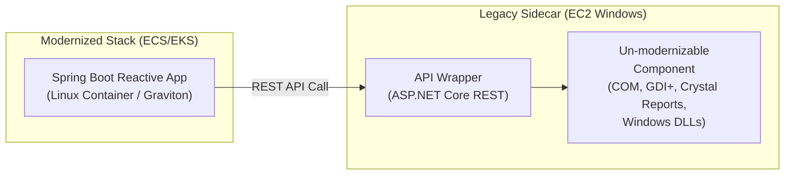
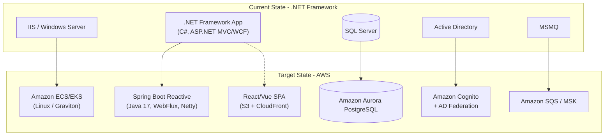

# .NET Framework to Java Spring Boot Migration

## Objective

Migrate .NET Framework applications (ASP.NET MVC, Web Forms, Web API, WCF) to Spring Boot 4.1.x with Java 21 or 25, completely eliminating all .NET Framework and Windows-specific dependencies, targeting AWS container-based deployments optimized for Linux and Graviton processors.

**IMPORTANT — Cross-Platform Migration:** This is a cross-language, cross-ecosystem migration (C# → Java). It is fundamentally more complex than same-ecosystem migrations (.NET Framework → .NET 10, or WebSphere → Spring Boot). The report MUST prominently acknowledge this complexity and surface the risks and effort items that flow from it.

**⛔ DO NOT RECOMMEND A .NET BRIDGE PATHWAY.** When the user has chosen Java as the target, they are committed to Java. Do NOT propose, suggest, or include any pathway that first upgrades to modern .NET and then migrates to Java as a second step. This includes — but is not limited to — phrasings such as "modernize to .NET 10 first, then migrate to Java", ".NET 10 stepping stone", "modern .NET intermediate target", or "phased cross-language approach via .NET". Such a two-step path roughly doubles the effort, doubles the business-continuity risk, and no team choosing Java would adopt it. The three pathways in the report must all terminate in Java Spring Boot Reactive (varying only by scope, timeline, and whether a hybrid EC2 sidecar is needed for un-modernizable Windows components) — NEVER in .NET 10 or any other .NET runtime as an interim state.

## Platform Detection

### .NET-Specific Files to Detect

- `.sln` - Solution files
- `.csproj` / `.vbproj` - Project files
- `web.config` / `app.config` - Configuration files
- `packages.config` - Legacy NuGet packages
- `appsettings.json` - Modern configuration
- `Global.asax` - ASP.NET application file

### .NET-Specific Dependencies

- `System.Web.*` - ASP.NET Web Forms / MVC
- `System.Data.SqlClient` / `Microsoft.Data.SqlClient` - SQL Server
- `System.ServiceModel.*` - WCF
- `EntityFramework` / `Microsoft.EntityFrameworkCore` - ORM
- `System.DirectoryServices` / `System.DirectoryServices.AccountManagement` - Active Directory (⛔ Critical Blocker)
- `System.Runtime.InteropServices` - COM Interop / P/Invoke (⛔ Critical Blocker)
- `System.Drawing.*` - GDI+ Graphics (⛔ Windows-Only)
- `Microsoft.Win32` - Windows Registry (⛔ Windows-Only)
- `System.Messaging` - MSMQ (⛔ Windows-Only)

### Target Selection Trigger

This steering file is loaded when the user explicitly requests migration to **Java / Spring Boot** from .NET. Trigger phrases:
- ".NET to Java"
- ".NET to Spring Boot"
- "migrate to Java"
- "cross-platform migration"
- "eliminate .NET"
- "standardize on Java"

### Active Directory / SSO Detection

Scan `web.config` for authentication mode:
- `<authentication mode="Windows" />` → Windows SSO scenario (⛔ Critical Blocker — Kerberos/NTLM incompatible with Linux)
- `<authentication mode="Forms">` with `ValidateUser` or `PrincipalContext` in code → Forms Auth against AD

Scan source code for:
- `User.IsInRole()`, `WindowsIdentity`, `WindowsPrincipal` → Windows SSO
- `Membership.ValidateUser()`, `PrincipalContext`, `FormsAuthentication.SetAuthCookie()` → Forms Auth against AD

### Target Framework Detection

**Report the exact version per project.** On this path the Framework version does not determine an
upgrade route — the code is being rewritten in Java either way — but it still tells you how much
modern C# the codebase uses, which directly affects how mechanical the translation is. A 3.5
codebase predates generics-heavy idiom, LINQ maturity, `async`/`await` and modern nullable handling,
so it translates less mechanically than a 4.8 codebase and carries more redesign.

Extract from `.csproj` / `.vbproj`:
- `<TargetFrameworkVersion>v3.5</TargetFrameworkVersion>` — .NET Framework 3.5 (expect pre-LINQ, pre-async idiom)
- `<TargetFrameworkVersion>v4.0</TargetFrameworkVersion>` through `v4.5.2` — early 4.x
- `<TargetFramework>net461</TargetFramework>` — .NET Framework 4.6.1
- `<TargetFramework>net472</TargetFramework>` — .NET Framework 4.7.2
- `<TargetFramework>net48</TargetFramework>` — .NET Framework 4.8
- `<TargetFrameworks>` (plural) — multi-targeting; list every moniker

**Note for this path:** there is no 3 → 4 pre-upgrade step here. That step exists only on the
.NET → modern .NET route. Do **not** introduce a .NET Framework upgrade as a stage on the way to
Java — see the prohibition in the Objective section above.

### Application Type Inventory — the Dominant Effort Driver

Application type dominates effort more than size does, and on a cross-language path it also decides
how much of the work is *translation* versus *redesign*. Inventory every project by type:

| Application type | Detection signals | Character of the Java migration |
|------------------|-------------------|---------------------------------|
| **ASP.NET Web Forms** | `.aspx`, `.ascx`, `.master`, `Global.asax`, `System.Web.UI`, ViewState | **Hardest.** No equivalent concept exists in Spring. Every page is a rewrite, and ViewState-dependent behaviour has to be re-modelled explicitly. Pair this with the front-end analysis — it is a front-end rewrite *plus* a logic extraction |
| **WCF (server-side)** | `System.ServiceModel`, `[ServiceContract]`, `.svc`, `<system.serviceModel>` | **Hardest.** Re-expressed as REST (`@RestController`) or gRPC. Duplex, callback and message-security patterns have no direct Spring equivalent |
| **ASP.NET MVC 5** | `System.Web.Mvc`, `Controllers/`, `Views/` | Most tractable. Controller and action concepts map onto Spring MVC or WebFlux |
| **ASP.NET Web API 2** | `System.Web.Http`, `ApiController` | Most tractable, and an existing REST surface means the front end can be migrated independently |
| **WinForms / WPF** | `System.Windows.Forms`, `System.Xaml`, `.xaml`, `.Designer.cs` | No Java equivalent is being targeted. These become a web front end, which is a full UI redesign, not a translation |
| **Windows Service** | `ServiceBase`, `System.ServiceProcess` | Becomes a Spring `@Scheduled` component, a worker, or a container task |
| **Console / scheduled jobs** | `Main()`, Task Scheduler entries, `.bat`/`.cmd` wrappers, `Quartz.NET` | Straightforward as code, but the **scheduling mechanism** needs its own target (EventBridge Scheduler, ECS scheduled task, Spring Scheduling) and lives outside the codebase |

Report per-type counts as **inventory only** — never as an effort figure.

### Primary Language and the VB.NET Split

Detect the language of every project (`.csproj` → C#, `.vbproj` → VB.NET, `.fsproj` → F#) and report
the split with named projects.

**VB.NET adds material friction on this path in particular, and there is no vendor tooling for it
at all.** AWS Transform for .NET treats VB.NET as a preview capability, but its targets are .NET 8
and .NET 10 — not Java — so it does not serve this path in any case (see the tooling note below).
C# → Java is a well-travelled translation with abundant reference material; VB.NET → Java is not.
VB-specific
constructs — `On Error Resume Next`, late binding, default properties, the `My.*` namespace,
implicit conversions, 1-based array conventions in older code — have no clean Java equivalent and
each needs an explicit decision. Where VB.NET is found:

- Name the projects and the approximate share of the codebase
- Flag it as a distinct finding in section 4, not as a footnote
- Note that AI-assisted translation quality is lower for VB.NET than for C#, so expect more review
  and correction cycles per module

### Tooling Reality on This Path

State this early, because teams reach for the wrong tool by default.

**AWS Transform for .NET does not serve this path.** Its documented targets are .NET 8 and .NET 10 —
both .NET runtimes. It ports .NET Framework to modern .NET; it does not translate C# to Java. Do not
list it as the automation path for a Java target, and do not imply that a .NET-to-.NET tool's
coverage table (Web Forms supported, VB.NET preview, and so on) transfers here.

What that leaves:

- **AI-assisted translation** (Kiro and comparable assistants) carries the bulk of the mechanical
  work — C# → Java, LINQ → Streams, NuGet → Maven — with human review per module. This is the
  primary accelerator on this path.
- **OpenRewrite** applies on the Java side after translation, for framework-version migrations, not
  for the cross-language step itself.
- **SCT / DMS** apply only if database migration is confirmed in scope.
- There is **no equivalent of a single-click transformation job** for C# → Java. Report that plainly
  rather than implying parity with the .NET → .NET route, because the difference in tool support is
  one of the largest distinctions between the two .NET pathways.

Where the same codebase is being considered for **both** targets, this asymmetry is decision-grade
evidence: the .NET → .NET 10 route has a vendor-supported transformation job, and this route does
not. Present it as evidence, not as advice to change target.

### Build Toolchain and Baseline Buildability

- **Visual Studio version** and build mechanism — msbuild, a packaged build, a CI pipeline, or a manual IDE build
- Project file style (SDK-style vs legacy) and package management (`packages.config` vs `PackageReference`) — both are inputs to the dependency mapping in the NuGet → Maven section
- **Whether the solution builds today from a clean checkout, and how long a full build takes**

A non-building baseline is a **gating finding** (see `evaluation-framework.md`). On a cross-language
path it matters even more than usual: without a working baseline there is no way to compare Java
behaviour against the original, and behavioural equivalence is the only real acceptance criterion a
cross-language migration has.

## Analyzer Mission: Risk Surfacing for Spring Boot Migration

This steering file is loaded when the user has already committed to migrating .NET Framework to Java Spring Boot Reactive. The analyzer's job is NOT to second-guess this choice or compare it with the .NET 10 route. The job is to surface every item in the codebase that needs attention before the migration begins.

**Focus on these outputs:**

1. **Automation-eligible items** — what AWS Transform, Kiro, SCT, and DMS can handle
2. **Manual-effort items** — what requires human translation, redesign, or decision-making
3. **Critical blockers** — Windows-only dependencies that cannot run on Linux without remediation
4. **Hidden risks** — tribal knowledge, undocumented behavior, subtle semantic differences between C# and Java
5. **Upfront remediation** — changes that should be made in the .NET codebase BEFORE the Java migration starts (refactoring, removing dead code, modularizing, writing missing tests)

Every finding in the report should answer: "What does the team need to know or do BEFORE they start writing Java code, so the migration doesn't get stuck?"

## .NET to Java Spring Boot Codebase Risk Discovery Tree

This tree walks through codebase attributes to discover what the team will face during migration. Every node surfaces risks and effort categories that need to be planned for BEFORE migration starts.

```mermaid
flowchart TD
    Start([Start: .NET Framework Codebase Scan])

    %% Phase 1: Windows Dependency Discovery
    CheckWinAuth{Windows Authentication<br/>or AD Integration Used?}
    FlagWinAuth[⛔ CRITICAL BLOCKER<br/>Plan: AWS Cognito + SAML<br/>federation to AD<br/>Manual effort: auth redesign]

    CheckCOM{COM Interop / P/Invoke<br/>Detected?}
    FlagCOM[⛔ CRITICAL BLOCKER<br/>Plan: Rewrite in Java OR<br/>EC2 Windows Sidecar<br/>Manual effort: per-component decision]

    CheckGDI{System.Drawing / GDI+<br/>Used for Images/Reports?}
    FlagGDI[⚠️ HIGH RISK<br/>Plan: Java ImageIO / Thumbnailator<br/>OR EC2 sidecar for complex reports<br/>Manual effort: capability gap review]

    CheckRegistry{Windows Registry<br/>Access Detected?}
    FlagRegistry[⚠️ MEDIUM RISK<br/>Plan: AWS Parameter Store<br/>Manual effort: config externalization]

    %% Phase 2: Frontend Discovery
    CheckWebForms{ASP.NET Web Forms<br/>(.aspx) Used?}
    FlagWebForms[⛔ HIGH EFFORT<br/>Plan: Full SPA rewrite React/Vue<br/>ViewState/postback model incompatible<br/>Manual effort: UI redesign]

    CheckRazor{ASP.NET MVC Razor Views<br/>(.cshtml) Used?}
    FlagRazor[⚠️ HIGH EFFORT<br/>Plan: SPA rewrite + REST API<br/>Manual effort: server-to-client state migration]

    %% Phase 3: Service Layer Discovery
    CheckWCF{WCF Services Detected?}
    FlagWCF[⚠️ HIGH EFFORT<br/>Plan: Spring WebFlux REST or RSocket<br/>Manual effort: contract redesign,<br/>WS-* security replacement]

    CheckSignalR{SignalR Real-Time<br/>Communication?}
    FlagSignalR[⚠️ MEDIUM EFFORT<br/>Plan: WebFlux SSE or RSocket<br/>Manual effort: reconnection/fallback logic]

    %% Phase 4: Data Layer Discovery
    CheckEF{Entity Framework<br/>with Navigation Properties?}
    FlagEF[⚠️ HIGH EFFORT<br/>R2DBC has no relationships<br/>Plan: Manual loading with Mono.zip<br/>OR denormalize data model]

    CheckStoredProcs{SQL Server Stored Procedures<br/>with Business Logic?}
    FlagStoredProcs[⚠️ HIGH RISK<br/>Plan: Convert to PostgreSQL functions<br/>OR move logic to Java service layer<br/>Manual effort: T-SQL to PL/pgSQL translation]

    CheckTSQL{Heavy T-SQL Features<br/>MERGE, CROSS APPLY, CTEs?}
    FlagTSQL[⚠️ MEDIUM RISK<br/>Plan: AWS SCT for automated conversion<br/>Manual effort: review edge cases]

    %% Phase 5: Language Pattern Discovery
    CheckExtMethods{C# Extension Methods<br/>Heavily Used?}
    FlagExtMethods[⚠️ LOW RISK but TEDIOUS<br/>Plan: Convert to static utility classes<br/>Call syntax changes throughout codebase]

    CheckLINQEntities{LINQ-to-Entities<br/>Complex Queries?}
    FlagLINQEntities[⚠️ HIGH RISK<br/>No automated translation exists<br/>Plan: Extract generated SQL,<br/>manually convert to PostgreSQL]

    CheckAsyncHeavy{async/await Heavily<br/>Used Throughout?}
    FlagAsyncHeavy[⚠️ MEDIUM RISK<br/>Plan: Map to Mono/Flux reactive chains<br/>Manual effort: reactive paradigm training,<br/>BlockHound validation]

    %% Phase 6: Quality Discovery
    CheckTests{Existing Test Coverage?}
    FlagNoTests[⛔ HIGH RISK<br/>No behavioral baseline for Java validation<br/>Plan: Write characterization tests<br/>in .NET BEFORE migration begins]
    FlagHasTests[✅ GOOD<br/>xUnit/NUnit cannot be reused<br/>Plan: Translate tests alongside code,<br/>use .NET tests as behavior spec]

    CheckDeps{NuGet Packages with<br/>No Maven Equivalent?}
    FlagDeps[⚠️ PER-PACKAGE REVIEW<br/>Plan: Rewrite, find alternative,<br/>or defer feature<br/>Manual effort: library-by-library]

    %% Phase 7: Schema & Reserved Word Discovery
    CheckReservedCols{Columns / Tables Using<br/>SQL Reserved Words?<br/>(Year, Order, User, Group,<br/>Date, Type, Key, Value)}
    FlagReservedCols[⚠️ MEDIUM RISK<br/>Transformation must preserve<br/>quoting in @Column/@Table<br/>Plan: inventory + verify<br/>post-transform annotation values]

    %% Phase 8: Authorization & Identity Plumbing Discovery
    CheckRoleAuth{Role-Based Authorization?<br/>[Authorize(Roles="X")]<br/>User.IsInRole, @HasRole}
    FlagRoleAuth[⚠️ HIGH RISK<br/>IdP group claim must be mapped<br/>to Spring Security ROLE_* authorities<br/>Plan: emit OidcUserService bean<br/>mapping cognito:groups / groups / roles]

    CheckIdPUserTable{Local User/Customer Table<br/>Keyed by IdP Subject?<br/>(Customer.Sub column +<br/>FK refs from other tables)}
    FlagIdPUserTable[⚠️ HIGH RISK<br/>Plan: emit AuthenticationSuccessHandler<br/>that upserts local row on every login<br/>+ defensive switchIfEmpty(createStub)<br/>in dependent service methods]

    %% Phase 9: View Completeness Discovery (Razor → Thymeleaf target)
    CheckRazorViewCount{Razor Views Count?<br/>(.cshtml file count)}
    FlagRazorViewCount[📊 EFFORT ESTIMATION<br/>Every view requires full port<br/>to Thymeleaf — NEVER stubs<br/>Plan: count by directory,<br/>flag customer-journey views as P0]

    CheckMediaFields{Entity Fields Matching<br/>*Url / *ImageUrl / *PhotoUrl<br/>/ *LogoUrl / *CoverImageUrl?}
    FlagMediaFields[⚠️ MEDIUM RISK<br/>Target templates must render<br/>null-safe img tags for every<br/>media field<br/>Plan: inventory entity fields,<br/>verify post-transform templates]

    CheckSummaryViews{Confirmation / Review /<br/>Summary Views?<br/>(checkout/*, *confirm*,<br/>*review*, *summary*)}
    FlagSummaryViews[⚠️ HIGH RISK<br/>Must render itemized line items<br/>with subtotals and grand total<br/>Plan: flag each view as P0,<br/>verify post-transform rendering]

    CheckNavCollections{Entity Navigation Collections?<br/>(virtual ICollection<T> in EF<br/>— ShoppingCart.Items, Order.Items,<br/>Customer.Addresses)}
    FlagNavCollections[⚠️ HIGH RISK<br/>R2DBC has NO lazy loading<br/>Every collection needs separate<br/>getItemsAsync() loader + view-model<br/>Plan: produce NAV_COLLECTION_INVENTORY.md<br/>per parent entity]

    %% Edges — all discoveries feed into aggregated risk report
    Start --> CheckWinAuth
    CheckWinAuth -- Yes --> FlagWinAuth
    CheckWinAuth -- No --> CheckCOM
    FlagWinAuth --> CheckCOM

    CheckCOM -- Yes --> FlagCOM
    CheckCOM -- No --> CheckGDI
    FlagCOM --> CheckGDI

    CheckGDI -- Yes --> FlagGDI
    CheckGDI -- No --> CheckRegistry
    FlagGDI --> CheckRegistry

    CheckRegistry -- Yes --> FlagRegistry
    CheckRegistry -- No --> CheckWebForms
    FlagRegistry --> CheckWebForms

    CheckWebForms -- Yes --> FlagWebForms
    CheckWebForms -- No --> CheckRazor
    FlagWebForms --> CheckRazor

    CheckRazor -- Yes --> FlagRazor
    CheckRazor -- No --> CheckWCF
    FlagRazor --> CheckWCF

    CheckWCF -- Yes --> FlagWCF
    CheckWCF -- No --> CheckSignalR
    FlagWCF --> CheckSignalR

    CheckSignalR -- Yes --> FlagSignalR
    CheckSignalR -- No --> CheckEF
    FlagSignalR --> CheckEF

    CheckEF -- Yes --> FlagEF
    CheckEF -- No --> CheckStoredProcs
    FlagEF --> CheckStoredProcs

    CheckStoredProcs -- Yes --> FlagStoredProcs
    CheckStoredProcs -- No --> CheckTSQL
    FlagStoredProcs --> CheckTSQL

    CheckTSQL -- Yes --> FlagTSQL
    CheckTSQL -- No --> CheckExtMethods
    FlagTSQL --> CheckExtMethods

    CheckExtMethods -- Yes --> FlagExtMethods
    CheckExtMethods -- No --> CheckLINQEntities
    FlagExtMethods --> CheckLINQEntities

    CheckLINQEntities -- Yes --> FlagLINQEntities
    CheckLINQEntities -- No --> CheckAsyncHeavy
    FlagLINQEntities --> CheckAsyncHeavy

    CheckAsyncHeavy -- Yes --> FlagAsyncHeavy
    CheckAsyncHeavy -- No --> CheckTests
    FlagAsyncHeavy --> CheckTests

    CheckTests -- "< 50% coverage" --> FlagNoTests
    CheckTests -- ">= 50% coverage" --> FlagHasTests
    FlagNoTests --> CheckDeps
    FlagHasTests --> CheckDeps

    CheckDeps -- Yes --> FlagDeps
    CheckDeps -- No --> CheckReservedCols
    FlagDeps --> CheckReservedCols

    CheckReservedCols -- Yes --> FlagReservedCols
    CheckReservedCols -- No --> CheckRoleAuth
    FlagReservedCols --> CheckRoleAuth

    CheckRoleAuth -- Yes --> FlagRoleAuth
    CheckRoleAuth -- No --> CheckIdPUserTable
    FlagRoleAuth --> CheckIdPUserTable

    CheckIdPUserTable -- Yes --> FlagIdPUserTable
    CheckIdPUserTable -- No --> CheckRazorViewCount
    FlagIdPUserTable --> CheckRazorViewCount

    CheckRazorViewCount --> FlagRazorViewCount
    FlagRazorViewCount --> CheckMediaFields

    CheckMediaFields -- Yes --> FlagMediaFields
    CheckMediaFields -- No --> CheckSummaryViews
    FlagMediaFields --> CheckSummaryViews

    CheckSummaryViews -- Yes --> FlagSummaryViews
    CheckSummaryViews -- No --> CheckNavCollections
    FlagSummaryViews --> CheckNavCollections

    CheckNavCollections -- Yes --> FlagNavCollections

    %% Styling
    classDef termination fill:#f9f9f9,stroke:#333,stroke-width:2px;
    classDef decision fill:#e1f5fe,stroke:#01579b,stroke-width:2px;
    classDef critical fill:#ffebee,stroke:#c62828,stroke-width:3px;
    classDef high fill:#fff3e0,stroke:#e65100,stroke-width:2px;
    classDef medium fill:#fff9c4,stroke:#fbc02d,stroke-width:2px;
    classDef good fill:#e8f5e9,stroke:#2e7d32,stroke-width:2px;
    classDef info fill:#e3f2fd,stroke:#1565c0,stroke-width:2px;

    class Start termination;
    class CheckWinAuth,CheckCOM,CheckGDI,CheckRegistry,CheckWebForms,CheckRazor,CheckWCF,CheckSignalR,CheckEF,CheckStoredProcs,CheckTSQL,CheckExtMethods,CheckLINQEntities,CheckAsyncHeavy,CheckTests,CheckDeps,CheckReservedCols,CheckRoleAuth,CheckIdPUserTable,CheckRazorViewCount,CheckMediaFields,CheckSummaryViews,CheckNavCollections decision;
    class FlagWinAuth,FlagCOM,FlagWebForms,FlagNoTests critical;
    class FlagGDI,FlagRazor,FlagWCF,FlagEF,FlagStoredProcs,FlagLINQEntities,FlagRoleAuth,FlagIdPUserTable,FlagSummaryViews,FlagNavCollections high;
    class FlagRegistry,FlagSignalR,FlagTSQL,FlagAsyncHeavy,FlagDeps,FlagExtMethods,FlagReservedCols,FlagMediaFields medium;
    class FlagHasTests good;
    class FlagRazorViewCount info;
```

### Risk Discovery Map Instructions

When generating the modernization report, include a **Risk Discovery Findings Map** section that walks through each node and documents:

| Codebase Check | What We Scanned | What We Found | Risk Level | Remediation Plan |
|----------------|-----------------|---------------|------------|------------------|
| Windows Authentication | `web.config`, `WindowsIdentity` usage | _(e.g., "Windows Auth mode detected in 3 web.config files")_ | 🔴 Critical | AWS Cognito + SAML federation |
| COM Interop | `[DllImport]`, `[ComImport]` attributes | _(e.g., "No COM interop detected")_ | ✅ None | N/A |
| Entity Framework Navigation | `virtual ICollection<T>`, `.Include()` calls | _(e.g., "12 entities with 34 navigation properties")_ | 🟠 High | Manual `Mono.zip` loading |
| Stored Procedures | `.sp_` files, `EXEC sp_` calls | _(e.g., "47 stored procedures with business logic")_ | 🟠 High | Convert to PostgreSQL functions or Java |
| Test Coverage | Test project presence, coverage tools | _(e.g., "22% unit test coverage in domain layer")_ | 🔴 Critical | Write characterization tests pre-migration |
| Reserved-Word Columns/Tables | DDL for `[Year]`, `[Order]`, `[User]`, `[Group]`, `[Date]`, `[Type]`, `[Key]`, `[Value]`; EF `[Table("Year")]` / `[Column("Year")]` attributes | _(e.g., `Book."Year"`, `"Order"` table)_ | 🟡 Medium | Transformation must emit `@Column("\"Year\"")` with embedded quotes to prevent PostgreSQL case-folding errors; inventory all reserved-word identifiers in schema and verify post-transform with `grep -rn '@Column("[A-Z]'` |
| Role-Based Authorization | `[Authorize(Roles="X")]`, `User.IsInRole(...)`, `[Authorize(Roles=...)]` in MVC controllers, `@attribute [Authorize(...)]` in Razor | _(e.g., "5 admin controllers use `[Authorize(Roles=\"Admin\")]`")_ | 🟠 High | Spring Security reactive target requires `OidcUserService` bean that maps the IdP group claim (`cognito:groups`, Azure AD `groups`, Okta `groups`, Auth0 `roles`) to `ROLE_*` authorities — without it, users in configured groups still get 403 |
| Local User Table Keyed by IdP Subject | Entity table with a unique-indexed `Sub` / `ExternalId` / `UserId` column AND foreign keys from other tables referencing it | _(e.g., `Customer.Sub` unique column, referenced by `Address.CustomerId`, `Order.CustomerId`, `ShoppingCart.CustomerId`)_ | 🟠 High | Target must emit `ServerAuthenticationSuccessHandler` that upserts the local row on every OAuth2 login using the OIDC subject + claims; dependent service methods need `switchIfEmpty(createStub(...))` fallbacks. Without this, first-time users have no local row and all dependent writes silently no-op |
| Razor View Count | `find . -name "*.cshtml"` in source | _(e.g., "23 .cshtml views: 10 customer-facing, 13 admin")_ | 📊 Effort | Every view requires full Thymeleaf port (tables, forms, validation blocks, CSS classes, URL expressions) — NEVER placeholder stubs. Use this count as the primary driver of frontend-port effort estimation. Customer-journey views (shopping cart, checkout, orders) are P0. Admin CRUD views are P1. Error/static pages are P2 |
| Entity Media URL Fields | Entity field names matching `*Url` / `*ImageUrl` / `*PhotoUrl` / `*LogoUrl` / `*CoverImageUrl` | _(e.g., `Book.CoverImageUrl`, `Category.IconUrl`)_ | 🟡 Medium | Target list/detail templates MUST render a null-safe `` tag for each field; transformation defect: media exists in data but renders as empty cards. Inventory fields and verify post-transform templates contain matching `` elements |
| Confirmation/Review/Summary Views | Razor views matching `checkout/*`, `*confirm*`, `*review*`, `*summary*`, `details*`, `finish*` | _(e.g., `Checkout/Index.cshtml`, `Checkout/Finished.cshtml`, `Orders/Details.cshtml`)_ | 🟠 High | These views MUST render itemized line items with subtotals and grand total in the target — not one-line summaries. Each view is P0 for manual verification. Common defect: controller passes only the parent envelope, template shows "Review your items" with no line items. Flag each matching view explicitly in the report |
| Entity Navigation Collections | `virtual ICollection<T>` / `virtual IList<T>` properties on EF entities, grouped by parent entity | _(e.g., `ShoppingCart.Items → ShoppingCartItem`, `Order.Items → OrderItem`, `Customer.Addresses → Address`)_ | 🟠 High | R2DBC has NO lazy loading. Each collection requires (1) a separate `getItemsAsync(parentId)` repository/service method returning `Flux<Child>` and (2) a view-model projection that joins each child with its referenced entity (e.g., `Book`). Produce a `NAV_COLLECTION_INVENTORY.md` listing every parent → collection → loader method — this becomes the service-layer porting checklist |

**Required report behavior:**
- Every flagged item must map to a concrete remediation plan
- Every remediation plan must indicate whether it is automation-eligible (Kiro, SCT, DMS) or manual
- Critical blockers (🔴) must be called out in the Executive Summary's "Critical Blockers" list
- Items requiring upfront work in the .NET codebase BEFORE migration starts must be flagged as "Pre-Migration Remediation"

## Migration Strategy Bank

### Application Framework → Spring Boot

| .NET Component | Java Spring Boot Equivalent |
|----------------|----------------------------|
| ASP.NET MVC Controller | Spring WebFlux `@RestController` with Mono/Flux |
| ASP.NET Web API ApiController | Spring WebFlux `@RestController` with reactive types |
| ASP.NET Web Forms (.aspx) | React/Vue/Angular SPA + Spring WebFlux REST API |
| Razor Views (.cshtml) | React/Vue/Angular SPA + Spring WebFlux REST API |
| WCF [ServiceContract] | Spring WebFlux `@RestController` or RSocket |
| WCF [DataContract] | Java DTO with Jackson `@JsonProperty` |
| Global.asax Application_Start | Spring Boot `@Configuration` + `ApplicationRunner` |
| OWIN Middleware | Spring WebFlux `WebFilter` chain |
| HTTP Modules / Handlers | Spring WebFlux `WebFilter` |
| ASP.NET SignalR | Spring WebFlux SSE / RSocket / WebSocket |
| ASP.NET Output Cache | Spring Cache + Redis reactive |
| IIS URL Rewrite | Spring WebFlux `RouterFunction` or ALB rules |

### Configuration Migration

| .NET | Spring Boot |
|------|-------------|
| `web.config` connectionStrings | `application.yml` R2DBC config (Aurora PostgreSQL) |
| `web.config` appSettings | `application.yml` or AWS Parameter Store |
| `web.config` authentication | Spring Security reactive config |
| `web.config` session state | Spring Session reactive + Redis |
| `web.config` custom errors | `ErrorWebExceptionHandler` |
| `packages.config` / PackageReference | Maven `pom.xml` / Gradle `build.gradle` |
| `Global.asax` | `@Configuration` + `ApplicationRunner` |
| `.csproj` build config | Maven/Gradle build config |

### Data Access Migration

| .NET Data Access | Spring Data |
|------------------|-------------|
| Entity Framework 6 DbContext | Spring Data R2DBC config in `application.yml` |
| Entity Framework DbSet<T> | `ReactiveCrudRepository<T, ID>` returning Mono/Flux |
| LINQ-to-Entities | `@Query` with native PostgreSQL SQL or derived query methods |
| Entity Framework navigation properties | Manual relationship loading with `Mono.zip` |
| Entity Framework Code First migrations | Flyway migration scripts (`V1__description.sql`) |
| Entity Framework Seed data | Flyway data migration scripts |
| ADO.NET SqlCommand/SqlDataReader | `R2DatabaseClient` for custom reactive queries |
| TransactionScope | `@Transactional` with R2DBC reactive transaction manager |
| LINQ-to-Objects | Java Streams API |

### Language Translation (C# → Java)

| C# Construct | Java Equivalent |
|--------------|-----------------|
| Properties (`get; set;`) | Getter/setter methods or Lombok `@Data` |
| `async Task<T>` | `Mono<T>` (Project Reactor) |
| `async Task` | `Mono<Void>` |
| `IEnumerable<T>` / `IAsyncEnumerable<T>` | `Flux<T>` |
| LINQ `.Where()` | `.filter()` (Streams) or SQL WHERE (R2DBC) |
| LINQ `.Select()` | `.map()` |
| LINQ `.SelectMany()` | `.flatMap()` |
| LINQ `.FirstOrDefault()` | `.next()` (Flux) or Mono operator |
| LINQ `.ToListAsync()` | `.collectList()` (Flux) |
| `string` interpolation `$""` | `String.format()` or text blocks |
| `DateTime` | `LocalDateTime` / `OffsetDateTime` / `ZonedDateTime` |
| `TimeSpan` | `Duration` / `Period` |
| `List<T>` | `List<T>` (java.util) |
| `Dictionary<K,V>` | `Map<K,V>` |
| `int?` (nullable) | `Optional<Integer>` or `Integer` (nullable wrapper) |
| Extension methods | Static utility class methods |
| Delegates / Events | Functional interfaces (`Function`, `Consumer`, `Predicate`) |
| `using` statement | `try-with-resources` |
| Attributes `[Attribute]` | Annotations `@Annotation` |
| `record` types | Java `record` classes (Java 17) |
| Pattern matching (`is`, `switch`) | Java `instanceof` pattern matching, sealed classes |
| `partial class` | Merge into single class or use composition |
| `ref` / `out` parameters | Wrapper objects or return types |

### Database Scope — Confirm Before Recommending an Engine Change

**Database migration is a separate decision from the language migration, and it is never assumed.**
A Java Spring Boot application runs perfectly well against SQL Server over JDBC or R2DBC, so
choosing Java does **not** imply choosing PostgreSQL. Some programmes deliberately keep the database
unchanged precisely so that the language migration is the only variable being tested.

**Required sequence:**

1. **Report the SQL Server footprint** — engine version and edition, counts of stored procedures,
   functions, triggers and SSIS packages, and the current data access technology and version. Do
   this regardless of scope: logic held in the database limits what can be extracted into a service,
   and stored procedures carrying domain rules must be either called from Java or reimplemented in it.
2. **State the scope question explicitly** as an open item for the customer: *is database migration
   in scope, or does the application stay on SQL Server?*
3. Only if migration is confirmed in scope, apply the conversion mapping below and treat it as a
   workstream of its own with its own sizing.

| If the customer confirms | Then |
|--------------------------|------|
| Database **stays** on SQL Server | Target RDS for SQL Server or SQL Server on EC2. Use the MS SQL Server Hibernate dialect / R2DBC MSSQL driver. No T-SQL conversion workstream. Stored procedures can be called from Java as-is, which may be the pragmatic choice for high-volume PL/T-SQL |
| Database **migrates** to PostgreSQL | Aurora PostgreSQL becomes the target, and the T-SQL conversion below applies as an additional workstream alongside the language migration. Note explicitly that this means two simultaneous changes — language and engine — which is a compounding risk worth stating |

### T-SQL to PostgreSQL Conversion (only when database migration is confirmed in scope)

| T-SQL | PostgreSQL | Notes |
|-------|------------|-------|
| `GETDATE()` | `NOW()` or `CURRENT_TIMESTAMP` | |
| `ISNULL(a, b)` | `COALESCE(a, b)` | |
| `CONVERT(type, value)` | `CAST(value AS type)` | |
| `TOP n` | `LIMIT n` | Move to end of query |
| `DATEADD(day, n, date)` | `date + INTERVAL 'n days'` | |
| `DATEDIFF(day, a, b)` | `DATE_PART('day', b - a)` | |
| `nvarchar(max)` | `TEXT` | |
| `uniqueidentifier` | `UUID` | |
| `datetime2` | `TIMESTAMP` | |
| `money` | `DECIMAL(19,4)` | |
| `BIT` | `BOOLEAN` | |
| `IDENTITY` | `SERIAL` or `GENERATED ALWAYS AS IDENTITY` | |
| `NEWID()` | `gen_random_uuid()` | |
| `MERGE` | `INSERT...ON CONFLICT` | |
| `CROSS APPLY` | `LATERAL JOIN` | |

### Messaging Migration

| .NET Messaging | AWS Messaging |
|----------------|---------------|
| MSMQ (System.Messaging) | Amazon SQS / Reactor Kafka |
| Azure Service Bus | Amazon SQS / SNS / EventBridge |
| NServiceBus / MassTransit | Reactor Kafka + Saga pattern |
| SignalR | Spring WebFlux SSE / RSocket |
| .NET BackgroundService | Spring `@Scheduled` / `Flux.interval` |
| System.Threading.Timer | Spring `@Scheduled` reactive |

### Security Migration

| .NET Security | Spring Security |
|---------------|--------------------------|
| Windows Authentication (Kerberos/NTLM) | AWS Cognito + SAML/OIDC federation to AD |
| Forms Authentication | Spring Security reactive form login + JWT |
| ASP.NET Identity (UserManager) | Spring Security `ReactiveUserDetailsService` + R2DBC |
| `[Authorize]` attribute | `@PreAuthorize` annotation |
| `[Authorize(Roles = "Admin")]` | `@PreAuthorize("hasRole('ADMIN')")` |
| Anti-forgery tokens | Spring Security CSRF `ServerCsrfTokenRepository` |
| Machine keys | AWS KMS / JWT signing keys |
| OWIN OAuth middleware | Spring Security OAuth2 resource server |
| ASP.NET Membership | Spring Security + AWS Cognito User Pool |

### NuGet to Maven Dependency Mapping

| NuGet Package | Maven Equivalent | Notes |
|---------------|------------------|-------|
| Newtonsoft.Json | jackson-databind | JSON serialization |
| AutoMapper | MapStruct | Object mapping (compile-time) |
| FluentValidation | hibernate-validator | Bean Validation |
| Serilog / NLog / log4net | SLF4J + Logback | Logging |
| Moq | Mockito | Mocking |
| xUnit / NUnit / MSTest | JUnit Jupiter | Testing |
| Dapper | Spring Data R2DBC or jOOQ | Micro-ORM |
| MediatR | Spring Events or custom mediator | CQRS |
| Polly | Resilience4j (reactor) | Resilience |
| Hangfire | Spring @Scheduled / Quartz | Background jobs |
| StackExchange.Redis | Lettuce (reactive) | Redis client |
| RestSharp / Refit | Spring WebFlux WebClient | HTTP client |
| Swashbuckle | springdoc-openapi-webflux | API docs |
| Entity Framework 6 | Spring Data R2DBC | ORM/Data access |
| Microsoft.Extensions.DI | Spring IoC (@Component, @Service) | DI container |
| Microsoft.Extensions.Logging | SLF4J + Logback | Logging abstraction |
| Microsoft.Extensions.Configuration | Spring Boot @ConfigurationProperties | Config |

## ⛔ Critical Blockers: Windows-Only Dependencies

### Windows Lock-In — Scan Exhaustively, Report as One Cluster

On this path the target is Linux and Java from the outset, so **every** Windows-bound dependency
must be resolved — there is no Windows-container interim hop available as there is on the
.NET → modern .NET route. That makes the completeness of this scan decisive for the whole
assessment. Treat it as a single findings cluster in section 4, with each item named and located,
and put the commercial libraries within it into section 5 as well.

| Category | Detection signals | Java-target consequence |
|----------|-------------------|-------------------------|
| **COM / COM+ interop** | `<COMReference>`, `[ComImport]`, `Type.GetTypeFromProgID`, `Marshal.*`, `System.EnterpriseServices` | No Java equivalent. Rewrite, eliminate, or isolate behind an API on a Windows host |
| **P/Invoke / native Windows API** | `[DllImport("kernel32.dll")]`, `user32.dll`, `advapi32.dll`, `gdi32.dll` | Each call site needs a Java equivalent or an abstraction. JNI is a last resort and reintroduces native coupling |
| **Registry access** | `Microsoft.Win32.Registry`, `RegistryKey` | Becomes Spring configuration, Parameter Store or Secrets Manager |
| **MSMQ** | `System.Messaging`, `MessageQueue`, `.\private$\` paths | Target SQS, Amazon MQ or Kafka. Message format and ordering guarantees must be re-established explicitly |
| **IIS modules and handlers** | `<httpModules>`, `<httpHandlers>`, `<modules>`, `<handlers>`, custom `IHttpModule` / `IHttpHandler`, ISAPI filters | Becomes Spring `WebFilter` / `HandlerInterceptor`. Custom modules are routinely missed because they are declared in config rather than called from code |
| **GAC-installed assemblies** | `<Reference>` with no `HintPath`, `gacutil` in build scripts | The binary may not exist anywhere in the repository. Flag as a supply problem needing customer input, not just a code problem |
| **`System.Drawing` / GDI+** | `System.Drawing`, `Bitmap`, `Graphics` | See the System.Drawing section below |
| **Crystal Reports** | `CrystalDecisions.*`, `.rpt` files | No Java equivalent and no Linux version. Candidate for the EC2 legacy sidecar, or a rewrite onto JasperReports or a reporting service |
| **RDLC / SSRS reporting** | `Microsoft.Reporting.WebForms`, `.rdlc`, `ReportViewer`, SSRS endpoints | Report definitions do not port. Rewrite onto a Java reporting stack, or keep SSRS and call it |
| **Office interop** | `Microsoft.Office.Interop.*`, `Excel.Application`, `Word.Application` | Replace with Apache POI (Excel/Word) or a document service. Requires no Office installation, which is a genuine improvement |
| **32-bit-only components** | `<PlatformTarget>x86</PlatformTarget>`, `Prefer32Bit`, 32-bit native DLLs or ODBC/OLEDB drivers | The constraint disappears once the component is replaced, but the replacement must be found first |
| **Unmanaged DLLs with no source** | Native binaries in `lib/`, `bin/`, `ThirdParty/` with no source or vendor | **Potentially unresolvable.** Flag explicitly as requiring customer confirmation of whether source or a vendor relationship still exists |
| **UNC shares and local paths** | `\\server\share`, `C:\`, drive-letter paths in code or config | Externalise to S3 or EFS. Path semantics and case sensitivity also change on Linux |
| **Windows scheduled tasks** | Task Scheduler XML, `schtasks`, `.bat`/`.cmd` wrappers | Lives outside the codebase entirely. Needs an explicit target (EventBridge Scheduler, ECS scheduled task, Spring Scheduling) |
| **Windows Authentication / AD** | See the section immediately below | Auth rework is routinely the hidden bulk of the effort |

For each item found, report what it is, where it is, why it cannot come to Java/Linux, and the
replacement or isolation option. Where an item cannot be resolved at all, connect it to the EC2
legacy sidecar pattern rather than leaving it as an open risk.

### Windows Authentication / Active Directory

This is a **critical modernization blocker**. Windows Authentication (Kerberos/NTLM) is fundamentally incompatible with Linux containers.

**Modernization Approach:**
- Windows SSO → AWS Cognito with SAML 2.0 federation to corporate AD
- Forms Auth against AD → Spring Security reactive LDAP or Cognito User Pool
- ASP.NET Identity → Spring Security `ReactiveUserDetailsService` with R2DBC user repository

**Password Migration:** ASP.NET Identity uses PBKDF2 by default; Spring Security uses BCrypt. Options:
1. Force password reset on first login after migration
2. Implement custom `PasswordEncoder` that validates PBKDF2 during transition, then rehashes to BCrypt
3. Bulk migrate users to Cognito User Pool with forced password reset

### COM Interop / P/Invoke

COM components and native Windows DLLs cannot run on Linux. Options:
1. **Rewrite in Java** if functionality can be replicated
2. **EC2 Sidecar Pattern** — isolate on Windows EC2 with REST API wrapper
3. **Eliminate** if feature is no longer needed

### System.Drawing / GDI+

GDI+ is Windows-only. Java alternatives:
- **Java ImageIO** (built-in) for basic image operations
- **Thumbnailator** for resizing/cropping
- **Apache PDFBox** for PDF rendering
- **EC2 Sidecar** for complex report generation (Crystal Reports, SSRS)

## Hybrid Modernization: EC2 Legacy Sidecar Pattern

When un-modernizable Windows components are detected, recommend a hybrid approach:



### When to Recommend This Pattern

- A critical library has no Java or Linux-compatible version
- COM components are used for business-critical functionality
- GDI+ is used for complex report/image generation that Java libraries cannot replicate
- Rewriting the component is not feasible within the migration timeline

## .NET-Specific Risks

### Cross-Language Translation Risks

| Risk | Mitigation |
|------|------------|
| Subtle C#/Java semantic differences | Comprehensive translation guide + mandatory code review |
| LINQ-to-Entities query translation | Extract generated SQL, convert T-SQL → PostgreSQL |
| async/await → Mono/Flux paradigm shift | Team training on reactive programming before translation |
| Extension methods restructuring | Convert to static utility classes, document call syntax changes |
| .NET test suite cannot be reused | Translate test cases alongside production code |
| No automated C#→Java transpiler | AI-assisted translation (Kiro) with human validation |

### Windows Dependency Risks

| Risk | Mitigation |
|------|------------|
| Windows Auth incompatible with Linux | AWS Cognito + SAML federation to AD |
| COM interop cannot run on Linux | Rewrite in Java or EC2 sidecar |
| GDI+ not available on Linux | Java ImageIO or third-party libraries |
| Windows Registry access eliminated | AWS Parameter Store / Spring Boot config |
| MSMQ is Windows-only | Amazon SQS / Reactor Kafka |
| .NET Remoting has no Java equivalent | REST or RSocket |

### Database Migration Risks

| Risk | Mitigation |
|------|------------|
| T-SQL → PostgreSQL syntax differences | AWS Schema Conversion Tool (SCT) |
| Stored procedures require conversion | Convert to PostgreSQL functions or Java service logic |
| Entity Framework migrations → Flyway | Convert Code First migrations to Flyway SQL scripts |
| SQL Server data types differ | Comprehensive data type mapping reference |
| Data migration integrity | AWS DMS with validation |

## Implementation Phases

### Phase 0: Dependency Analysis

1. Scan for .NET Framework namespaces (`System.Web`, `System.Data.SqlClient`, `System.ServiceModel`)
2. Identify Windows-specific dependencies (COM, GDI+, Registry, Windows Auth)
3. Analyze web.config, Global.asax, .csproj files
4. Map NuGet packages to Maven equivalents
5. Calculate .NET dependency density and Windows dependency density scores
6. Assess C# to Java translation complexity (LOC by complexity category)
7. Generate migration complexity report

### Phase 1: Project Structure and Language Foundation

1. Create Maven/Gradle project with the Spring Boot 4.1.x parent, Java 21 or 25
2. Establish Java package structure mirroring .NET namespaces
3. Add Spring Boot reactive starters (webflux, r2dbc, rsocket)
4. Document C# to Java translation conventions for the team
5. Configure multi-architecture Docker build (x86_64 + ARM64)

### Phase 2: Configuration Migration

1. Migrate web.config to application.yml
2. Convert Global.asax to @Configuration + ApplicationRunner
3. Map NuGet packages to Maven dependencies
4. Convert DI container registrations to Spring @Bean/@Component

### Phase 3: Domain Model and Business Logic Translation

1. Translate C# POCOs to Java POJOs (or Lombok @Data)
2. Convert async/await to Mono/Flux reactive types
3. Translate LINQ to Java Streams or R2DBC queries
4. Convert delegates/events to functional interfaces
5. Translate exception hierarchy

### Phase 4: Data Access Migration

1. Remove Entity Framework, configure Spring Data R2DBC
2. Convert EF entities to R2DBC @Table entities
3. Translate LINQ-to-Entities to PostgreSQL SQL
4. Convert EF migrations to Flyway scripts
5. Migrate SQL Server to Aurora PostgreSQL (SCT + DMS)

### Phase 5: Web Layer Migration

1. Convert ASP.NET MVC/Web API controllers to Spring WebFlux @RestController
2. Replace ASP.NET filters with WebFlux WebFilter
3. Migrate middleware pipeline to WebFilter chain
4. Convert model binding and validation

### Phase 6: Frontend Migration

1. Analyze ASPX/Razor views
2. Create React/Vue/Angular SPA
3. Convert server-side rendering to client-side + REST API
4. Migrate validation, routing, i18n

### Phase 7: WCF Service Migration

1. Convert WCF service contracts to Spring WebFlux REST endpoints
2. Replace WCF data contracts with Java DTOs + Jackson
3. Migrate WCF bindings to REST/RSocket
4. Convert fault contracts to ErrorWebExceptionHandler

### Phase 8: Security Migration

1. Replace Windows Auth with AWS Cognito + Spring Security reactive
2. Convert ASP.NET Identity to ReactiveUserDetailsService
3. Migrate authorization rules to @PreAuthorize
4. Replace machine keys with JWT + AWS KMS

### Phase 9: Messaging Migration

1. Replace MSMQ with SQS/Kafka reactive
2. Convert BackgroundService to Spring @Scheduled
3. Replace SignalR with SSE/RSocket

### Phase 10: Container and AWS Optimization

1. Create multi-arch Dockerfile (Corretto 17, x86_64 + ARM64)
2. Configure for Graviton processors
3. Implement reactive health checks (Actuator WebFlux)
4. Configure CloudWatch, X-Ray, Parameter Store

## Code Migration Examples

### ASP.NET MVC Controller to Spring WebFlux

**Before (ASP.NET MVC):**
```csharp
public class OrderController : Controller
{
    private readonly IOrderService _orderService;

    public OrderController(IOrderService orderService)
    {
        _orderService = orderService;
    }

    [HttpGet]
    [Route("api/orders/{id}")]
    public async Task<ActionResult<Order>> GetOrder(int id)
    {
        var order = await _orderService.GetByIdAsync(id);
        if (order == null) return NotFound();
        return Ok(order);
    }

    [HttpPost]
    [Route("api/orders")]
    [ValidateAntiForgeryToken]
    public async Task<ActionResult<Order>> CreateOrder([FromBody] CreateOrderRequest request)
    {
        var order = await _orderService.CreateAsync(request);
        return CreatedAtAction(nameof(GetOrder), new { id = order.Id }, order);
    }
}
```

**After (Spring WebFlux):**
```java
@RestController
@RequestMapping("/api/orders")
public class OrderController {
    private final OrderService orderService;

    public OrderController(OrderService orderService) {
        this.orderService = orderService;
    }

    @GetMapping("/{id}")
    public Mono<ResponseEntity<Order>> getOrder(@PathVariable int id) {
        return orderService.findById(id)
            .map(ResponseEntity::ok)
            .defaultIfEmpty(ResponseEntity.notFound().build());
    }

    @PostMapping
    public Mono<ResponseEntity<Order>> createOrder(@Valid @RequestBody CreateOrderRequest request) {
        return orderService.create(request)
            .map(order -> ResponseEntity
                .created(URI.create("/api/orders/" + order.getId()))
                .body(order));
    }
}
```

### Entity Framework to R2DBC

**Before (Entity Framework 6):**
```csharp
public class AppDbContext : DbContext
{
    public DbSet<Order> Orders { get; set; }
    public DbSet<OrderItem> OrderItems { get; set; }

    public AppDbContext() : base("DefaultConnection") { }
}

public class OrderService
{
    private readonly AppDbContext _context;

    public async Task<Order> GetByIdAsync(int id)
    {
        return await _context.Orders
            .Include(o => o.Items)
            .FirstOrDefaultAsync(o => o.Id == id);
    }

    public async Task<List<Order>> GetActiveOrdersAsync()
    {
        return await _context.Orders
            .Where(o => o.Status == "Active")
            .OrderByDescending(o => o.CreatedDate)
            .ToListAsync();
    }
}
```

**After (Spring Data R2DBC):**
```java
@Table("orders")
public class Order {
    @Id
    private Long id;

    @Column("status")
    private String status;

    @Column("created_date")
    private LocalDateTime createdDate;
    // getters/setters or Lombok @Data
}

public interface OrderRepository extends ReactiveCrudRepository<Order, Long> {
    Flux<Order> findByStatusOrderByCreatedDateDesc(String status);
}

@Service
public class OrderService {
    private final OrderRepository orderRepository;
    private final OrderItemRepository orderItemRepository;

    public Mono<OrderWithItems> findById(Long id) {
        return Mono.zip(
            orderRepository.findById(id),
            orderItemRepository.findByOrderId(id).collectList()
        ).map(tuple -> new OrderWithItems(tuple.getT1(), tuple.getT2()));
    }

    public Flux<Order> findActiveOrders() {
        return orderRepository.findByStatusOrderByCreatedDateDesc("Active");
    }
}
```

### WCF Service to Spring WebFlux

**Before (WCF):**
```csharp
[ServiceContract]
public interface IPaymentService
{
    [OperationContract]
    Task<PaymentResult> ProcessPayment(PaymentRequest request);

    [OperationContract]
    Task<PaymentStatus> GetPaymentStatus(string transactionId);
}

[DataContract]
public class PaymentRequest
{
    [DataMember] public decimal Amount { get; set; }
    [DataMember] public string Currency { get; set; }
    [DataMember] public string CardToken { get; set; }
}
```

**After (Spring WebFlux):**
```java
@RestController
@RequestMapping("/api/payments")
public class PaymentController {
    private final PaymentService paymentService;

    @PostMapping
    public Mono<PaymentResult> processPayment(@Valid @RequestBody PaymentRequest request) {
        return paymentService.processPayment(request);
    }

    @GetMapping("/{transactionId}/status")
    public Mono<PaymentStatus> getPaymentStatus(@PathVariable String transactionId) {
        return paymentService.getPaymentStatus(transactionId);
    }
}

public record PaymentRequest(
    @JsonProperty("amount") BigDecimal amount,
    @JsonProperty("currency") String currency,
    @JsonProperty("cardToken") String cardToken
) {}
```

## AWS Target Architecture



## Validation Criteria

1. Zero .NET Framework, Windows, IIS, or SQL Server dependencies in final build
2. All C# business logic correctly translated to Java with equivalent behavior verified
3. Application starts with an embedded container - Tomcat 11 / Jetty 12.1, or Netty on the reactive stack - not IIS or any managed application server
4. All data access migrated from Entity Framework / ADO.NET to Spring Data JPA (blocking) or Spring Data R2DBC (reactive), with Aurora PostgreSQL
5. All R2DBC entities have explicit @Column annotations mapping to database column names
6. SQL Server fully migrated to Aurora PostgreSQL (T-SQL → PostgreSQL)
7. Flyway migrations execute successfully before custom data loading
8. All ASP.NET controllers converted to Spring WebFlux reactive endpoints
9. All WCF services replaced with Spring WebFlux REST or RSocket
10. ASPX/Razor pages replaced with modern SPA frontend consuming reactive REST APIs
11. Windows Authentication replaced with AWS Cognito + Spring Security reactive
12. Messaging works with Kafka/SQS using reactive clients
13. Container runs on both x86_64 and ARM64 (Graviton) with AWS Java Runtime
14. All tests pass with WebTestClient, StepVerifier, and JUnit
15. Frontend deployment configured for S3 + CloudFront

## Recommended Tools

| Tool | Purpose | Priority |
|------|---------|----------|
| Kiro | AI-assisted C# to Java translation, code migration, test generation | 1st - Use throughout all phases |
| AWS Schema Conversion Tool (SCT) | SQL Server → Aurora PostgreSQL schema conversion | 2nd - Use for database migration |
| AWS Database Migration Service (DMS) | Data migration with minimal downtime | 2nd - Use with SCT |
| AWS App2Container | Initial containerization analysis | 3rd - Use for discovery |

**Tool Selection Guidance:**
- For C# to Java code translation: Use **Kiro** for AI-assisted translation with human review
- For database migration (SQL Server → Aurora PostgreSQL): Use **SCT + DMS**
- For initial containerization discovery: Use **AWS App2Container**
- There is no equivalent to AWS Transform for .NET-to-Java — this is a manual/AI-assisted translation
