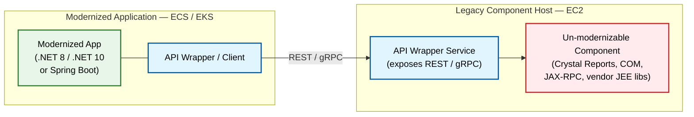

# Common Modernization Evaluation Framework

This framework applies to ALL modernization analyses regardless of source platform — .NET,
WebSphere, WebLogic, WildFly/JBoss EAP, plain Java, or COBOL/Mainframe.

## Mandatory Baseline Inventory — Every Path

Everything in this section must be determined from the source code for **every** path. These are
the questions a modernization specialist would otherwise have to go back to the customer for, and
they are answerable from a repository. Where a specific item genuinely cannot be determined from
the code available, say so explicitly and name it as an open question — do not omit it silently and
do not guess.

Findings from this inventory surface in **section 3 (Visual Architecture State)** and **section 4
(Critical Findings Matrix)**; dependency and licence findings surface in **section 5 (Proprietary
Dependency Analysis)**; database findings in **section 6 (Database Analysis & Migration
Opportunity)**. This inventory adds no new report sections.

### B1. Runtime Version and Vendor — Exact, Not Approximate

- **.NET**: the exact .NET Framework version per project — 3.0 / 3.5 / 4.0 / 4.5 / 4.6.1 / 4.7 / 4.8. The version decides the upgrade path, so "legacy .NET Framework" is not an acceptable finding.
- **Java**: the exact version including patch level where visible (e.g. `1.8.0_292`), **and the JDK vendor** — Oracle JDK, OpenJDK, Amazon Corretto, IBM Semeru/J9, Azul Zulu. Vendor is a finding in its own right because Oracle JDK licensing changed after Java 8, so an Oracle JDK 8 estate carries a commercial exposure that an OpenJDK estate does not.
- **COBOL**: dialect and compiler (IBM Enterprise COBOL and version, Micro Focus, GnuCOBOL).
- Report per-module versions where they differ. A mixed-version estate is itself a finding.

### B2. Build Tooling, Buildability and Build Time

- Build tool and version — msbuild, Maven, Gradle, Ant, JCL-driven compile, or a manual IDE build
- Project file style and package management style (SDK-style vs legacy `.csproj`; `packages.config` vs `PackageReference`; Maven vs Gradle vs Ant)
- Whether a scripted or pipeline build exists at all, or whether the build is a developer-workstation activity
- **Whether the project builds today from a clean checkout, and how long a full build takes**

### B3. Size, Structure and Actual Layering

- Lines of code, and project / module / program count
- The layering **actually in place** — UI, business logic, data access — as opposed to the layering the documentation claims. Report the difference where they diverge
- Layering violations: UI reaching directly into the database, data access carrying domain rules
- Report all counts as **inventory only**. Never convert file, line or project counts into an effort figure

### B4. Where Business Logic Physically Lives

**This single finding drives extraction effort more than any other.** Determine, with named
examples and locations, whether domain logic sits in:

- Web Forms code-behind (`.aspx.cs`, `.aspx.vb`)
- MVC or Web API controllers
- JSP scriptlets (`<% ... %>`) — and at what density
- JSF backing beans doing domain work rather than view coordination
- Servlets handling both request routing and business rules
- COBOL `PROCEDURE DIVISION` paragraphs mixing screen handling, validation and calculation
- Stored procedures, functions and triggers in the database
- A genuine service layer with the domain logic isolated in it

Logic embedded in the UI or view layer means the migration carries a **business-logic extraction
workstream** in addition to the platform migration. Logic in a real service layer means it does
not. These are materially different efforts and the report must distinguish them explicitly rather
than describing both as "refactoring".

### B5. Third-Party and Commercial Dependencies

For **every** third-party and commercial dependency, report: **name, version, licence, vendor, and
whether a target-compatible version exists.**

**State plainly that this is where most modernization programmes stall.** A dependency with no
target-compatible version, an abandoned vendor, or a licence that does not permit the target
deployment model is a hard constraint on the whole programme, not a line item to resolve later.

Additionally flag:
- Dependencies whose vendor no longer exists or no longer ships the product
- Commercial libraries whose licence is tied to a named host, CPU count or OS
- Libraries with no source available and no modern build
- Transitive dependencies pulled in at a version incompatible with the target runtime

These findings belong in **section 5 (Proprietary Dependency Analysis)**, with the licence position
verified via the registry APIs rather than assumed.

### B6. Authentication Mechanism and Its Blast Radius

- The mechanism in use — Windows Authentication / Kerberos, Forms Auth, container-managed security, JAAS, LDAP/Active Directory, SAML, OIDC, Spring Security, RACF/ACF2/Top Secret, or a custom scheme
- **Blast radius**: how many entry points, screens, services and downstream systems depend on it, and whether other applications share the same identity plumbing
- Whether authorization is role-based, and where the role definitions physically live (directory, database table, config file, hard-coded)

Auth rework is routinely the hidden bulk of the effort, and it is rarely contained within one
module.

### B7. Data Access Technology and Version

ADO.NET, Entity Framework 6 (which version), EF Core, NHibernate, Dapper, plain JDBC,
Hibernate/JPA (which version), MyBatis, Spring Data JPA, embedded SQL (`EXEC SQL`), or raw SQL in
strings. Report the version, not just the technology — the upgrade path differs sharply between
versions of the same ORM.

### B8. Session State and Caching

- **Session state**: stateless, in-process, HTTP session, database-backed, or sticky sessions
- **Caching**: in-memory, AppFabric (**end-of-life** — needs replacement in any containerized target), Redis/ElastiCache, Infinispan, Ehcache, or none

**In-process session state blocks containerization and horizontal scaling on every path.** State
this consequence explicitly wherever in-process or sticky sessions are found, and connect it to the
target hosting model rather than reporting it as a neutral observation.

### B9. Integration Inventory

List every upstream and downstream integration with:

- **Protocol** — REST, SOAP, JMS, Kafka, RabbitMQ, MQ, file drop, FTP/SFTP, ESB, database link, screen-scrape
- **Direction** — inbound, outbound, or bidirectional
- **Whether the contract is documented** — OpenAPI/Swagger, WSDL, schema files (XSD, Avro, Protobuf), copybook layouts, or nothing
- Owning system, where determinable from the code

An undocumented contract means behavioural equivalence cannot be verified against a specification,
only against the running system. Also assess whether downstream consumers could tolerate a
router or adapter placed in front of them, since that determines whether an incremental
strangler approach is even viable.

### B10. Architectural Seams

Identify candidate service boundaries — the process, module or activity boundaries that could be
extracted first. Report what makes each a seam (a narrow interface, a distinct data set, low
coupling) and what compromises it (shared mutable state, chatty cross-calls, a shared database
table written from several places).

### B11. Existing Automated Tests

- Presence and framework — MSTest / NUnit / xUnit; JUnit 4 or JUnit 5; Selenium; anything else
- Rough coverage and, more importantly, **what is covered** — domain logic, or only trivial wiring
- Whether a regression pack or documented UAT script exists that could serve as a behavioural baseline
- Test compilation targets: tests compiled against Java 8 or .NET Framework need their own migration, and JUnit 4 → 5 may be required

Without a behavioural baseline, migrated code cannot be proven equivalent to the original. Report
the absence of one as a finding, not an omission.

### B12. Deployment Artifact — Today and Target

What is built and deployed today — WAR, EAR, fat JAR, MSI, IIS site, Windows Service, load module,
Docker image — and where it must end up. A pipeline that expects a WAR or EAR deployment onto an
application server needs rework if the target produces an executable JAR or a container image, and
that rework sits outside the application code.

### B13. Configuration and Secrets Handling

`web.config` and config transforms, `app.config`, `application.properties` / `application.yml`,
JNDI-bound resources, environment variables, HashiCorp Vault, Azure Key Vault, AWS Secrets Manager,
Parameter Store, or credentials hard-coded in source. Note specifically:

- `web.config` transform patterns do not carry over to modern .NET or containers
- Any credential found in source control is a finding in its own right — **report its presence and
  location, never its value**
- Whether configuration is externalised enough for the same artifact to run in several environments

### B14. Dead Code, Duplication and Existing Static Analysis

- Modules, screens or programs that appear unreachable
- Substantial duplication, especially copy-paste variants of the same business rule that may have
  since diverged
- Any existing static-analysis output — SonarQube, Maintainability Index, technical-debt reports,
  compiler warning baselines. Use it rather than regenerating it, and say where it came from

Duplicated business rules that have diverged are a correctness risk during migration, not just
untidiness.

### B15. Native Code and OS-Specific Dependencies

JNI calls, `.so` / `.dll` native libraries, P/Invoke, COM interop, OS-specific file paths, shell-outs
to OS commands, and platform-specific binaries. **Native code blocks containerization** until it is
either recompiled for the target platform and architecture, replaced, or isolated behind an API on a
host that can still run it.

### B16. Delivery Baseline

- Source control platform and branching strategy — and whether the repository holds the whole application, or only part of it
- CI/CD tooling and pipeline maturity, or its absence
- Observability stack — logging, metrics, APM, tracing (CloudWatch, Datadog, Dynatrace, ELK, or none). Extracted services have to appear in whatever dashboards the operations team already uses
- Environments that exist (DEV / SIT / UAT / PROD) as far as the code and pipeline definitions reveal

## Gating Findings

Some findings do not merely add effort — they invalidate the report's own downstream claims until
resolved. These are **gating findings**, and they take the highest priority band in **section 4
(Critical Findings Matrix)**. Do not add a report section for them; use the existing matrix and
state the consequence.

| Gating finding | Why it gates |
|----------------|--------------|
| **The baseline does not build from a clean checkout** | Nothing downstream can be validated. Migrated or generated code cannot be compiled, tested or compared against the original, so every effort and feasibility statement in the report is unverified until the baseline builds |
| **No behavioural baseline exists** — no tests, no regression pack, no documented UAT script | Behavioural equivalence cannot be demonstrated, only asserted |
| **A critical dependency has no target-compatible version and no available source** | The migration cannot complete for that component by any amount of effort; it needs replacement, retirement or isolation |
| **Unmanaged or native binaries with no source and no vendor** | Same constraint, and it may not be resolvable at all |

When a gating finding is present, say so in **section 2 (Executive Summary)** as a stated caveat on
the confidence of the assessment. Frame it as evidence a modernization specialist needs up front,
never as a reason not to proceed.

## Derivable From Source vs Requires Customer Input

The analyzer reads code. Some of what a modernization programme needs is simply not in the code,
and the report is more useful when it is honest about which is which. Split every input into one of
two columns and treat the split as a hard rule.

**Column 1 — Derivable from source. The analyzer MUST determine these and MUST NOT ask the
customer for them.** Everything in the Mandatory Baseline Inventory above sits here, along with the
platform-specific detection in each path's steering file. Asking the customer to hand-answer a
question that the repository already answers wastes their time and is the most common way an
assessment loses credibility.

**Column 2 — Requires customer input. The analyzer MUST name these as open questions, MUST NOT
guess at them, and MUST NOT silently omit them.** None of the following can be derived from source
code:

| Area | Open questions |
|------|----------------|
| Business context | Business criticality; whether the application is customer-facing or internal; the business function it serves in the customer's own words |
| Ownership | Named application owner, solution architect and development lead |
| Lifecycle | Whether the application is actively developed or frozen; decommission plans in the next 12–18 months |
| Intent | End-state vision; disposition (Retire / Retain / Rehost / Replatform / Refactor); whether an incremental approach or a full rewrite is intended |
| Risk appetite | Blast radius if a given module breaks — who is affected and for how long |
| Proof-of-concept scope | Which workflow is nominated as the first candidate, and the success criteria for it |
| Timeline | Hard deadlines — licence renewal, data-centre exit, audit, end-of-support dates |
| Compliance | Regulatory constraints, data-residency and cross-border restrictions |
| People | Developer availability, allocation percentage, and current skill level in the target stack |
| Non-functional requirements | Concurrent users, peak transactions per second, latency SLA, availability target |
| Environments | Whether a non-production environment can be made available, and with what data |
| Data sensitivity | Data classification — PII, payment, or otherwise regulated data |
| AI governance | Approved AI models and services, and whether source code may be processed by cloud-hosted AI services or must remain in a named region, VPC or account |
| Governance | Sign-off authorities and approval gates |
| Scope boundaries | Whether database migration is in scope; whether a front-end rewrite is in scope; whether a language change is in scope |

**How to present column 2.** Surface these as explicitly-flagged open items in **section 4**, and
as stated caveats on confidence in **section 2**. Present them as inputs a modernization specialist
will gather from the customer — which is normal and expected at this stage — never as analyzer
failures or as gaps in the customer's readiness. Where an open question would change the
recommendation if answered differently, say which recommendation depends on it.

**Never fabricate a column 2 answer.** An invented business criticality, an assumed SLA or a guessed
owner is worse than a stated gap, because a reader cannot tell it apart from a derived finding.

## Universal Evaluation Areas

### 1. Architecture Assessment

Evaluate the current architecture for modernization readiness:

- **Monolithic vs Modular**: Identify if application is monolithic or has modular components
- **Layering Patterns**: Assess Domain/Data/Web/Infrastructure separation
- **Coupling Analysis**: Measure inter-component dependencies
- **Layering Violations**: Identify cross-layer dependencies that violate architecture
- **Service Boundaries**: Identify potential microservice decomposition points

### 2. Code Quality

Assess codebase maintainability:

- **Cyclomatic Complexity**: Measure method/class complexity
- **Maintainability Index**: Overall code maintainability score
- **Code Duplication**: Identify duplicated code blocks
- **Technical Debt**: Estimate accumulated technical debt
- **Code Coverage**: Existing test coverage percentage

### 3. DevOps Readiness

Evaluate CI/CD and deployment maturity:

- **CI/CD Pipeline**: Existing automation for build/test/deploy
- **Container Readiness**: Dockerfile or containerization present
- **Infrastructure as Code**: CloudFormation, CDK, Terraform usage
- **Environment Parity**: Dev/staging/prod consistency
- **Deployment Frequency**: Current release cadence

### 4. Security Patterns

Assess security implementation:

- **Authentication Mechanisms**: Current auth patterns (LDAP, OAuth, custom)
- **Authorization Patterns**: Role-based access control implementation
- **Secrets Management**: How credentials are stored and accessed
- **Transport Security**: TLS/SSL configuration
- **Security Vulnerabilities**: Known CVEs in dependencies

### 5. Observability

Evaluate monitoring and logging:

- **Logging Patterns**: Structured vs unstructured logging
- **Log Aggregation**: Centralized logging solution
- **Metrics Collection**: Application and infrastructure metrics
- **Distributed Tracing**: Request tracing across services
- **Alerting**: Monitoring and alerting configuration

### 6. Database Layer

Assess data access patterns:

- **ORM Usage**: Entity Framework, Hibernate, JPA, etc.
- **Connection Patterns**: Connection pooling, transaction management
- **Stored Procedure Complexity**: Count and complexity of stored procedures
- **Database-Specific Features**: Vendor-specific SQL features in use
- **Data Model Complexity**: Relationship complexity, normalization level

### 7. Testing Maturity

Evaluate test coverage and quality:

- **Unit Test Coverage**: Percentage of code covered by unit tests
- **Integration Tests**: Presence of integration test suites
- **End-to-End Tests**: Automated E2E testing
- **Performance Tests**: Load and stress testing capability
- **Test Automation**: CI integration of test suites

### 8. Documentation Quality

Assess existing documentation:

- **Architecture Diagrams**: Current state documentation
- **API Documentation**: OpenAPI/Swagger or equivalent
- **Runbooks**: Operational documentation
- **Code Comments**: Inline documentation quality
- **README Files**: Project documentation completeness

## Risk of Inaction Framework

For EVERY finding, articulate the business impact if not modernized:

| Risk Category | Questions to Answer |
|---------------|---------------------|
| Security | What vulnerabilities will emerge? What compliance risks exist? |
| Performance | How will performance degrade over time? |
| Support Lifecycle | When do frameworks/libraries reach EOL? |
| Competitive Disadvantage | How does technical debt impact time-to-market? |
| Cost Implications | What are the ongoing maintenance costs? |
| Talent Acquisition | How hard is it to hire developers for legacy tech? |
| Scalability | Can the system handle future growth? |

## Strategic Alignment Frameworks

### AWS 7 Rs of Migration

Classify each modernization pathway:

| Strategy | Description | When to Use |
|----------|-------------|-------------|
| **Rehost** | Lift-and-shift to cloud | Quick migration, minimal changes |
| **Replatform** | Lift-tinker-and-shift | Minor optimizations during migration |
| **Refactor** | Re-architect for cloud-native | Significant modernization needed |
| **Repurchase** | Move to SaaS | Replace with commercial solution |
| **Retire** | Decommission | Application no longer needed |
| **Retain** | Keep as-is | Not ready for migration |
| **Relocate** | Hypervisor-level migration | VMware to AWS migration |

### Gartner TIME Framework

Classify applications for portfolio decisions:

| Classification | Description | Action |
|----------------|-------------|--------|
| **Tolerate** | Keep running with minimal investment | Maintain only |
| **Invest** | Modernize and enhance | Active development |
| **Migrate** | Move to new platform | Platform change |
| **Eliminate** | Decommission or replace | Remove from portfolio |

## Cost-Benefit Analysis Framework

### Infrastructure Cost Comparison

Use qualitative levels (Low/Medium/High/Very High) for:

- Current infrastructure costs
- Modernized infrastructure costs
- Licensing costs (current vs target)
- Operational overhead
- Savings potential

### ROI Assessment

Evaluate return on investment:

- Investment level required
- Expected returns (cost savings, efficiency gains)
- Time to value realization
- Risk-adjusted returns

## Report Quality Standards

### Visualization Requirements

- Use Mermaid.js for ALL diagrams
- NEVER use ASCII art
- Include architecture diagrams (current and target state)
- Include dependency graphs
- Include migration roadmap visualizations

### Evidence-Based Analysis

- Reference actual files, packages, and patterns found
- Provide specific metrics (file counts, LOC, dependency counts)
- Include code examples for migration patterns
- Back all claims with codebase evidence

## Hybrid Modernization Pattern: Legacy Component Isolation

In some cases, certain libraries or components are tightly coupled to the original architecture and have no modern equivalent for the target platform. When this is detected, recommend a **hybrid modernization** approach: modernize everything possible to the target architecture, and isolate the un-modernizable components on a dedicated EC2 instance with API wrappers.

### When to Apply

This pattern applies when the analysis finds dependencies that:
- Have no compatible version for the target platform/OS
- Are tightly coupled to the legacy runtime and cannot be replaced
- Would require prohibitive effort to rewrite from scratch

### Platform-Specific Examples

| Platform | Un-Modernizable Dependency Example | Why It Can't Modernize |
|----------|-------------------------------------|------------------------|
| .NET Framework | Crystal Reports | No Linux-compatible version; requires Windows + .NET Framework runtime |
| .NET Framework | Windows-only system DLLs, COM components | Tied to Windows OS; no cross-platform equivalent |
| .NET Framework | Legacy .NET Framework-only DLLs (no .NET 8 port) | Vendor abandoned or closed-source with no modern build |
| WebSphere / WebLogic | Deprecated J2EE libraries (e.g., JAX-RPC, Entity Beans) | Removed from Jakarta EE; no Spring Boot equivalent |
| WebSphere / WebLogic | Vendor-specific JEE extensions (e.g., IBM MQ JEE bindings, WebLogic T3 protocol) | Proprietary APIs with no open-source replacement |

### Recommended Architecture

**Colour legend:**

| Colour | Meaning |
|--------|---------|
| 🟢 Green | Modernized application running on the target platform |
| 🔵 Blue | API boundary components — the wrapper client and the wrapper service that isolate the legacy dependency |
| 🔴 Red | The un-modernizable legacy component, retained on a host that can still run it |

The legacy host runs whatever runtime the component requires — Windows Server with .NET Framework for
COM or Crystal Reports, or a JEE application server for deprecated J2EE libraries. The wrapper service
is the only thing the modernized application talks to, which is what makes the legacy component
replaceable later without touching the caller.

### Implementation Guidance

1. **Identify** all un-modernizable components during the codebase scan
2. **Extract** these components into a standalone service with a clean API boundary
3. **Deploy** the legacy service on an EC2 instance running the required legacy runtime (Windows Server for .NET Framework, or a JEE app server for WebSphere/WebLogic components)
4. **Wrap** each legacy component with a REST or gRPC API so the modernized application can interface with it
5. **Modernize** everything else to the target architecture (ECS/EKS on Linux)

### Report Guidance

When this pattern is recommended, the report should:
- List each un-modernizable component with the specific reason it cannot be migrated
- Show the wrapper API design for each isolated component
- Include the EC2 legacy host in the target architecture diagram
- Factor the EC2 instance cost into the cost-benefit analysis
- Note this as a transitional architecture — the long-term goal is to eventually replace or retire the legacy components
