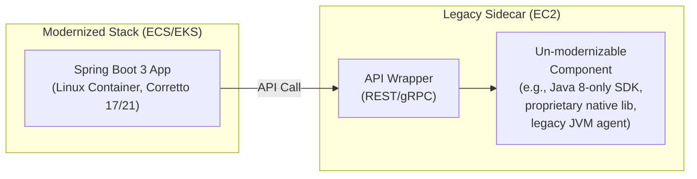
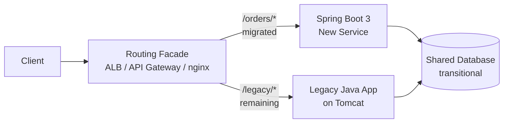
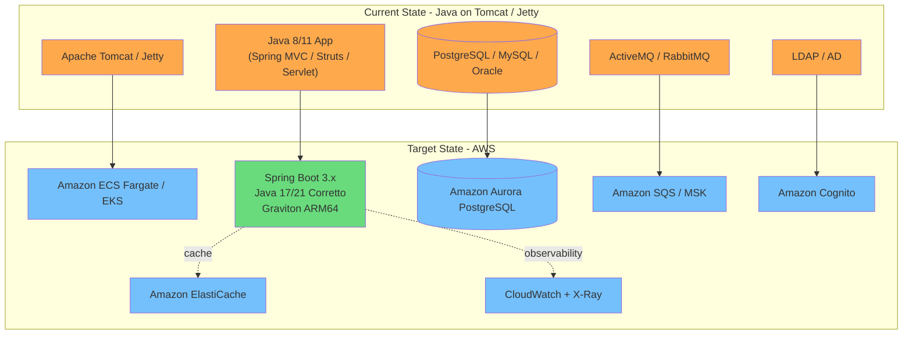

# Java 8/11 to Spring Boot 3.x + AWS Modernization

## Objective

Migrate generic server-side Java applications (Servlet/JSP on Tomcat/Jetty, Spring MVC, Struts, JSF, Dropwizard, Java SE batch, and similar non-application-server workloads) to Spring Boot 3.x with Java 17 or 21, targeting AWS container-based deployments optimized for Graviton processors.

This guide applies when a Java codebase exists WITHOUT strong IBM WebSphere or Oracle WebLogic markers. For application-server-anchored workloads, use `websphere-to-springboot.md` or `weblogic-to-springboot.md` instead.

## Platform Detection

### Positive Java Indicators

Build and project markers:
- `pom.xml` (Maven)
- `build.gradle`, `build.gradle.kts`, `settings.gradle` (Gradle)
- `src/main/java/**/*.java`, `src/test/java/**/*.java`
- `src/main/resources/**/*.properties`, `**/*.yml`, `**/*.yaml`
- `src/main/webapp/WEB-INF/web.xml` (classic servlet descriptor)
- `Dockerfile`, `jib-maven-plugin`, `spring-boot-maven-plugin`

JDK version signals (prioritize, in order):
- `<maven.compiler.source>` / `<maven.compiler.target>` / `<maven.compiler.release>` in `pom.xml`
- `sourceCompatibility` / `targetCompatibility` / `languageVersion` in Gradle
- `.java-version`, `.sdkmanrc`, `.tool-versions`
- `jdk-11`, `jdk-17`, `openjdk:11`, `openjdk:17`, `amazoncorretto` in Dockerfile/CI

### Negative Indicators (Rule Out Other Platforms)

To confirm this is a plain Java workload and NOT an application-server workload, verify the absence of:

| Signal | If Present, Redirect To |
|--------|-------------------------|
| `ibm-web-bnd.xml`, `ibm-web-ext.xml`, `ibm-application-*.xml`, `ibm-ejb-jar-*.xml` | `websphere-to-springboot.md` |
| `com.ibm.websphere.*`, `com.ibm.ws.*`, `com.ibm.wsspi.*`, `com.ibm.mq.*` imports | `websphere-to-springboot.md` |
| `weblogic.xml`, `weblogic-application.xml`, `weblogic-ejb-jar.xml`, `plan.xml` | `weblogic-to-springboot.md` |
| `weblogic.*`, `oracle.weblogic.*`, `com.bea.*`, `oracle.toplink.*` imports | `weblogic-to-springboot.md` |
| `weblogic-client.jar`, `wlthint3client.jar`, `com.ibm.ws.runtime.jar` on classpath | Corresponding guide |

### Framework Sub-Detection

Once a Java codebase is confirmed, identify the web/runtime framework to tune migration recommendations:

**Spring family:**
- `org.springframework.boot` in dependencies → Spring Boot (check version: 1.x/2.x/3.x)
- `org.springframework.web.servlet.*`, `@Controller`, `@RestController` → Spring MVC
- `org.springframework:spring-webmvc` without Spring Boot → classic Spring MVC on Tomcat
- `org.springframework:spring-core` 4.x or 5.x → pre-Boot or Boot 2.x era

**Other Java web frameworks:**
- `org.apache.struts2.*`, `struts.xml` → Struts 2
- `org.apache.struts.action.*`, `struts-config.xml` → Struts 1.x (legacy)
- `javax.faces.*`, `jakarta.faces.*`, `faces-config.xml` → JSF / Jakarta Faces
- `io.dropwizard.*` → Dropwizard
- `io.micronaut.*` → Micronaut
- `io.quarkus.*` → Quarkus
- `com.vaadin.*` → Vaadin
- `org.eclipse.jetty.*` embedded → Jetty-hosted app
- `play.*`, `build.sbt` → Play Framework

**Servlet / JSP era:**
- `javax.servlet.*` / `jakarta.servlet.*` imports
- `*.jsp`, `*.jspx`, `*.tag` files under `WEB-INF/`
- `*.tld` tag library descriptors
- Classic `web.xml` deployment descriptor

**Data access:**
- `javax.persistence.*` / `jakarta.persistence.*` → JPA (check provider: Hibernate, EclipseLink, OpenJPA)
- `org.hibernate.*` → Hibernate direct
- `org.mybatis.*`, `mapper.xml` → MyBatis
- `org.jooq.*` → jOOQ
- `spring-jdbc`, `JdbcTemplate` → Spring JDBC
- `persistence.xml` under `META-INF/`

**Messaging:**
- `javax.jms.*` / `jakarta.jms.*` → JMS (check broker: ActiveMQ, RabbitMQ, Artemis)
- `org.apache.kafka.*`, `spring-kafka` → Kafka
- `com.rabbitmq.*`, `spring-rabbit` → RabbitMQ

**Batch / scheduling:**
- `org.springframework.batch.*` → Spring Batch
- `org.quartz.*` → Quartz Scheduler
- `javax.batch.*` / `jakarta.batch.*` → JSR-352

**Build tool:**
- `pom.xml` → Maven
- `build.gradle` (Groovy DSL) or `build.gradle.kts` (Kotlin DSL) → Gradle
- `build.sbt` → SBT

**Runtime container:**
- `<packaging>war</packaging>` → deployed to external servlet container (Tomcat/Jetty/etc.)
- `<packaging>jar</packaging>` with `spring-boot-starter` → embedded (self-contained)
- `Dockerfile` base image → Tomcat, Jetty, OpenJDK, Corretto, distroless, etc.

## Target Architecture

All Java migrations target:
- Spring Boot 3.x with Java 17 (baseline) or Java 21 (recommended for new projects)
- Reactive architecture (WebFlux, R2DBC, Reactor) where suitable, or servlet stack (Spring MVC + Tomcat embedded) where blocking I/O dominates
- AWS container-based deployments (ECS Fargate / EKS)
- Graviton processor optimization
- Amazon Corretto JDK

**Reactive vs Servlet Decision:**

| Workload Profile | Recommended Target |
|------------------|--------------------|
| High-concurrency I/O (API gateway, streaming, event fan-out) | Spring Boot 3 + WebFlux (reactive) |
| Mixed CRUD APIs with moderate traffic | Spring Boot 3 + Spring MVC (servlet, Tomcat embedded) |
| Heavy blocking SDK/driver usage (no reactive equivalent) | Spring Boot 3 + Spring MVC |
| Data-intensive batch | Spring Boot 3 + Spring Batch |

The rest of this guide assumes Spring Boot 3 as the target and covers both reactive and servlet patterns.

## Java Modernization Decision Tree

Use this tree as the base logic. When generating the report, walk through each node and map actual findings from the codebase scan to show readers exactly which attributes were extracted and how they influenced the recommendation.

```mermaid
flowchart TD
    Start([Start: Java Application])

    CheckJDK{Current JDK Version?}
    JDK8[Java 8]
    JDK11[Java 11]
    JDK17Plus[Java 17+]

    CheckSpring{Uses Spring?}
    HasSpring{Spring Boot Version?}
    NoSpring[No Spring / Plain Servlet / Struts / JSF / Dropwizard]

    SpringBoot3[Spring Boot 3.x<br/>Already Modern]
    SpringBoot2[Spring Boot 2.x<br/>Upgrade Path]
    SpringBoot1[Spring Boot 1.x<br/>Multi-Step Upgrade]
    SpringLegacy[Spring 4.x / 5.x<br/>No Boot]

    CheckNamespace{javax.* or jakarta.*?}
    JavaxOnly[javax.* Only<br/>Namespace Migration Required]
    Mixed[Mixed javax/jakarta<br/>Consolidate to jakarta]
    JakartaOnly[jakarta.* Only<br/>Spring Boot 3 Ready]

    CheckRemovedModules{Uses Removed JDK Modules?<br/>(java.xml.bind, java.activation,<br/>java.corba, sun.*)}
    AddJakartaDeps[Add Jakarta Standalone Deps<br/>jakarta.xml.bind, jakarta.activation]
    RewriteInternal[Rewrite sun.* / JDK-Internal Usage]

    CheckReactiveFit{Workload I/O Profile?}
    ReactiveFit[High-Concurrency I/O<br/>→ WebFlux + R2DBC]
    ServletFit[Blocking / CRUD<br/>→ Spring MVC Embedded Tomcat]
    BatchFit[Batch / ETL<br/>→ Spring Batch]

    CheckPackaging{WAR or JAR?}
    WarToJar[Convert WAR → Embedded JAR<br/>Remove external container]
    AlreadyJar[Already Embedded<br/>Container Ready]

    CheckArm{All Libs/Agents Support<br/>linux-arm64?}
    TargetGraviton[Target: AWS Graviton / ARM64]
    TargetLinuxX86[Target: Linux x86-64]

    Start --> CheckJDK
    CheckJDK --> JDK8
    CheckJDK --> JDK11
    CheckJDK --> JDK17Plus
    JDK8 --> CheckSpring
    JDK11 --> CheckSpring
    JDK17Plus --> CheckSpring

    CheckSpring -- Yes --> HasSpring
    CheckSpring -- No --> NoSpring
    HasSpring --> SpringBoot3
    HasSpring --> SpringBoot2
    HasSpring --> SpringBoot1
    HasSpring --> SpringLegacy

    SpringBoot3 --> CheckNamespace
    SpringBoot2 --> CheckNamespace
    SpringBoot1 --> CheckNamespace
    SpringLegacy --> CheckNamespace
    NoSpring --> CheckNamespace

    CheckNamespace --> JavaxOnly
    CheckNamespace --> Mixed
    CheckNamespace --> JakartaOnly

    JavaxOnly --> CheckRemovedModules
    Mixed --> CheckRemovedModules
    JakartaOnly --> CheckRemovedModules

    CheckRemovedModules -- Yes --> AddJakartaDeps
    CheckRemovedModules -- Yes --> RewriteInternal
    CheckRemovedModules -- No --> CheckReactiveFit
    AddJakartaDeps --> CheckReactiveFit
    RewriteInternal --> CheckReactiveFit

    CheckReactiveFit --> ReactiveFit
    CheckReactiveFit --> ServletFit
    CheckReactiveFit --> BatchFit

    ReactiveFit --> CheckPackaging
    ServletFit --> CheckPackaging
    BatchFit --> CheckPackaging

    CheckPackaging -- WAR --> WarToJar
    CheckPackaging -- JAR --> AlreadyJar

    WarToJar --> CheckArm
    AlreadyJar --> CheckArm

    CheckArm -- Yes --> TargetGraviton
    CheckArm -- No --> TargetLinuxX86

    classDef termination fill:#f9f9f9,stroke:#333,stroke-width:2px;
    classDef decision fill:#e1f5fe,stroke:#01579b,stroke-width:2px;
    classDef process fill:#fff9c4,stroke:#fbc02d,stroke-width:2px;
    classDef success fill:#e8f5e9,stroke:#2e7d32,stroke-width:4px;

    class Start termination;
    class CheckJDK,CheckSpring,HasSpring,CheckNamespace,CheckRemovedModules,CheckReactiveFit,CheckPackaging,CheckArm decision;
    class JDK8,JDK11,JDK17Plus,SpringBoot3,SpringBoot2,SpringBoot1,SpringLegacy,NoSpring,JavaxOnly,Mixed,JakartaOnly,AddJakartaDeps,RewriteInternal,WarToJar,AlreadyJar process;
    class TargetGraviton,TargetLinuxX86,ReactiveFit,ServletFit,BatchFit success;
```

### Decision Tree Findings Map Template

When generating the report, include a **Decision Tree Findings Map** section that walks through each node and captures evidence from the scan:

| Decision Node | What We Scanned | What We Found | Result |
|---------------|-----------------|---------------|--------|
| Current JDK Version? | `maven.compiler.source`, Gradle `sourceCompatibility`, Dockerfile base image | _(e.g., "Java 11, OpenJDK")_ | 8 / 11 / 17+ |
| Uses Spring? | `pom.xml`/`build.gradle` dependencies, `@Controller`/`@Service` annotations | _(e.g., "Spring Boot 2.7.18 detected")_ | Yes/No |
| Spring Boot Version? | `spring-boot-starter-parent` version or BOM | _(e.g., "2.7.18 — within OSS support")_ | 3.x / 2.x / 1.x / Legacy |
| javax.* or jakarta.*? | Import scan across `src/main/java` | _(e.g., "javax.servlet, javax.persistence throughout")_ | javax / mixed / jakarta |
| Uses Removed JDK Modules? | Imports of `javax.xml.bind`, `javax.activation`, `sun.*`, CORBA, Nashorn | _(e.g., "javax.xml.bind in 3 JAXB classes")_ | Yes/No |
| Workload I/O Profile? | Controller count, blocking SDK usage, concurrency patterns, existing reactive libraries | _(e.g., "Mostly CRUD, blocking JDBC")_ | Reactive / Servlet / Batch |
| WAR or JAR? | `<packaging>` in `pom.xml`, Gradle plugin, presence of `WEB-INF` | _(e.g., "WAR packaged for external Tomcat")_ | WAR / JAR |
| ARM64 Support? | Dependency scan for native libs, agent compatibility | _(e.g., "All JVM libs are pure Java")_ | Yes/No |

Highlight the path taken with ✅ and branches not applicable with ⚪ so readers can trace codebase evidence to the recommended target.

## JDK Upgrade Considerations (Java 8/11 → 17/21)

### Removed or Deprecated JDK Modules

Between Java 8 and Java 17, several modules were removed from the JDK. Replacements are available as standalone Jakarta artifacts.

| Removed Module | Removed In | Replacement (Standalone Dependency) |
|----------------|------------|-------------------------------------|
| `java.xml.bind` (JAXB) | JDK 11 | `jakarta.xml.bind:jakarta.xml.bind-api` + `org.glassfish.jaxb:jaxb-runtime` |
| `java.activation` (JAF) | JDK 11 | `jakarta.activation:jakarta.activation-api` + `org.eclipse.angus:angus-activation` |
| `java.xml.ws` (JAX-WS) | JDK 11 | `jakarta.xml.ws:jakarta.xml.ws-api` + `com.sun.xml.ws:jaxws-rt` |
| `java.xml.ws.annotation` | JDK 11 | `jakarta.annotation:jakarta.annotation-api` |
| `java.corba` | JDK 11 | No direct replacement — modernize to REST/gRPC/RSocket |
| `java.transaction` | JDK 11 | `jakarta.transaction:jakarta.transaction-api` |
| Nashorn JavaScript engine | JDK 15 | GraalJS or externalize scripting |
| Applet API (`java.applet`, `javax.swing.JApplet`) | JDK 17 (deprecated) / JDK 21 (removed) | Browser-based replacement |
| Security Manager | JDK 17 (deprecated for removal) | AWS IAM + network controls + runtime policies |

### JDK-Internal APIs (sun.*, com.sun.*)

The strong encapsulation introduced by the Java Platform Module System (JPMS) and tightened in JDK 17 disallows reflective access to JDK internals. Scan for:

| Pattern | Impact | Replacement |
|---------|--------|-------------|
| `sun.misc.Unsafe` | Warning in JDK 11, removal planned | `VarHandle`, `MethodHandle` (JEP 193) |
| `sun.misc.BASE64Encoder` / `Decoder` | Removed | `java.util.Base64` |
| `sun.reflect.*` | Encapsulated | Public `java.lang.reflect` APIs |
| `com.sun.image.codec.jpeg.*` | Removed | `javax.imageio.ImageIO` |
| `com.sun.org.apache.xerces.*` | Encapsulated | Standard `javax.xml.parsers` |
| `sun.security.*` | Encapsulated | `java.security` public APIs / BouncyCastle |

### Language and Platform Enhancements Available (Java 17 / 21)

These are capabilities to leverage during and after migration:

| Feature | Introduced | Migration Benefit |
|---------|-----------|-------------------|
| Records | JDK 14 (stable 16) | Replaces DTO / value-object boilerplate |
| Sealed classes | JDK 17 | Exhaustive pattern matching for domain types |
| Pattern matching for `instanceof` | JDK 16 | Cleaner type-checking code |
| Pattern matching for `switch` | JDK 21 | Replaces visitor patterns and type-cascades |
| Text blocks | JDK 15 | Clean multi-line SQL / JSON / HTML literals |
| `var` local variable inference | JDK 10 | Reduces noise in local declarations |
| Virtual threads (Project Loom) | JDK 21 | Servlet Spring MVC with Loom provides reactive-like scalability without Reactor API |
| Structured concurrency (preview) | JDK 21 | Cleaner concurrent task scoping |
| `HttpClient` API | JDK 11 | Replaces `HttpURLConnection` / Apache HTTPClient where possible |

### GC and Runtime Tuning

Java 8 era tuning rarely transfers. Recalibrate on Java 17/21:

| Aspect | Java 8 Default | Java 17/21 Recommendation |
|--------|---------------|---------------------------|
| Default collector | Parallel GC | G1GC (default since JDK 9) |
| Low-pause GC | CMS (removed in JDK 14) | ZGC or Shenandoah |
| Container awareness | Flags required | Automatic since JDK 10 |
| Memory flag | `-Xmx` fixed | `-XX:MaxRAMPercentage` (container-friendly) |
| Class Data Sharing | Off by default | Application CDS — faster startup |

### Common Library Upgrades

| Library | Pre-Migration Concern | Target |
|---------|----------------------|--------|
| Log4j 1.x | End-of-life since 2015, unpatched CVEs | Log4j 2.x (or SLF4J + Logback) |
| Log4j 2.x (pre-2.17) | Log4Shell (CVE-2021-44228) | Log4j 2.17.1+ |
| Apache Commons Collections 3.x | Deserialization CVEs | 4.x or replacement |
| Jackson 2.9 / earlier | Multiple CVEs | Jackson 2.15+ (aligned with Spring Boot 3) |
| Hibernate 5.x | javax.persistence | Hibernate 6.x (jakarta.persistence) |
| Spring Framework 4.x / 5.x | javax.* namespace | Spring Framework 6.x (jakarta.*) |
| Spring Security 5.x | javax.servlet | Spring Security 6.x (jakarta.servlet) |
| JUnit 4 | Legacy runner model | JUnit 5 (Jupiter) |
| Mockito 1.x / 2.x | JDK 17 reflection issues | Mockito 5.x (mockito-core) |
| Lombok 1.18.22 or older | Fails on JDK 17+ | Lombok 1.18.30+ |
| MapStruct 1.3.x | javax annotations | MapStruct 1.5.5+ (jakarta aware) |
| javax.annotation 1.x | Removed API | jakarta.annotation 2.x |

## javax → jakarta Namespace Migration

Spring Boot 3.x and Spring Framework 6.x require the Jakarta EE 9+ namespace. This is the single largest breaking change in the migration.

### Affected Packages

| javax.* | jakarta.* |
|---------|-----------|
| `javax.servlet` | `jakarta.servlet` |
| `javax.servlet.http` | `jakarta.servlet.http` |
| `javax.persistence` | `jakarta.persistence` |
| `javax.validation` | `jakarta.validation` |
| `javax.annotation` | `jakarta.annotation` |
| `javax.ejb` | `jakarta.ejb` |
| `javax.jms` | `jakarta.jms` |
| `javax.inject` | `jakarta.inject` |
| `javax.mail` | `jakarta.mail` |
| `javax.transaction` | `jakarta.transaction` |
| `javax.ws.rs` | `jakarta.ws.rs` |
| `javax.xml.bind` | `jakarta.xml.bind` |
| `javax.xml.ws` | `jakarta.xml.ws` |
| `javax.websocket` | `jakarta.websocket` |

### Migration Approach

The Eclipse Transformer or Jakarta Migration Tool performs bulk namespace replacement. Spring Boot's `spring-boot-starter-parent:3.x` transitively pulls the jakarta-namespace versions. For Maven projects:

1. Upgrade `spring-boot-starter-parent` to `3.x`
2. Remove any standalone `javax.*` API dependencies
3. Add jakarta equivalents only where Spring Boot does not bring them transitively
4. Run `./mvnw dependency:tree | grep javax` to catch leftover javax artifacts
5. Run a global find/replace for `javax.servlet`, `javax.persistence`, `javax.validation`, `javax.annotation` imports
6. Review and update any `web.xml`, `persistence.xml`, or custom annotation processors

Tools that help:
- **OpenRewrite** recipe: `org.openrewrite.java.migrate.UpgradeToJava17` + `org.openrewrite.java.spring.boot3.UpgradeSpringBoot_3_0`
- **Eclipse Transformer** for WAR-level namespace rewrite
- **Spring Boot Migrator** (`spring-boot-migrator`) for scan + automated refactoring
- **IntelliJ IDEA** structural search & replace templates

## Migration Strategy Bank

### Framework Migration Matrix

| Source | Target Spring Boot 3 Equivalent |
|--------|---------------------------------|
| Servlet / JSP on Tomcat (plain) | Spring Boot 3 + Spring MVC + embedded Tomcat |
| Struts 2 Actions | `@Controller` / `@RestController` |
| Struts 1 Actions | `@Controller` + full rewrite of action forms |
| JSF / Jakarta Faces | Spring MVC + Thymeleaf, or SPA frontend (React/Angular/Vue) + REST |
| Spring MVC (XML-config, pre-Boot) | Spring Boot 3 auto-configuration + `@SpringBootApplication` |
| Spring Boot 1.x | Spring Boot 3.x (two-step: 1.x → 2.7 → 3.x) |
| Spring Boot 2.x | Spring Boot 3.x (namespace + version alignment) |
| Dropwizard | Spring Boot 3 WebFlux or MVC |
| JAX-RS / Jersey (standalone) | Spring MVC (preferred) or keep Jersey via `spring-boot-starter-jersey` as a transitional bridge |
| Vaadin (classic) | Vaadin Flow on Spring Boot 3, or SPA frontend |
| Apache Wicket | Spring MVC + Thymeleaf |
| Play Framework 2.x | Spring Boot 3 WebFlux |

### Data Access Migration

| Source | Target |
|--------|--------|
| Plain JDBC + `DriverManager` | `JdbcTemplate` or Spring Data JPA |
| Hibernate 5.x (javax.persistence) | Hibernate 6.x (jakarta.persistence) or Spring Data JPA |
| MyBatis 3.4 | MyBatis-Spring-Boot 3.x |
| JPA 2.x (javax) | JPA 3.x (jakarta) via Spring Data JPA 3.x |
| jOOQ 3.14 or earlier | jOOQ 3.19+ (jakarta-aware) |
| Blocking JDBC (reactive target) | R2DBC + Spring Data R2DBC |

### Messaging Migration

| Source | Target |
|--------|--------|
| ActiveMQ 5.x (javax.jms) | ActiveMQ Classic/Artemis with `spring-boot-starter-artemis` (jakarta), or Amazon SQS/MSK |
| RabbitMQ via `spring-amqp` | `spring-boot-starter-amqp` 3.x, or Amazon MQ for RabbitMQ |
| Apache Kafka via `spring-kafka` 2.x | `spring-kafka` 3.x / Reactor Kafka, or Amazon MSK |
| JMS MDB (on plain Tomcat with external MQ) | Spring JMS listener or Reactor messaging |

### Scheduling and Batch

| Source | Target |
|--------|--------|
| Quartz Scheduler (standalone) | Spring Batch + Spring Boot Scheduling, or AWS Step Functions |
| Spring Batch 4.x | Spring Batch 5.x |
| JSR-352 (`javax.batch`) | Spring Batch 5.x |
| `@Scheduled` on Spring 5 | `@Scheduled` on Spring 6 (jakarta) |
| Cron via `cron4j` | Spring `@Scheduled` / AWS EventBridge Scheduler |

### Security

| Source | Target |
|--------|--------|
| Spring Security 5.x (javax.servlet) | Spring Security 6.x (jakarta.servlet) |
| Container-managed auth (`web.xml` security constraints) | Spring Security config class |
| JAAS login modules | Spring Security `AuthenticationProvider` |
| Shiro | Spring Security 6.x |
| Custom filter-based auth | Spring Security filter chain |
| Basic/Form auth | JWT / OAuth2 via Spring Security OAuth2 Resource Server |
| LDAP binding | `spring-security-ldap` or Amazon Cognito federated |

### Observability

| Source | Target |
|--------|--------|
| Log4j 1.x | Log4j 2.x or Logback (Spring Boot default) |
| Commons Logging | SLF4J facade (Spring Boot default) |
| Custom JMX beans | Spring Boot Actuator + Micrometer + CloudWatch |
| `java.util.logging` only | SLF4J bridge (`jul-to-slf4j`) + Logback |
| No distributed tracing | Micrometer Tracing + AWS X-Ray |

### Build and Packaging

| Source | Target |
|--------|--------|
| Maven 3.3 or older | Maven 3.9+ (required for Spring Boot 3) |
| Gradle 6.x or older | Gradle 8.x+ |
| WAR deployed to external Tomcat | Executable JAR with embedded Tomcat (Spring Boot default) |
| EAR with WARs | Split into multiple Spring Boot services |
| Ant | Migrate to Maven or Gradle |
| Fat JAR via `maven-assembly-plugin` | `spring-boot-maven-plugin` repackage |

## Tomcat Embedded vs External

Spring Boot's default packaging is an executable JAR with an embedded servlet container (Tomcat 10+ for Spring Boot 3). Two main transition paths exist depending on current packaging:

### Path A: WAR on External Tomcat → Embedded JAR

1. Change `<packaging>war</packaging>` → `<packaging>jar</packaging>`
2. Remove `tomcat-embed-*` scope `provided` overrides
3. Remove `SpringBootServletInitializer` subclass (no longer needed)
4. Move `web.xml` contents into Spring Boot configuration properties
5. Move `META-INF/context.xml` into `application.yml` (datasources, JNDI → Spring DI)
6. Keep `src/main/webapp/` only if still serving static content; prefer `src/main/resources/static/`

### Path B: WAR on External Tomcat → WAR on Embedded Tomcat (Transitional)

Useful when ops needs to keep deploying WARs during transition:

1. Keep `<packaging>war</packaging>`
2. Extend `SpringBootServletInitializer` in the main class
3. Mark `spring-boot-starter-tomcat` as `provided`
4. Deploy to an external Tomcat 10.1+ (Jakarta namespace)

This is a transition state and should be retired in favor of Path A once ops tooling catches up.

### Tomcat Version Compatibility

| Tomcat | Servlet API | Namespace | Spring Boot Compatible |
|--------|-------------|-----------|------------------------|
| 8.5.x / 9.x | 3.1 / 4.0 | javax.servlet | Spring Boot 2.x only |
| 10.0.x / 10.1.x | 5.0 / 6.0 | jakarta.servlet | Spring Boot 3.x |

## Hybrid Modernization: EC2 Legacy Sidecar Pattern

In some cases, components or libraries are tightly coupled to legacy APIs, Java 8 JDK internals, or vendor-specific non-open-source middleware that cannot be cleanly ported. When these components are identified, recommend a hybrid approach:

### Pattern: Modernize + Legacy Sidecar

1. Modernize everything possible to Spring Boot 3 / Linux containers
2. Isolate the un-modernizable components into a dedicated EC2 instance running the original Java runtime (e.g., Java 8 + old Tomcat + proprietary library)
3. Build API wrappers (REST or gRPC) around the legacy components on the EC2 instance
4. Have the modernized Spring Boot application call the legacy sidecar through these wrappers



### When to Apply This Pattern

- A critical dependency has no Java 17+ / jakarta-namespace version
- A vendor SDK is distributed only as a JDK 8 JAR with no upgrade path
- A native library depends on JDK 8 internal APIs
- Rewriting the component is not feasible within the migration timeline
- The component is stable and rarely changes

### Report Guidance

Include this pattern in the report with:
- List of specific components requiring the sidecar
- Why each component cannot be modernized in-place
- API wrapper interface design recommendations
- Cost and operational implications of maintaining the EC2 sidecar
- Long-term retirement plan for the sidecar (if feasible)

## Implementation Phases

### Phase 0: Discovery and Compatibility Audit

1. Inventory JDK versions across environments
2. Scan all dependency manifests for javax.* and jakarta.* usage
3. Identify EOL/unsupported libraries (Log4j 1.x, old Jackson, old Commons Collections)
4. Map framework landscape (Spring Boot / MVC / Struts / JSF / Dropwizard)
5. Identify JDK-internal API usage (`sun.*`, removed modules)
6. Run OpenRewrite or Spring Boot Migrator in dry-run mode to quantify changes

### Phase 1: JDK Upgrade (Java 8/11 → 17)

1. Update build tool: Maven 3.9+ / Gradle 8+
2. Update `maven.compiler.release` or Gradle `languageVersion` to 17
3. Switch base image to Amazon Corretto 17
4. Add standalone replacements for removed modules (`jakarta.xml.bind`, etc.)
5. Remove or replace `sun.*` / JDK-internal usage
6. Recalibrate GC flags (G1GC is default; ZGC for low-pause)
7. Validate build + tests pass on JDK 17

### Phase 2: Dependency Modernization

1. Upgrade Log4j 1.x → Log4j 2.x or Logback
2. Upgrade Jackson, Commons, Hibernate core libs
3. Upgrade Lombok, MapStruct, JUnit, Mockito to JDK 17-compatible versions
4. Verify with `mvn versions:display-dependency-updates` or `gradle dependencyUpdates`

### Phase 3: Spring Boot Upgrade (Staircase)

1. If Spring Boot 1.x: first upgrade to 2.7 (last 2.x release)
2. If Spring Boot 2.x: upgrade to 2.7.18 as a stable baseline
3. Apply OpenRewrite `UpgradeSpringBoot_3_0` recipe
4. Resolve javax → jakarta namespace changes
5. Update `spring-boot-starter-parent` to 3.x
6. Update Spring Security config to component-based (removed `WebSecurityConfigurerAdapter`)
7. Update `application.properties`/`yml` for renamed properties

### Phase 4: Namespace Migration (javax → jakarta)

1. Run Eclipse Transformer or OpenRewrite jakarta recipe
2. Manually audit `persistence.xml`, `web.xml`, `beans.xml`, annotation processors
3. Update custom code using jakarta imports
4. Remove any leftover `javax.*` API dependencies

### Phase 5: Framework Migration (If Needed)

Branch-specific:
- **Struts 2 → Spring MVC**: Replace Actions with `@Controller`, action forms with `@ModelAttribute` DTOs, result types with view/ResponseEntity
- **JSF → Spring MVC + Thymeleaf or SPA**: Port managed beans to `@Controller`, Facelets to Thymeleaf templates or detach the frontend
- **Dropwizard → Spring Boot**: Map resources to `@RestController`, Guice modules to `@Configuration`, Dropwizard metrics to Micrometer
- **Plain Servlet → Spring MVC**: Wrap servlets as `@Controller` beans or migrate logic into services

### Phase 6: Packaging and Runtime

1. Convert WAR → executable JAR (or transitional WAR on embedded Tomcat)
2. Remove external container config
3. Migrate external config (JNDI, context.xml) to Spring Boot properties
4. Externalize secrets to AWS Secrets Manager / Parameter Store

### Phase 7: Observability and Operations

1. Add Spring Boot Actuator
2. Wire Micrometer to CloudWatch
3. Add Micrometer Tracing + AWS X-Ray
4. Structured logging via Logback + ECS / JSON encoder
5. Add health checks for container orchestration

### Phase 8: Container Optimization

1. Multi-stage Dockerfile with Amazon Corretto 17/21 base
2. Jib or `spring-boot-maven-plugin` for layered images
3. Multi-arch image (x86_64 + ARM64) with Docker buildx
4. Verify all libraries support linux-arm64 before targeting Graviton
5. Application CDS for faster startup

### Phase 9: AWS Integration

1. ECS Fargate or EKS for orchestration
2. Aurora PostgreSQL for relational data
3. Amazon SQS / MSK for messaging
4. Amazon Cognito for identity
5. AWS Secrets Manager / Parameter Store for config
6. CloudWatch Logs / X-Ray for observability

## Build and Dependency Management

Starting from a clean Spring Boot skeleton is safer than mutating a legacy POM in place. The legacy POM typically pins versions that Spring Boot's parent/BOM wants to manage, and those pins cause subtle runtime conflicts that only surface under load.

### Recommended Approach

1. Generate a fresh project from start.spring.io with the target Spring Boot version, JDK, and packaging (jar by default)
2. Copy source code into the new structure module by module
3. Adopt `spring-boot-starter-parent` (Maven) or the Spring Boot BOM (Gradle) and **remove explicit versions** for anything Boot already manages
4. Exclude legacy libraries that Boot's starters replace rather than double-declaring them

### Common Conflicts to Resolve

| Legacy Library | Conflict | Action |
|----------------|----------|--------|
| `commons-logging` | Duplicated by `jcl-over-slf4j` | Exclude from Spring deps; Boot brings SLF4J bridge |
| Log4j 1.x | Conflicts with Logback default | Remove; replace with Log4j 2 or rely on Logback |
| Old `slf4j-api` | Version pin differs from Boot BOM | Remove explicit version; let BOM drive it |
| Multiple Jackson versions | Transitive conflicts | Remove explicit Jackson; align with Boot BOM |
| Legacy JDBC drivers | Old driver on classpath alongside new | Upgrade driver to JDBC 4.2+ compatible with Java 17 |
| `javax.servlet-api` (explicit) | Conflicts with Jakarta servlet | Remove; Boot 3 starter pulls jakarta.servlet |
| `spring-*` 4.x/5.x jars | Transitive drag | Align all Spring modules via Boot parent version |
| Logback-classic pinned | Version drift from Boot | Let the Boot starter manage the version |

### Verification Commands

```bash
# Maven: check for unmanaged and conflicting versions
./mvnw dependency:tree
./mvnw dependency:tree -Dincludes=log4j,commons-logging,javax.servlet
./mvnw dependency:analyze

# Gradle: show resolved versions and duplicates
./gradlew dependencies --configuration runtimeClasspath
./gradlew dependencyInsight --dependency log4j-core
```

## Application Bootstrap and Early Smoke Test

Before migrating any business logic, stand up a minimal Spring Boot application and prove it starts end-to-end. This is a low-cost early gate that catches classpath, packaging, and container-startup issues while the blast radius is small.

### Minimal Bootstrap

```java
@SpringBootApplication
public class Application {
    public static void main(String[] args) {
        SpringApplication.run(Application.class, args);
    }
}
```

```yaml
# application.yml
spring:
  application:
    name: my-service
server:
  port: 8080
management:
  endpoints:
    web:
      exposure:
        include: health,info,metrics
  endpoint:
    health:
      show-details: when-authorized
```

### Early Smoke Test Checklist

Before porting business code, confirm:

- `./mvnw spring-boot:run` (or `./gradlew bootRun`) completes without errors
- `curl http://localhost:8080/actuator/health` returns `{"status":"UP"}`
- `java -jar target/*.jar` runs the executable artifact
- Docker image builds and container starts (use Amazon Corretto base image)
- `/actuator/info` and `/actuator/metrics` respond
- Logs flow to stdout in expected format

Only after this baseline works should you start moving controllers, repositories, and batch runners in.

## Dependency Injection and Bean Lifecycle

Legacy code often creates dependencies with `new`, hides state in static fields, or uses ad-hoc singletons. Mixing that with Spring's container leads to two lifecycles living in the same JVM, and subtle bugs during context refresh or multi-environment runs.

### Refactoring Targets

| Anti-pattern | Replacement |
|--------------|-------------|
| `new ServiceImpl()` inside business code | Inject `ServiceImpl` as a Spring bean via constructor |
| Static singleton `Holder.getInstance()` | `@Component` or `@Service` bean with appropriate scope |
| Field injection `@Autowired private X x;` | Constructor injection with `final` field |
| Manual thread-local context | `RequestContextHolder` / `@RequestScope` beans |
| `new Thread(...)` for background work | `@Async` + `TaskExecutor` or `ThreadPoolTaskExecutor` bean |
| `@Configuration` scattered across main method | Dedicated `@Configuration` classes per concern |
| Properties read via `System.getProperty` | `@ConfigurationProperties`-typed config class |

### Constructor Injection Pattern

```java
@Service
public class OrderService {
    private final OrderRepository repository;
    private final PaymentClient paymentClient;

    public OrderService(OrderRepository repository, PaymentClient paymentClient) {
        this.repository = repository;
        this.paymentClient = paymentClient;
    }
}
```

Constructor injection makes the class testable without Spring and makes dependencies explicit. Prefer it over field or setter injection.

### Self-Invocation and `@Transactional`

A common refactor trap: calling a `@Transactional` method from another method in the same class bypasses the Spring proxy, so no transaction starts. Fix by calling through an injected reference to the same bean, or by splitting into collaborator beans.

```java
// WRONG — self-call bypasses the proxy
public void outer() {
    inner();  // @Transactional ignored
}
@Transactional
public void inner() { /* ... */ }

// RIGHT — inject self, or move inner() to a separate service
```

### Lazy Loading and Open-Session-In-View

Spring Boot enables `spring.jpa.open-in-view` by default for convenience. This hides lazy-load bugs in development and surfaces them as N+1 queries in production. During migration:

```yaml
spring:
  jpa:
    open-in-view: false  # recommended for production-grade apps
```

Fetch what you need explicitly with `JOIN FETCH`, entity graphs, or DTO projections.

## Database Schema Evolution

Legacy apps often rely on hand-run SQL scripts or DBA-owned change tickets. Spring Boot integrates cleanly with Flyway and Liquibase for versioned, repeatable schema evolution.

### Recommended Approach

1. Capture the current production schema as a Flyway baseline (`V1__baseline.sql` or equivalent)
2. Add `spring-boot-starter-data-jpa` + `flyway-core` (or `liquibase-core`) to the build
3. Set `spring.flyway.baseline-on-migrate=true` when onboarding an existing database
4. Write all future DDL as versioned migrations under `src/main/resources/db/migration/`
5. Run migrations automatically on startup in lower environments, gated in production

### Schema Evolution Tools

| Tool | Format | Notes |
|------|--------|-------|
| Flyway | Plain SQL migrations (`V1__*.sql`) | Simplest model; strong default |
| Liquibase | XML/YAML/JSON/SQL changelogs | Richer change model, supports diff/rollback |
| AWS SCT | Oracle/SQL Server → PostgreSQL conversion | Use for cross-engine migration |
| AWS DMS | Data replication | Pair with SCT for full DB migration |

## Web Layer Migration Details

### web.xml Mappings → Spring Boot

| web.xml Construct | Spring Boot Equivalent |
|-------------------|------------------------|
| `<servlet>` + `<servlet-mapping>` | `@RestController` / `@Controller` + `@RequestMapping`, or `ServletRegistrationBean` for non-Spring servlets |
| `<filter>` + `<filter-mapping>` | `@Component` implementing `Filter`, or `FilterRegistrationBean<MyFilter>` bean |
| `<listener>` | `@Component` implementing the listener interface, or `ServletListenerRegistrationBean` |
| `<context-param>` | `@ConfigurationProperties` or `application.yml` keys |
| `<error-page>` | `@ControllerAdvice` with `@ExceptionHandler`, or `ErrorAttributes` customization |
| `<welcome-file-list>` | Static file under `src/main/resources/static/` |
| `<session-config>` | `server.servlet.session.*` properties |
| `<security-constraint>` | Spring Security filter chain configuration |

### FilterRegistrationBean Example

```java
@Configuration
public class WebConfig {
    @Bean
    public FilterRegistrationBean<CorrelationIdFilter> correlationIdFilter() {
        FilterRegistrationBean<CorrelationIdFilter> registration = new FilterRegistrationBean<>();
        registration.setFilter(new CorrelationIdFilter());
        registration.addUrlPatterns("/api/*");
        registration.setOrder(1);
        return registration;
    }
}
```

### Static State → Spring Beans

Common in plain Java web apps: `public static final Map<String, X> CACHE = ...`. Under Spring, promote these to beans so lifecycle, configuration, and multi-environment behavior stay consistent.

```java
// Before
public class OrderCache {
    private static final Map<String, Order> CACHE = new ConcurrentHashMap<>();
    public static Order get(String id) { return CACHE.get(id); }
}

// After
@Component
public class OrderCache {
    private final Map<String, Order> cache = new ConcurrentHashMap<>();
    public Order get(String id) { return cache.get(id); }
}
```

### Jersey / JAX-RS Transitional Bridge

If a significant volume of JAX-RS resources exists and the team prefers an incremental cutover, `spring-boot-starter-jersey` allows Jersey to run inside a Spring Boot application:

```xml
<dependency>
    <groupId>org.springframework.boot</groupId>
    <artifactId>spring-boot-starter-jersey</artifactId>
</dependency>
```

```java
@Component
public class JerseyConfig extends ResourceConfig {
    public JerseyConfig() {
        register(OrderResource.class);
    }
}
```

Treat this as a stepping stone. Over time, migrate resources to `@RestController` for tighter integration with Spring's request pipeline, exception handling, and metrics.

## Batch Layer Migration

Plain Java batch jobs typically have a `public static void main` entry point, ad-hoc argument parsing, and manual dependency wiring. Under Spring Boot, bring these under container management using `CommandLineRunner` or `ApplicationRunner`.

### Single Batch Job

```java
@Component
public class NightlyCloseRunner implements ApplicationRunner {
    private final NightlyCloseService service;

    public NightlyCloseRunner(NightlyCloseService service) {
        this.service = service;
    }

    @Override
    public void run(ApplicationArguments args) {
        String cutoff = args.getOptionValues("cutoff") != null
            ? args.getOptionValues("cutoff").get(0)
            : LocalDate.now().toString();
        service.execute(cutoff);
    }
}
```

Invocation: `java -jar app.jar --cutoff=2026-05-01`

### Multiple Batch Jobs in One Application

When many jobs coexist in the same JAR, avoid running all of them on startup. Use an explicit `--job=` argument and skip runners that don't match:

```java
@Component
public class JobDispatcher implements ApplicationRunner {
    private final Map<String, Runnable> jobs;

    public JobDispatcher(NightlyCloseService nightly, ReindexService reindex) {
        this.jobs = Map.of(
            "nightly-close", () -> nightly.execute(LocalDate.now().toString()),
            "reindex", reindex::execute
        );
    }

    @Override
    public void run(ApplicationArguments args) {
        List<String> selected = args.getOptionValues("job");
        if (selected == null || selected.isEmpty()) {
            return;  // no-op when no job requested (e.g. during web startup or tests)
        }
        selected.forEach(name -> {
            Runnable job = jobs.get(name);
            if (job == null) throw new IllegalArgumentException("Unknown job: " + name);
            job.run();
        });
    }
}
```

Invocation: `java -jar app.jar --job=nightly-close`

### Migration to Spring Batch

For jobs that need chunk processing, restartability, job repository persistence, or retry/skip semantics, adopt Spring Batch. Note:

- Spring Batch 5.x aligns with Spring Boot 3.x and Java 17+
- The job repository schema must be initialized (use Flyway/Liquibase or `spring.batch.jdbc.initialize-schema=always` for dev)
- Migrate existing job logic into `Tasklet` or chunk-oriented `ItemReader` / `ItemProcessor` / `ItemWriter` components
- Use `JobLauncherApplicationRunner` auto-configuration to kick off jobs from the command line

### Batch Operating Patterns on AWS

| Pattern | Implementation |
|---------|----------------|
| Scheduled cluster-wide job | Amazon EventBridge Scheduler → ECS Run Task |
| On-demand job | ECS Run Task from API or CI |
| Kubernetes native | EKS CronJob or Argo Workflows |
| Long-running ETL | AWS Batch + Fargate |
| Event-driven job | SQS trigger → Lambda (small) or ECS Run Task (large) |

Design the batch app to be startable as a one-shot process: exit code 0 on success, non-zero on failure, logs to stdout. This lines up cleanly with ECS/EKS/AWS Batch task semantics.

## Scheduling

For in-JVM scheduled tasks, enable Spring scheduling and externalize the cron expression:

```java
@SpringBootApplication
@EnableScheduling
public class Application { }

@Component
public class CacheWarmer {
    @Scheduled(cron = "${app.cache.warm.cron:0 */15 * * * *}")
    public void warm() { /* ... */ }
}
```

### Single-Instance Guarantee Across a Cluster

`@Scheduled` fires on every JVM instance. In a multi-replica deployment this causes duplicate work. Options:

| Option | Use When |
|--------|----------|
| External scheduler (EventBridge Scheduler → ECS Run Task) | Cluster-wide single execution, production-grade |
| Amazon EventBridge with SQS target | Fan-out to worker, idempotent consumers |
| Quartz with JDBC job store | Strict exactly-once in-JVM semantics |
| ShedLock (`net.javacrumbs.shedlock`) | Lightweight distributed lock over DB/Redis |
| EKS CronJob | Kubernetes-native cluster-wide scheduling |

Keep scheduled methods thin — delegate to a service that tests and other runners can also invoke.

## Web + Batch Coexistence in One Application

A single Spring Boot application can host both a web layer and batch runners, but structure matters. Without care, tests accidentally run all batch jobs, and web deployments waste memory on dormant batch infrastructure.

### Profile-Gated Runners

```java
@Component
@Profile("batch")
public class NightlyCloseRunner implements ApplicationRunner { /* ... */ }

@RestController
@Profile("web")
@RequestMapping("/orders")
public class OrderController { /* ... */ }
```

Start each deployment with the appropriate profile:

```bash
# Web container
java -jar app.jar --spring.profiles.active=web

# Batch one-shot
java -jar app.jar --spring.profiles.active=batch --job=nightly-close
```

### Shared Module Structure

```
src/main/java/com/example/
├── domain/          # entities, value objects (no Spring)
├── service/         # @Service beans (web + batch share these)
├── repository/      # Spring Data repositories
├── web/             # @RestController, filters (profile: web)
├── batch/           # Runners, Spring Batch jobs (profile: batch)
├── config/          # @Configuration classes
└── Application.java
```

Controllers and runners are thin adapters over services. Services are framework-agnostic and fully testable.

### Isolating Runners in Tests

By default, `@SpringBootTest` activates all beans and runners. Prevent startup side effects with profile gating, or by disabling specific runners via `@ConditionalOnProperty`:

```java
@Component
@ConditionalOnProperty(name = "app.runners.nightly-close.enabled", havingValue = "true", matchIfMissing = true)
public class NightlyCloseRunner implements ApplicationRunner { /* ... */ }
```

Set `app.runners.nightly-close.enabled=false` in `application-test.yml`.

For service-layer tests that don't need the web stack:

```java
@SpringBootTest(properties = "spring.main.web-application-type=none")
@ActiveProfiles("test")  // no "batch", no "web"
class ServiceLayerTest { /* ... */ }
```

## Testing Strategy

Framework migrations are risky when the legacy app has weak test coverage. Build a regression safety net before porting business logic.

### Pre-Migration Baseline

1. Capture behavior with black-box tests against the legacy app:
   - HTTP-level tests for web endpoints (REST Assured, HTTP clients, or recorded requests replayed via WireMock)
   - Golden-output tests for batch jobs (input fixture → expected output file/DB state)
2. Freeze these tests and run them against both the legacy and the migrated app during cutover

### Spring Boot Test Slices

Avoid loading the full context for every test. Use slices:

| Annotation | Scope | Use For |
|-----------|-------|---------|
| `@SpringBootTest` | Full context | End-to-end integration tests only |
| `@WebMvcTest` | Web layer (controllers, filters) | Controller unit tests with `MockMvc` |
| `@DataJpaTest` | JPA repositories + embedded/Testcontainers DB | Repository and query tests |
| `@DataJdbcTest` | Spring Data JDBC | JDBC template tests |
| `@JsonTest` | Jackson / Gson serialization | Serialization contract tests |
| `@RestClientTest` | `RestTemplate` / `WebClient` | Outbound client tests |
| `@JdbcTest` | Raw JDBC | `JdbcTemplate` tests |

### Testcontainers for Real Infrastructure

For integration tests that need a real database, broker, or cache:

```java
@SpringBootTest
@Testcontainers
class OrderIntegrationTest {

    @Container
    static PostgreSQLContainer<?> postgres = new PostgreSQLContainer<>("postgres:16");

    @DynamicPropertySource
    static void props(DynamicPropertyRegistry registry) {
        registry.add("spring.datasource.url", postgres::getJdbcUrl);
        registry.add("spring.datasource.username", postgres::getUsername);
        registry.add("spring.datasource.password", postgres::getPassword);
    }
}
```

Testcontainers catches issues that H2 hides (dialect differences, JSONB, sequence behavior, full-text search).

### Test Tooling Versions

| Tool | Target Version |
|------|----------------|
| JUnit | 5.10+ (Jupiter) |
| Mockito | 5.x (JDK 17 compatible) |
| AssertJ | 3.25+ |
| Testcontainers | 1.19+ |
| REST Assured | 5.4+ |
| WireMock | 3.x |
| ArchUnit | 1.3+ (enforce package/layer rules) |

## Migration Strategy: Incremental vs Big-Bang

Big-bang rewrites of large systems carry high risk: long feedback loops, late integration surprises, and no partial value until cutover. For most non-trivial codebases, an incremental strategy reduces risk and delivers value earlier.

### Strangler Fig Pattern

Stand up the new Spring Boot application alongside the legacy system. Route traffic through a façade (reverse proxy or API gateway) that progressively shifts endpoints from the legacy app to the new one as features are migrated.



### Recommended Sequence

1. **Low-risk utilities and adapters first**: logging wrappers, HTTP clients, validators, shared libraries — these migrate cleanly and prove the build/deploy pipeline
2. **Read-only endpoints**: GETs are easy to run in parallel with the legacy app for A/B comparison
3. **Write endpoints and workflows**: add feature flags and shadow-traffic comparison before cutover
4. **Batch jobs**: often standalone, easy to run side-by-side with output diffing
5. **Shared domain / core**: move last, once the surrounding layers are modernized

### Parallel Run and Cutover

| Technique | Purpose |
|-----------|---------|
| Shadow traffic | Duplicate production requests to the new service; compare responses without acting on them |
| Dual writes | Write to both old and new stores during transition; reconcile and pick a source of truth |
| Feature flags (LaunchDarkly, AWS AppConfig, Unleash) | Toggle per-endpoint routing without redeploy |
| Canary deployment | Shift small traffic percentage; watch error and latency SLOs |
| Golden signals dashboard | Monitor latency, traffic, errors, saturation for both stacks in parallel |

### Database Transition Options

| Option | Trade-off |
|--------|-----------|
| Shared database, both apps write | Simpler routing, tight coupling, schema becomes a contract |
| New database, CDC from legacy | Clean break, adds replication complexity |
| New database, dual writes | No replication infra, application-level risk of divergence |
| New database, read replica during transition | Easy reads, harder writes |

## Team Enablement

Modernization depends as much on people as on code. Small investments up front reduce rework later.

### Up-Front Activities

- Build a small greenfield Spring Boot service (a utility or internal tool) as a hands-on PoC before tackling the main migration
- Document team conventions: constructor injection only (no field injection), thin controllers, `@ConfigurationProperties` over scattered `@Value`, service-layer transactions, no `System.out.println`
- Pair programming for the first few modules to spread patterns
- Code review checklist covering Spring Boot idioms (bean scope, profile gating, test slices, property externalization)

### Reference Architecture

Publish an internal reference layout that other teams can copy:

```
src/main/java/com/example/{service}/
├── Application.java
├── domain/               # plain Java, no Spring
├── service/              # @Service, constructor injection
├── repository/           # Spring Data
├── web/                  # @RestController
├── batch/                # runners, Spring Batch steps
└── config/               # @Configuration classes

src/main/resources/
├── application.yml
├── application-dev.yml
├── application-prod.yml
└── db/migration/         # Flyway
```

## Code Migration Examples

### Servlet → Spring MVC Controller

**Before (plain Servlet on Tomcat):**
```java
@WebServlet("/orders/*")
public class OrderServlet extends HttpServlet {
    private OrderService orderService;

    @Override
    protected void doGet(HttpServletRequest req, HttpServletResponse resp)
            throws ServletException, IOException {
        String id = req.getPathInfo().substring(1);
        Order order = orderService.findById(id);
        resp.setContentType("application/json");
        new ObjectMapper().writeValue(resp.getWriter(), order);
    }
}
```

**After (Spring Boot 3 + Spring MVC):**
```java
@RestController
@RequestMapping("/orders")
public class OrderController {
    private final OrderService orderService;

    public OrderController(OrderService orderService) {
        this.orderService = orderService;
    }

    @GetMapping("/{id}")
    public Order getOrder(@PathVariable String id) {
        return orderService.findById(id);
    }
}
```

### Struts 2 Action → Spring MVC Controller

**Before (Struts 2):**
```java
public class OrderAction extends ActionSupport {
    private String id;
    private Order order;

    public String execute() {
        order = orderService.findById(id);
        return SUCCESS;
    }
    // getters/setters
}
```

`struts.xml`:
```xml
<action name="order" class="com.example.OrderAction">
    <result name="success">/WEB-INF/jsp/order.jsp</result>
</action>
```

**After (Spring Boot 3):**
```java
@Controller
@RequestMapping("/order")
public class OrderController {
    private final OrderService orderService;

    public OrderController(OrderService orderService) {
        this.orderService = orderService;
    }

    @GetMapping
    public String getOrder(@RequestParam String id, Model model) {
        model.addAttribute("order", orderService.findById(id));
        return "order";
    }
}
```

### Spring MVC (XML config) → Spring Boot 3

**Before (Spring 5 with XML config):**
```xml
<!-- applicationContext.xml -->
<bean id="dataSource" class="org.apache.commons.dbcp2.BasicDataSource">
    <property name="url" value="jdbc:postgresql://localhost:5432/mydb"/>
</bean>
<bean id="orderService" class="com.example.OrderServiceImpl">
    <property name="dataSource" ref="dataSource"/>
</bean>
```

**After (Spring Boot 3):**
```yaml
# application.yml
spring:
  datasource:
    url: jdbc:postgresql://localhost:5432/mydb
```

```java
@Service
public class OrderServiceImpl implements OrderService {
    private final JdbcTemplate jdbc;

    public OrderServiceImpl(JdbcTemplate jdbc) {
        this.jdbc = jdbc;
    }
}
```

### Dropwizard Resource → Spring Boot Controller

**Before (Dropwizard):**
```java
@Path("/orders")
@Produces(MediaType.APPLICATION_JSON)
public class OrderResource {
    private final OrderService service;

    public OrderResource(OrderService service) { this.service = service; }

    @GET
    @Path("/{id}")
    public Order get(@PathParam("id") String id) {
        return service.findById(id);
    }
}
```

**After (Spring Boot 3):**
```java
@RestController
@RequestMapping("/orders")
public class OrderController {
    private final OrderService service;

    public OrderController(OrderService service) { this.service = service; }

    @GetMapping("/{id}")
    public Order get(@PathVariable String id) {
        return service.findById(id);
    }
}
```

### javax.persistence → jakarta.persistence

**Before (Java 11 + Hibernate 5):**
```java
import javax.persistence.Entity;
import javax.persistence.Id;
import javax.persistence.GeneratedValue;
import javax.persistence.Table;

@Entity
@Table(name = "orders")
public class Order {
    @Id
    @GeneratedValue
    private Long id;
    private String customerId;
}
```

**After (Java 17 + Hibernate 6):**
```java
import jakarta.persistence.Entity;
import jakarta.persistence.Id;
import jakarta.persistence.GeneratedValue;
import jakarta.persistence.Table;

@Entity
@Table(name = "orders")
public class Order {
    @Id
    @GeneratedValue
    private Long id;
    private String customerId;
}
```

### Log4j 1.x → SLF4J + Logback

**Before (Log4j 1.x):**
```java
import org.apache.log4j.Logger;

public class OrderService {
    private static final Logger log = Logger.getLogger(OrderService.class);

    public void process(Order o) {
        log.info("Processing order " + o.getId());
    }
}
```

`log4j.properties`:
```properties
log4j.rootLogger=INFO, stdout
log4j.appender.stdout=org.apache.log4j.ConsoleAppender
log4j.appender.stdout.layout=org.apache.log4j.PatternLayout
```

**After (SLF4J + Spring Boot default Logback):**
```java
import org.slf4j.Logger;
import org.slf4j.LoggerFactory;

public class OrderService {
    private static final Logger log = LoggerFactory.getLogger(OrderService.class);

    public void process(Order o) {
        log.info("Processing order {}", o.getId());
    }
}
```

`application.yml`:
```yaml
logging:
  level:
    root: INFO
    com.example: DEBUG
  pattern:
    console: "%d{yyyy-MM-dd'T'HH:mm:ss.SSSXXX} %-5level [%thread] %logger{36} - %msg%n"
```

### web.xml → Spring Boot Configuration

**Before (web.xml):**
```xml
<web-app>
    <servlet>
        <servlet-name>api</servlet-name>
        <servlet-class>com.example.ApiServlet</servlet-class>
    </servlet>
    <servlet-mapping>
        <servlet-name>api</servlet-name>
        <url-pattern>/api/*</url-pattern>
    </servlet-mapping>
    <context-param>
        <param-name>mode</param-name>
        <param-value>production</param-value>
    </context-param>
</web-app>
```

**After (Spring Boot 3):**
```yaml
# application.yml
app:
  mode: production
```

```java
@Configuration
@ConfigurationProperties(prefix = "app")
public class AppProperties {
    private String mode;
    // getter/setter
}
```

### WAR → Executable JAR

**Before (`pom.xml`):**
```xml
<packaging>war</packaging>
<dependencies>
    <dependency>
        <groupId>javax.servlet</groupId>
        <artifactId>javax.servlet-api</artifactId>
        <version>4.0.1</version>
        <scope>provided</scope>
    </dependency>
</dependencies>
```

**After (`pom.xml`):**
```xml
<parent>
    <groupId>org.springframework.boot</groupId>
    <artifactId>spring-boot-starter-parent</artifactId>
    <version>3.2.0</version>
</parent>
<packaging>jar</packaging>
<dependencies>
    <dependency>
        <groupId>org.springframework.boot</groupId>
        <artifactId>spring-boot-starter-web</artifactId>
    </dependency>
</dependencies>
<build>
    <plugins>
        <plugin>
            <groupId>org.springframework.boot</groupId>
            <artifactId>spring-boot-maven-plugin</artifactId>
        </plugin>
    </plugins>
</build>
```

## Proprietary Dependency Analysis — Java Ecosystem

When running proprietary dependency analysis for a Java codebase, apply this Java 17-compatibility matrix:

| Library / Family | Pre-Migration Version | Java 17 / Spring Boot 3 Readiness | Recommended Action |
|------------------|----------------------|-----------------------------------|--------------------|
| Log4j 1.x | 1.2.x | Unsupported since 2015, unpatched CVEs | Replace with Log4j 2.x or Logback |
| Apache Commons Collections | 3.x | Historical deserialization CVEs | Upgrade to 4.x |
| Apache HttpClient | 4.5.x | Supported; Java 17 compatible | Optional upgrade to 5.x or migrate to `java.net.http.HttpClient` |
| Jackson | 2.9 / 2.11 | Older CVEs present | Align with Spring Boot 3 BOM (2.15+) |
| Hibernate ORM | 5.x | javax.persistence only | Upgrade to 6.x (jakarta.persistence) |
| Spring Framework | 4.x / 5.x | javax namespace | Upgrade to 6.x via Spring Boot 3 |
| Spring Security | 5.x | javax.servlet | Upgrade to 6.x (jakarta.servlet) |
| JUnit | 4.x | Requires `junit-vintage-engine` under JUnit 5 | Migrate to JUnit 5 Jupiter |
| Mockito | 1.x / 2.x | Reflection issues on JDK 17+ | Upgrade to 5.x |
| Lombok | ≤ 1.18.22 | Fails on JDK 17 | Upgrade to 1.18.30+ |
| PowerMock | Any | Not maintained for JDK 17 | Replace with Mockito 5 / refactor static calls |
| Quartz Scheduler | 2.3 | Works on JDK 17 | Keep or migrate to Spring Batch / EventBridge |
| Apache Axis 1.x | 1.x | Long EOL | Replace with JAX-WS (jakarta.xml.ws) or REST |
| Apache Axis 2 | 1.x | JDK 11+ caveats | Replace with JAX-WS/REST unless actively used |
| JBoss Logging | Any | Compatible | Keep |
| JDK-internal `sun.*` usage | — | Disallowed under strong encapsulation | Rewrite to public APIs |
| JAXB (bundled JDK 8) | Bundled | Removed from JDK 11 | Add `jakarta.xml.bind-api` + `jaxb-runtime` |
| JavaFX (bundled JDK 8) | Bundled | Removed from JDK 11 | Add OpenJFX as external dependency |
| Nashorn scripting | Bundled | Removed in JDK 15 | Replace with GraalJS or external |
| IBM JDK-specific APIs | — | Not portable | Refactor to standard Java |
| Oracle JRockit APIs | — | JRockit EOL | Refactor to standard Java |
| JCE export restriction (Java 8 builds) | — | Removed in Java 9+ | No action needed on Java 17 |
| Commercial APM agents (New Relic, AppDynamics, Dynatrace) | Older builds | Verify JDK 17 / linux-arm64 support | Upgrade agent version; confirm ARM64 binaries |
| Oracle JDBC (ojdbc8/ojdbc11) | Any | Fine on Java 17 | Validate JDBC driver matches database version |
| BouncyCastle (bcprov-jdk15on) | Older | Compatible | Upgrade to `bcprov-jdk18on` |
| ehcache 2.x | 2.x | javax.cache caveats | Upgrade to ehcache 3.x (jakarta) |
| Hazelcast 3.x | 3.x | Older | Upgrade to 5.x (jakarta) |
| gRPC Java | Any recent | Compatible | Validate version, consider native image support |

For each material proprietary dependency found, the report should include:
- Current version detected and its maintenance status
- Java 17 / jakarta namespace compatibility
- Breaking changes (if applicable)
- Before/after code example where migration requires code change
- Mitigation options table with effort level (Low / Medium / High)

## AWS Target Services

| Component | AWS Service |
|-----------|-------------|
| Container Orchestration | Amazon ECS (Fargate) / Amazon EKS |
| JDK Runtime | Amazon Corretto 17 or 21 |
| Database (relational) | Amazon Aurora PostgreSQL (preferred) or Amazon RDS |
| Database (relational, reactive) | Aurora PostgreSQL via R2DBC |
| NoSQL | Amazon DynamoDB |
| Caching | Amazon ElastiCache (Redis) |
| Messaging | Amazon SQS / Amazon MSK (Kafka) / Amazon MQ (for RabbitMQ or ActiveMQ) |
| Identity | Amazon Cognito |
| Secrets | AWS Secrets Manager |
| Configuration | AWS Systems Manager Parameter Store / AWS AppConfig |
| Logging | Amazon CloudWatch Logs |
| Metrics | Amazon CloudWatch + Micrometer |
| Tracing | AWS X-Ray + Micrometer Tracing |
| Load Balancing | Application Load Balancer |
| CI/CD | AWS CodeBuild / CodePipeline / CodeDeploy, or third-party (GitHub Actions, GitLab CI) |

## AWS Target Architecture



**Legend:**
- 🟠 Orange: Components to modernize
- 🟢 Green: Modernized application
- 🔵 Blue: AWS managed services

## Recommended Tools

Prioritize in this order:

| Tool | Purpose |
|------|---------|
| AWS Transform for Java | End-to-end Java upgrade and framework porting |
| Spring Boot Migrator | Automated Spring Boot upgrade and recipe-based refactoring |
| OpenRewrite | Recipe-driven refactoring (JDK upgrade, Spring Boot upgrade, jakarta namespace) |
| Eclipse Transformer | Bytecode-level javax → jakarta namespace transformation |
| AWS Schema Conversion Tool (SCT) | Database schema conversion (Oracle / SQL Server → PostgreSQL) |
| AWS Database Migration Service (DMS) | Data migration |
| AWS App2Container | Containerization of existing Java apps |
| Kiro | AI-assisted code migration, refactoring, test generation |
| Amazon Q Developer | IDE-integrated code assistance |

## Validation Criteria

A complete Java-to-Spring-Boot modernization should meet:

1. Runs on Amazon Corretto 17 or 21
2. Zero `javax.*` imports outside of jakarta-compatible transitive shims
3. Zero references to removed JDK modules (`java.xml.bind`, `java.activation`, `java.corba`, etc.)
4. Zero `sun.*` / JDK-internal API usage
5. Spring Boot 3.x starter dependencies (if Spring-based)
6. Executable JAR with embedded servlet container (or transitional WAR on Tomcat 10+)
7. Logback or Log4j 2.x (no Log4j 1.x)
8. Spring Boot Actuator endpoints exposed for health, info, metrics
9. Micrometer metrics flowing to CloudWatch
10. Structured JSON logging
11. Multi-arch container image (x86_64 + ARM64) if all libraries support ARM64
12. All tests pass under JUnit 5 + Mockito 5
13. External config via Spring profiles, AWS Parameter Store, or Secrets Manager

## Engagement with AWS

Every modernization engagement should direct readers to engage with AWS Modernization Specialists or authorized AWS Modernization Partners for a tailored implementation strategy. This guide produces evidence for those specialists to plan with — it does not replace their role.
