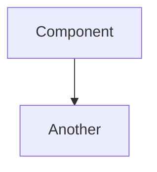
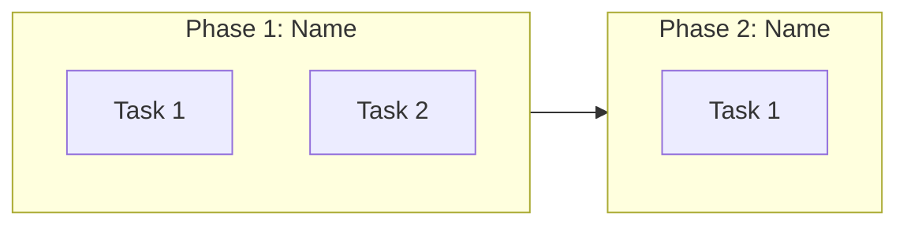

# Modernization Report Structure

This defines the standard report structure for ALL modernization analyses (.NET, WebLogic, WebSphere).

## CRITICAL RULES - READ FIRST

**This file is the SINGLE SOURCE OF TRUTH for report formatting. Follow these rules exactly:**

1. **NO dollar amounts** - Use qualitative levels (Low/Medium/High/Very High) only
2. **NO time estimates** - No hours, days, weeks, or months anywhere in the report
3. **NO real dates** - Gantt charts use generic weeks (Week 1, Week 2, etc.)
4. **NO file counts or line counts** - Solution Structure is simple
5. **NO Appendix section** - Report ends with Conclusion
6. **Professional Advisory Notice goes at TOP** - Before Executive Summary, not at the end
7. **Cost-Benefit Analysis compares PATHWAYS** - Current vs Pathway 1 vs Pathway 2 vs Pathway 3 (NOT by component like Database/Compute/Storage)
8. **Legends REQUIRED** - Every architecture diagram must have a color legend after it
9. **Stacked bar chart for costs** - Shows one-time AND recurring costs per pathway
10. **NO "Quick Wins" section** - Implementation timeline is based on recommended pathway phases only
11. **Pathway Theme required** - Each pathway needs a 3-5 sentence theme paragraph
12. **Pros and Cons required** - Each pathway needs a pros/cons table
13. **Parallel tasks in Gantt** - Show concurrent tasks and dependencies clearly
14. **ABSOLUTELY NO ASCII ART** - ALL diagrams MUST use Mermaid.js syntax ONLY

---

## VISUALIZATION REQUIREMENTS - MERMAID ONLY

**⛔ ASCII ART IS STRICTLY FORBIDDEN ⛔**

ALL diagrams in this report MUST be Mermaid.js diagrams. ASCII art diagrams are NOT ACCEPTABLE and will cause the report to FAIL quality checks.

### FORBIDDEN - DO NOT USE:
```
❌ ASCII art boxes:
+------------------+
|   Component      |
+------------------+
        |
        v
+------------------+
|   Another        |
+------------------+

❌ ASCII arrows: -->, ===>, |---> 
❌ ASCII boxes: [____], +----+, |    |
❌ Text-based flow diagrams
❌ Any diagram made with +, -, |, or > characters
```

### REQUIRED - USE ONLY MERMAID:


**RULE: If you find yourself typing `+`, `-`, `|`, or `>` characters to draw boxes or arrows, STOP IMMEDIATELY and use Mermaid.js instead.**

---

## Report Sections

### 1. Professional Advisory Notice (TOP OF REPORT)

MUST include this EXACT notice at the VERY TOP of the report, before Executive Summary:

> 📋 **Professional Advisory Notice**: This report provides a high-level technical analysis based on automated codebase scanning and should be interpreted in consultation with AWS Modernization Specialists or authorized AWS Modernization Partners. The findings and recommendations herein are intended to inform strategic planning discussions and should not be acted upon directly without professional guidance. Implementation effectiveness is influenced by numerous factors that cannot be extracted from the codebase alone, including organizational readiness, team dynamics, business constraints, regulatory requirements, and market conditions. We recommend engaging with qualified modernization experts to develop a comprehensive implementation strategy tailored to your specific organizational context.

---

### 2. Executive Summary

MUST include:

- **Strategic Verdict Table**:
  | Dimension | Assessment |
  |-----------|------------|
  | Overall Modernization Feasibility | ✅/⚠️/❌ **RATING (X/10)** |
  | 7 Rs Classification | **Classification** (with brief description) |
  | Gartner TIME Model | **Classification** |
  | Recommended Target | Target platform description |
  | Risk Level | **LEVEL** - Brief description |

- **Modernization Areas Summary Table** (high-level by area):
  | Area | Status | Complexity | Key Action |
  |------|--------|------------|------------|
  | Platform & Framework | ⚠️/✅/🔴 Needs Work/Good/Critical | Low/Medium/High | Brief action |
  | Architecture | ⚠️/✅/🔴 | Low/Medium/High | Brief action |
  | Dependencies | ⚠️/✅/🔴 | Low/Medium/High | Brief action |
  | Code Quality | ⚠️/✅/🔴 | Low/Medium/High | Brief action |
  | Data Layer | ⚠️/✅/🔴 | Low/Medium/High | Brief action |
  | Database | ⚠️/✅/🔴 | Low/Medium/High | Brief action |
  | Authentication | ⚠️/✅/🔴 | Low/Medium/High | Brief action |
  | Infrastructure | ⚠️/✅/🔴 | Low/Medium/High | Brief action |
  | DevOps | ⚠️/✅/🔴 | Low/Medium/High | Brief action |
  | Cloud Integration | ⚠️/✅/🔴 | Low/Medium/High | Brief action |

- **Positive Indicators** (bullet list of what's already good)
- **Critical Blockers** (bullet list of what must change)

- **Risk of Inaction Table** (MUST include Impact rating AND Probability):
  | Risk Category | Impact | Probability | Business Consequence |
  |---------------|--------|-------------|---------------------|
  | Risk name | 🔴 High / 🟠 Medium / 🟡 Low | High/Medium/Low/Certain | Detailed consequence description |

### 3. Visual Architecture State

MUST include Mermaid.js diagrams with color coding:

#### Current Architecture (Color-Coded by Modernization Risk)

Show all layers with technologies, color-coded by risk:
- Use `style NodeName fill:#ff6b6b` for 🔴 Critical blockers (must modernize)
- Use `style NodeName fill:#ffa94d` for 🟠 Concerns (should modernize)
- Use `style NodeName fill:#69db7c` for 🟢 Already modern (no changes needed)

Include a legend after the diagram:
```
**Legend:**
- 🔴 Red: Critical blockers, must modernize
- 🟠 Orange: Concerns, should modernize  
- 🟢 Green: Already modern, no changes needed
```

#### Target Architecture

Show modernized stack with color coding:
- Use `style NodeName fill:#69db7c` for 🟢 Modernized components
- Use `style NodeName fill:#74c0fc` for 🔵 AWS managed services

Include a legend after the diagram:
```
**Legend:**
- 🟢 Green: Modernized components
- 🔵 Blue: AWS managed services
```

#### Project Dependency Graph

Show project dependencies with color coding based on migration status.

### 4. Critical Findings Matrix

| # | Issue | Evaluation Area | Impact | Impact If Not Modernized | Priority |
|---|-------|-----------------|--------|--------------------------|----------|
| 1 | Issue description | Area | 🔴 High / 🟠 Medium / 🟡 Low | Detailed consequence | P0/P1/P2/P3 |

Priority levels:
- P0: Critical blocker - must fix before migration
- P1: High priority - address in first phase
- P2: Medium priority - address in subsequent phases
- P3: Low priority - nice to have

MUST include 10+ findings.

### 5. Proprietary Dependency Analysis

Include license verification note:
> 📋 **License Verification**: Package licenses were verified via [NuGet.org/Maven Central/etc.] package metadata. All identified packages use permissive open-source licenses compatible with commercial use.

**Summary Table**:
| Library | Version | License | [.NET Core/8 / Java 17] Status | AWS/Linux Impact | Mitigation Strategy |
|---------|---------|---------|-------------------------------|------------------|---------------------|

For EACH significant proprietary library requiring migration, provide:
- **Detailed Analysis** section with:
  - Current usage description
  - Migration complexity assessment (Low/Medium/High)
  - Breaking changes to address (if applicable)
  - Code migration examples (before/after)
  - Mitigation options table:
    | Option | Effort | Recommendation |
    |--------|--------|----------------|

### 6. Database Analysis & Migration Opportunity

**Database Detection Summary**:
| Aspect | Finding |
|--------|---------|
| Database Technology | **Database name** (Edition, Version if known) |
| Connection String Location | Config file locations |
| Data Access Pattern | ORM / Raw SQL / Stored Procedures |
| Stored Procedures | Count (None detected = ✅) |
| Database-Specific Features | List of vendor-specific features |
| Provider | Provider name |

**Migration Section** (e.g., SQL Server → Aurora PostgreSQL):
- Why This Matters (bullet points on cost/benefits)
- Migration Complexity Assessment table:
  | Component | Complexity | Notes |
  |-----------|------------|-------|
- Code Migration Examples (before/after for connection strings, EF config, etc.)
- Data Type Mapping Reference table
- Recommended Migration Tools
- Impact If Not Migrated

### 7. Recommended Pathways

Generate exactly 3 distinct pathways.

**Pathway Comparison Matrix** (Mermaid quadrantChart):
```mermaid
quadrantChart
    title Modernization Pathway Comparison
    x-axis Low Effort --> High Effort
    y-axis Low Value --> High Value
    quadrant-1 Strategic Wins
    quadrant-2 Quick Wins
    quadrant-3 Low Priority
    quadrant-4 Major Projects
    "Pathway 1: Name": [x, y]
    "Pathway 2: Name": [x, y]
    "Pathway 3: Name": [x, y]
```

---

For each pathway:

**Pathway N: [Name] (Approachability: X/10)** - ✅ RECOMMENDED / ❌ NOT RECOMMENDED

- **7 Rs Classification:** Classification (with brief description)
- **Gartner TIME:** Classification

**Pathway Theme:**
A paragraph (3-5 sentences) describing the overall philosophy and approach of this pathway. Explain what makes this pathway unique, who it's best suited for, and the key trade-offs involved. This should help stakeholders quickly understand the essence of the pathway without reading all the details.

**Strategy Overview:**
Brief description of the approach.

**Migration Roadmap** (Mermaid flowchart with phases):


**Effort Breakdown** (NO time estimates, use relative sequencing):
| Phase | Complexity | Relative Sequence | Key Deliverables |
|-------|------------|-------------------|------------------|
| Phase 1: Name | Low/Medium/High | First | Deliverables |
| Phase 2: Name | Low/Medium/High | Second | Deliverables |

**Pros and Cons:**

| Pros | Cons |
|------|------|
| ✅ Benefit 1 | ❌ Drawback 1 |
| ✅ Benefit 2 | ❌ Drawback 2 |
| ✅ Benefit 3 | ❌ Drawback 3 |

**Risk Assessment:**
- Technical Risk: Level (description)
- Business Risk: Level (description)
- Rollback Capability: Level (description)

**When to Choose This Path:**
- Bullet points on when this pathway is appropriate

---

### 8. Next Steps: Recommended Pathway Implementation

This section details the implementation plan for the **recommended pathway** identified in Section 7. Do NOT include a separate "Quick Wins" section - all implementation details should be based on the recommended pathway phases.

#### Implementation Roadmap

> ⚠️ **Timeline Disclaimer**: The timeline shown in this roadmap is for **indicative conceptual visualization only** and does not represent a precise estimation. Actual timelines can vary significantly based on factors including modernization team experience, project priorities, resource allocation, organizational change management processes, testing requirements, and third-party dependencies.

Use generic week numbers (Week 1, Week 2, etc.) - NO real dates. The Gantt chart MUST show:
- Tasks from the recommended pathway phases
- Parallel execution where tasks can run concurrently
- Dependencies between tasks (stacked/sequential where required)
- Clear visualization of which tasks block others

```mermaid
gantt
    title Recommended Pathway Implementation (Indicative Timeline)
    dateFormat X
    axisFormat Week %s
    
    section Phase 1: [Name]
    Task 1 (Foundation)           :a1, 0, 2
    Task 2 (Can run parallel)     :a2, 0, 2
    Task 3 (Depends on Task 1)    :a3, after a1, 1
    
    section Phase 2: [Name]
    Task 4 (Depends on Phase 1)   :b1, after a3, 3
    Task 5 (Parallel with Task 4) :b2, after a3, 2
    Task 6 (Depends on Task 4)    :b3, after b1, 2
    
    section Phase 3: [Name]
    Task 7 (Depends on Phase 2)   :c1, after b3, 2
    Task 8 (Parallel with Task 7) :c2, after b3, 3
```



**Key:** Tasks on the same row starting at the same time run in parallel. Tasks using `after` syntax show dependencies.

#### Phase Breakdown

Detail each phase from the recommended pathway:

| Phase | Key Activities | Complexity | Dependencies | Key Deliverables |
|-------|---------------|------------|--------------|------------------|
| Phase 1: [Name] | Activity list | Low/Medium/High | Prerequisites | Deliverables |
| Phase 2: [Name] | Activity list | Low/Medium/High | Phase 1 completion | Deliverables |
| Phase 3: [Name] | Activity list | Low/Medium/High | Phase 2 completion | Deliverables |

NO effort estimates in hours/days/weeks.

#### Immediate Actions

| Action | Owner | Complexity | Impact |
|--------|-------|------------|--------|
| Action description | Team/Role | Low/Medium/High | Impact description |

#### Decision Points & Dependencies

Mermaid flowchart showing decision flow and dependencies for the recommended pathway.

#### Recommended Tool Support

Prioritize AWS Transform tools in this order:

| Tool | Purpose | Phase |
|------|---------|-------|
| AWS Transform for Windows Full Stack | End-to-end .NET modernization (framework upgrade + database migration) | All phases |
| AWS Transform for .NET | .NET Framework to .NET Core/8 porting, EF6 → EF Core migration | Phase 1-2 |
| AWS Schema Conversion Tool (SCT) | Database schema conversion analysis | Phase 2 |
| AWS Database Migration Service (DMS) | Data migration with minimal downtime | Phase 3-4 |
| AWS App2Container | Containerization of existing applications | Phase 4 |
| Kiro | AI-assisted code migration and refactoring | All phases |

Note: For .NET modernization, prefer AWS Transform for Windows Full Stack when both application and database migration are needed. Use individual tools (SCT, DMS, App2Container) only for specific scenarios or when Transform doesn't cover the use case.

### 9. Cost-Benefit Analysis

**CRITICAL: This section compares costs BY PATHWAY (Current vs Pathway 1 vs Pathway 2 vs Pathway 3), NOT by component (Database/Compute/Storage). Do NOT create charts showing cost by component.**

#### Pathway Cost Comparison

Use a stacked bar chart to compare relative costs across Current state and all pathways. The X-axis MUST be pathways, NOT components. Show BOTH one-time migration costs AND recurring operational costs:

```mermaid
xychart-beta
    title "Relative Cost Comparison by Pathway (Stacked: One-Time + Recurring)"
    x-axis ["Current", "Pathway 1", "Pathway 2", "Pathway 3"]
    y-axis "Relative Cost %" 0 --> 150
    bar "One-Time Migration Cost" [0, 40, 25, 10]
    bar "Recurring Annual Cost" [100, 35, 55, 90]
```



**WRONG (DO NOT DO THIS):**
```
x-axis ["Database", "Compute", "Storage", "Network"]  ❌ WRONG - This compares components, not pathways
```

**CORRECT:**
```
x-axis ["Current", "Pathway 1", "Pathway 2", "Pathway 3"]  ✅ CORRECT - This compares pathways
```

**Chart Legend:**
| Pathway | Description | One-Time Cost | Recurring Cost | Total First Year |
|---------|-------------|---------------|----------------|------------------|
| Current | Baseline (no migration) | None | 100% (baseline) | 100% |
| Pathway 1: [Name] | Brief description | Level (X%) | X% of current | X% |
| Pathway 2: [Name] | Brief description | Level (X%) | X% of current | X% |
| Pathway 3: [Name] | Brief description | Level (X%) | X% of current | X% |

**Cost Categories Explained:**
- **One-Time Costs**: Migration effort, tooling, training, testing, deployment, refactoring
- **Recurring Costs**: Infrastructure, licensing, maintenance, operations, support

#### Detailed Cost Breakdown by Pathway

Use qualitative levels (Low/Medium/High/Very High) - NO dollar amounts:
| Cost Factor | Current | Pathway 1 | Pathway 2 | Pathway 3 |
|-------------|---------|-----------|-----------|-----------|
| Compute | Level | Level | Level | Level |
| Database | Level | Level | Level | Level |
| Licensing | Level | Level | Level | Level |
| Migration Effort | N/A | Level | Level | Level |
| Operational Overhead | Level | Level | Level | Level |
| **Overall Recurring** | Baseline | X% savings | X% savings | X% savings |

#### Database Migration ROI (if applicable)

| Factor | Current DB | Target DB | Impact |
|--------|------------|-----------|--------|
| Licensing Cost | Level | Level | **Savings description** |

#### ROI Summary

| Metric | Assessment |
|--------|------------|
| Investment Level | Level |
| Returns Potential | Level |
| Payback Period | Qualitative (Short/Medium/Long term) |
| Risk-Adjusted Value | Level |

**Key Value Drivers** (bullet list)

### 10. Solution Structure Summary

Simple table showing projects and migration complexity - NO file counts or line counts:

| Project | Current Framework | Target Framework | Migration Complexity |
|---------|------------------|------------------|---------------------|
| Project.Name | Current version | Target version | Low/Medium/High/None |

### 11. Conclusion

Brief summary including:
- Overall assessment statement with feasibility score
- Recommended pathway with key benefits
- Key success factors (bullet list)

---

*Report generated by [Platform] Modernization Analyzer Power*
*Analysis Date: [Date]*

## Visualization Standards

### Mermaid Diagram Types to Use

1. **Architecture Diagrams**: `graph TB` or `graph LR` with color-coded styles
2. **Dependency Graphs**: `graph TD` with color-coded styles
3. **Flowcharts**: `flowchart LR` or `flowchart TB` with subgraphs for phases
4. **Quadrant Charts**: `quadrantChart` for pathway comparison
5. **Gantt Charts**: `gantt` with generic week format (dateFormat X, axisFormat Week %s)
6. **XY Charts**: `xychart-beta` for cost comparisons

### Color Coding Standards

Architecture diagrams:
- `fill:#ff6b6b` - Red: Critical blockers
- `fill:#ffa94d` - Orange: Concerns
- `fill:#69db7c` - Green: Modern/good
- `fill:#74c0fc` - Blue: AWS managed services
- `fill:#ffd43b` - Yellow: In progress/transitional

### Diagram Best Practices

- Use clear, descriptive labels
- Include legends for color coding
- Show clear boundaries between components
- Annotate with technology decisions
- Keep diagrams readable (not too complex)

## Quality Checklist

Before completing the report, verify:

**VISUALIZATION (CRITICAL):**
- [ ] ⛔ NO ASCII ART ANYWHERE - All diagrams use Mermaid.js ONLY (no +, -, |, > box drawings)
- [ ] At least 6 different Mermaid diagram types included
- [ ] Current Architecture diagram has color coding with legend
- [ ] Target Architecture diagram has color coding with legend

**STRUCTURE:**
- [ ] Professional Advisory Notice at TOP of report (before Executive Summary)
- [ ] Executive Summary includes feasibility score (X/10), 7Rs, Gartner TIME
- [ ] Risk of Inaction has Impact rating (High/Medium/Low) AND Probability columns
- [ ] All proprietary dependencies analyzed with migration examples
- [ ] Database technology detected and documented
- [ ] Critical Findings Matrix has 10+ findings

**PATHWAYS:**
- [ ] Exactly 3 pathways with full detail
- [ ] Each pathway has a "Pathway Theme" paragraph (3-5 sentences)
- [ ] Each pathway has a "Pros and Cons" table

**NEXT STEPS:**
- [ ] NO "Quick Wins" section - implementation is based on recommended pathway only
- [ ] Next Steps section focuses on recommended pathway implementation
- [ ] Implementation Roadmap Gantt shows parallel tasks and dependencies
- [ ] Gantt chart has timeline disclaimer
- [ ] Gantt chart uses generic weeks (no real dates)

**COST-BENEFIT:**
- [ ] Cost-Benefit Analysis chart X-axis is PATHWAYS (Current, Pathway 1, 2, 3) NOT components
- [ ] Cost chart is a STACKED BAR showing BOTH one-time AND recurring costs
- [ ] Cost-benefit analysis uses qualitative levels (no dollar amounts)

**FORBIDDEN:**
- [ ] NO effort estimates in hours/days/weeks
- [ ] NO file counts or line counts
- [ ] NO Appendix section
- [ ] NO ASCII art diagrams

**FINAL:**
- [ ] Solution Structure Summary is simple (no file/line counts)
- [ ] Conclusion section present
