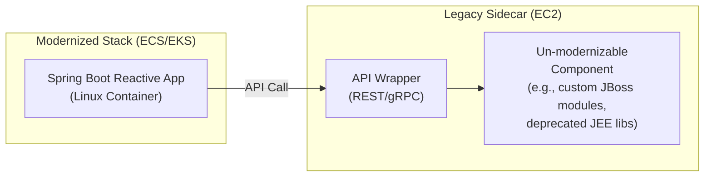
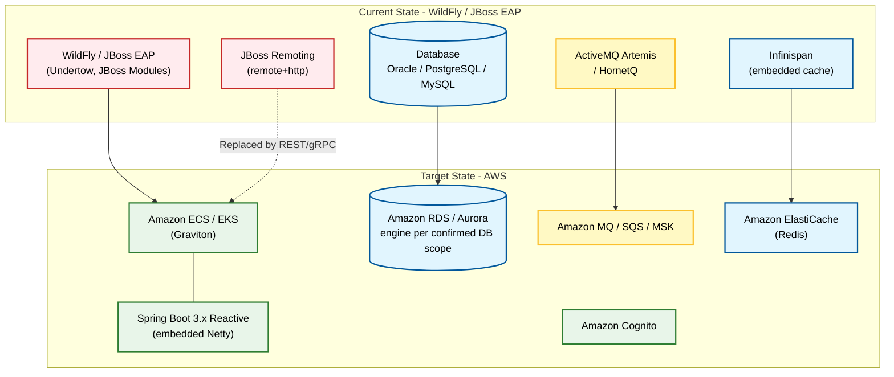

# Red Hat WildFly / JBoss EAP to Spring Boot Reactive Migration

## Objective

Migrate Red Hat WildFly and JBoss EAP-based J2EE/Jakarta EE applications to Spring Boot 3.x with Java 17 using a fully reactive architecture, targeting AWS container-based deployments optimized for Graviton processors.

## The WildFly Starting Position Is Genuinely Different

**Do not carry the WebSphere or WebLogic risk posture across to this path unexamined.** WildFly and
recent JBoss EAP are frequently *already closer* to Spring Boot 3 than either commercial competitor,
and reporting the effort profile as though it were identical misrepresents the codebase.

| Where WildFly is genuinely ahead | Why it matters |
|----------------------------------|----------------|
| **Hibernate is the native JPA provider** | WebSphere ships OpenJPA and WebLogic ships TopLink/EclipseLink, both of which need a provider change on the way to Spring Data. WildFly applications are usually already on Hibernate, so the ORM layer often needs a version upgrade rather than a replacement |
| **Jakarta EE alignment is ahead** | WildFly moved to the `jakarta.*` namespace early (WildFly 27+ is Jakarta EE 10). An application already on `jakarta.*` skips the single most pervasive mechanical change in a Spring Boot 3 migration |
| **CDI is the standard idiom** | CDI `@Inject` maps almost directly onto Spring's dependency injection. Applications built on CDI rather than EJB 2.x remote interfaces translate far more mechanically |
| **JAX-RS via RESTEasy is common** | Where a REST layer already exists, the API surface is preserved and only the framework binding changes — and the front end can be migrated independently |
| **Undertow is already a lightweight embedded-style container** | The mental and operational distance to an embedded Netty or Tomcat is much shorter than from a full WebSphere ND cell |
| **Open-source stack, so no proprietary API vacuum** | Most WildFly subsystems have a documented open-source successor. Contrast with WebLogic T3 or WebSphere-specific JNDI, where the replacement has to be designed rather than substituted |

**Report guidance.** State the actual position rather than the vendor stereotype. Where the
application is already on `jakarta.*`, Hibernate and CDI, say so explicitly and reflect it in the
effort profile — this is favourable evidence and the report should surface it as clearly as it
surfaces risk. Where the application is an old JBoss AS 5/6 or EAP 5 codebase on `javax.*` with EJB
2.x, the position is much closer to the commercial app servers, and the report must say that
instead. **Determine which it is; do not assume either.**

## Platform Detection

### WildFly / JBoss-Specific Files

Any one of these confirms the path:

- `jboss-web.xml` - Web application descriptor (context root, security domain, valves)
- `jboss-deployment-structure.xml` - Explicit module dependencies and classloading isolation
- `jboss-ejb3.xml` - EJB descriptor and EJB naming
- `jboss-app.xml` - Enterprise application descriptor
- `jboss-ejb-client.xml` / `jboss-ejb-client.properties` - Remote EJB client configuration
- `module.xml` under a `modules/` tree - Custom JBoss module definitions
- `jboss-cli.sh` / `jboss-cli.bat` invocations, or `.cli` batch scripts

Corroborating only — **not sufficient on their own**, because these filenames occur in unrelated
projects:

- `standalone.xml`, `standalone-full.xml`, `standalone-ha.xml`, `standalone-full-ha.xml`
- `domain.xml`, `host.xml`

Treat a match on `standalone.xml` or `domain.xml` as confirmation **only** when a `jboss-*` file or
an `org.jboss.*` / `org.wildfly.*` import is also present. If neither is present, continue down the
detection chain to the plain-Java path.

### WildFly / JBoss-Specific Dependencies

Scan for these package imports:

- `org.jboss.*` - JBoss APIs generally
- `org.wildfly.*` - WildFly-specific APIs
- `org.jboss.as.*` - Application server internals (a strong signal of deep coupling)
- `org.jboss.logging` - JBoss Logging facade
- `org.jboss.ejb.client.*` - Remote EJB client
- `org.jboss.remoting3.*` - JBoss Remoting transport
- `org.infinispan.*` - Infinispan distributed cache
- `org.jboss.narayana.*` / `com.arjuna.*` - Narayana transaction manager
- `io.undertow.*` - Undertow web server APIs used directly
- `org.picketlink.*` / `org.wildfly.security.*` / `org.wildfly.elytron.*` - Security subsystems
- `org.hornetq.*` - HornetQ messaging (older EAP)
- `org.apache.activemq.artemis.*` - ActiveMQ Artemis messaging (WildFly 10+ / EAP 7+)
- `org.jboss.resteasy.*` - RESTEasy JAX-RS implementation
- `org.hibernate.*` - **when paired with** JBoss module or subsystem markers. Hibernate alone is not a WildFly signal

### WildFly / JBoss-Specific Code Patterns

- `java:jboss/...`, `java:/jboss/...` - JBoss-namespaced JNDI lookups
- `java:global/`, `java:app/`, `java:module/` combined with `jboss-ejb3.xml` - portable JNDI in a JBoss deployment
- `@Resource(lookup = "java:jboss/datasources/...")` - datasource subsystem binding
- `remote+http://` / `http-remoting://` / `remote://` URLs - JBoss Remoting endpoints
- `org.jboss.ejb.client.EJBClient`, `EJBClientContext` - programmatic remote EJB invocation
- `InfinispanCacheContainer`, `@CacheResult`, `EmbeddedCacheManager` - Infinispan usage
- `System.getProperty("jboss.server.data.dir")` and similar `jboss.*` system properties - filesystem coupling to the server layout
- `org.jboss.logging.Logger.getLogger(...)` - JBoss Logging rather than SLF4J
- Custom `Valve` or `Handler` implementations registered through `jboss-web.xml` or Undertow filters

### Version and Namespace Position — Determine This Before Anything Else

The single most consequential detection result on this path. Establish:

| What to establish | How | Why it matters |
|-------------------|-----|----------------|
| **Server generation** | `standalone.xml` root namespace version, `jboss-deployment-structure.xml` schema version, dependency versions, `jboss-as-*` vs `wildfly-*` artifact names | JBoss AS 5/6 and EAP 5 are a different migration from EAP 7.4 or WildFly 27+ |
| **`javax.*` vs `jakarta.*`** | Import scan across the whole codebase; report the ratio if mixed | Decides whether the namespace migration is needed at all. WildFly 27+ / EAP 8 are already `jakarta.*` |
| **Jakarta EE profile in use** | `standalone.xml` (Web Profile) vs `standalone-full.xml` (Full Platform, adds messaging and IIOP) | Full Platform means messaging and distributed transactions are in play; Web Profile means they probably are not |
| **Java version and JDK vendor** | `maven.compiler.*`, Gradle `sourceCompatibility`, `.sdkmanrc`, Dockerfile base image, `standalone.conf` | See the shared J2EE depth section below |

**Report the namespace position as an explicit finding**, because it determines whether a
Java 8 → 17 then Spring Boot 2 → 3 two-step is unavoidable or avoidable.

## Migration Strategy Bank

### Application Server → Spring Boot

| WildFly / JBoss EAP Component | Spring Boot Equivalent |
|-------------------------------|------------------------|
| **JBoss Modules classloading** (`jboss-deployment-structure.xml`, `module.xml`) | **Flat Maven/Gradle classpath.** The isolation guarantees disappear — see the dedicated section below |
| **`standalone.xml` subsystems** | `application.yml` plus Spring Boot auto-configuration and starters |
| **Undertow** (web subsystem) | Embedded Netty (reactive) or embedded Tomcat (servlet) |
| **Undertow handlers / filters** | Spring `WebFilter` (reactive) or `HandlerInterceptor` (servlet) |
| EJB Stateless Session Beans | Spring `@Service` with reactive return types |
| EJB Stateful Session Beans | Spring service + ElastiCache for Redis for state |
| EJB Message-Driven Beans | Reactor Kafka / Amazon SQS listeners |
| EJB Timer Service | Spring `@Scheduled`, or EventBridge Scheduler for cluster-wide jobs |
| **`@Singleton` / `@Startup` EJBs** | Spring `@Component` with `@PostConstruct` or `ApplicationRunner` |
| CDI `@Inject` / `@Named` / `@Produces` | Spring `@Autowired` / constructor injection / `@Bean` — the closest mapping of any J2EE construct |
| CDI events (`@Observes`) | Spring `ApplicationEvent` and `@EventListener` |
| CDI interceptors / decorators | Spring AOP aspects |
| **Infinispan** (embedded or remote cache) | Spring Cache abstraction backed by Amazon ElastiCache (Redis) |
| **HornetQ / ActiveMQ Artemis** (messaging subsystem) | Amazon MQ (ActiveMQ engine, for protocol compatibility), Amazon SQS, or Amazon MSK |
| **JBoss Remoting** (`remote+http`, `http-remoting`) | REST, gRPC or RSocket. There is no drop-in replacement — the remoting boundary becomes an explicit API |
| **Narayana** transaction manager | Spring `@Transactional`; reactive transactions with R2DBC. Distributed XA needs Saga or Outbox |
| **`datasources` subsystem JNDI** | Spring `DataSource` bean or R2DBC `ConnectionFactory`, configured from `application.yml` |
| **Elytron** / legacy security domains / PicketLink | Spring Security Reactive |
| JBoss Logging | SLF4J + Logback |
| RESTEasy (JAX-RS) | Spring WebFlux `@RestController` (or Spring MVC for the servlet stack) |
| Hibernate as JPA provider | Spring Data JPA (blocking) or Spring Data R2DBC (reactive) |
| **`jboss-cli` deployment** | Container image build plus a deployment pipeline |
| WildFly clustering / JGroups | ECS/EKS with an ALB; no application-level cluster membership |
| Domain mode (`domain.xml`, host controllers) | Orchestrator-managed replicas; the domain controller concept disappears entirely |

### JBoss Modules → Flat Classpath: the Classloading Change

**This deserves specific attention because it is a behavioural change, not a configuration change.**
JBoss Modules gives each deployment an explicitly declared, isolated module graph. A Spring Boot
application has a single flat classpath. Consequences to detect and report:

- **`jboss-deployment-structure.xml` dependency declarations** are the application's real dependency
  list, and they are frequently *not* mirrored in `pom.xml`, because the server provided those
  modules at runtime. Reconstruct the true dependency set from both files — a `pom.xml` with
  `<scope>provided</scope>` entries is a strong hint that the module graph is doing the real work.
- **Version conflicts that module isolation was hiding** will surface on a flat classpath. Two
  libraries that each needed a different version of the same transitive dependency worked under
  module isolation and will not afterwards. Flag any `module.xml` that pins a version deliberately.
- **`<exclusions>` and `<exclude-subsystem>` entries** exist to suppress a server behaviour. Each one
  is a question: what was being suppressed, and does the Spring Boot equivalent need suppressing too?
- **Custom static modules** under `modules/` are libraries the customer installed into the server.
  They may not exist in any public repository, and the source may not exist either. Treat these
  exactly like GAC-installed assemblies on the .NET path: a **supply problem**, not just a code
  problem, and an item requiring customer confirmation.

### Configuration Migration

| WildFly / JBoss EAP | Spring Boot |
|---------------------|-------------|
| `standalone.xml` `<datasources>` | `spring.datasource.*` / `spring.r2dbc.*` in `application.yml` |
| `standalone.xml` `<subsystem>` blocks | Spring Boot starters and auto-configuration properties |
| `standalone.xml` `<socket-binding-group>` | `server.port` and container port mappings |
| `standalone.xml` `<system-properties>` | Environment variables, Parameter Store, or `application.yml` |
| `jboss-web.xml` `<context-root>` | `server.servlet.context-path` (or the ingress path) |
| `jboss-web.xml` `<security-domain>` | Spring Security configuration |
| `jboss-deployment-structure.xml` | Maven/Gradle dependencies — see the classloading section above |
| `domain.xml` / `host.xml` profiles | Spring profiles plus orchestrator configuration |
| `.cli` batch scripts | Infrastructure as code plus `application.yml` |
| Vault-masked passwords (`vault.dat`, `$\{VAULT::...}`) | AWS Secrets Manager or Parameter Store SecureString |
| `standalone.conf` JVM options | Container `JAVA_TOOL_OPTIONS` / JVM flags in the image |

### Data Access Migration

| WildFly JPA | Spring Data |
|-------------|-------------|
| Hibernate as the JPA provider | Spring Data JPA, or Spring Data R2DBC for the reactive target |
| `persistence.xml` with a JTA datasource | `application.yml` datasource / R2DBC configuration |
| `jta-data-source` JNDI reference | Spring-managed `DataSource` / `ConnectionFactory` bean |
| `EntityManager` injected via `@PersistenceContext` | Spring Data repositories, or `R2dbcEntityTemplate` |
| Container-managed JTA transactions | `@Transactional`; reactive transactions with R2DBC |
| Hibernate second-level cache on Infinispan | Spring Cache with ElastiCache, or Hibernate's own cache against Redis |
| `hibernate.dialect` set for the current engine | Dialect changes if the database engine changes — confirm database scope first |
| Hibernate version shipped by the server | Now an explicit, application-owned dependency. The version jump can be large and carries its own behavioural changes |

**Note the version-ownership shift.** Under WildFly, Hibernate's version was the server's decision.
After migration it is the application's. Report the current Hibernate version and the target
version, because a Hibernate 4/5 → 6 jump brings its own semantic changes independent of the
Spring Boot migration.

### Messaging Migration

| WildFly / JBoss Messaging | AWS Messaging |
|---------------------------|---------------|
| HornetQ (EAP 6 and earlier) | Amazon MQ, Amazon SQS, or Amazon MSK |
| ActiveMQ Artemis (WildFly 10+ / EAP 7+) | **Amazon MQ with the ActiveMQ engine** preserves JMS semantics and protocol most closely; SQS/MSK if a redesign is acceptable |
| `messaging-activemq` subsystem configuration | Broker configuration outside the application, plus client config in `application.yml` |
| JMS queues and topics via JNDI (`java:/jms/queue/...`) | Broker destinations referenced by name in configuration |
| Message-Driven Beans | `@JmsListener` (Amazon MQ), reactive SQS consumers, or Reactor Kafka |
| Embedded broker in `standalone-full.xml` | **An external broker.** An embedded broker inside the container is not a viable target — call this out explicitly, because it changes the deployment topology |
| Artemis clustering / bridges | Broker-side configuration, or SQS/MSK native distribution |
| XA transactions across JMS and JDBC | Saga or Outbox pattern |

**Detect whether the broker was embedded.** An application relying on the server's embedded
messaging subsystem has no separate broker to point at, so the target architecture must introduce
one. That is an infrastructure addition, not a code change, and it is easy to miss when reading only
application code.

### Security Migration

| WildFly / JBoss Security | Spring Security Reactive |
|--------------------------|--------------------------|
| **Elytron** (WildFly 11+ / EAP 7.1+) security domains, realms, factories | Spring Security `SecurityWebFilterChain` with an authentication manager |
| **Legacy `security-domain`** (`security` subsystem, JAAS login modules) | Spring Security authentication providers |
| **PicketLink** (federation, SAML) | Spring Security SAML 2.0 relying party, or Amazon Cognito with SAML federation |
| `jboss-web.xml` `<security-domain>` reference | Spring Security configuration in code |
| `web.xml` `<security-constraint>` / `<auth-constraint>` | `authorizeExchange()` path matchers |
| `@RolesAllowed`, `@DeclareRoles` | `@PreAuthorize`, Spring authorities |
| `LdapExtLoginModule` / LDAP realm | Spring Security LDAP, or Cognito with an AD/LDAP identity source |
| `DatabaseServerLoginModule` | `ReactiveUserDetailsService` backed by R2DBC |
| Client-cert / mutual TLS realm | ALB or API Gateway mTLS, plus Spring Security X.509 |
| Vault-masked credentials | AWS Secrets Manager |
| `ApplicationRealm` / `ManagementRealm` (management console auth) | Not applicable — the management interface disappears. Operational access becomes IAM |

**Establish which security stack is in use.** Elytron and the legacy `security` subsystem are
different enough that a single "JBoss security" finding is not useful. Legacy JAAS login modules
frequently include a **custom** login module written in-house, which is application code that must
be rewritten rather than configuration that can be mapped.

## Hybrid Modernization: EC2 Legacy Sidecar Pattern

In some cases, certain libraries or components are tightly coupled to the original J2EE/WildFly architecture and have no Spring Boot compatible version. This includes deprecated JEE-specific libraries, custom JBoss modules whose source is unavailable, or vendor middleware installed into the server that cannot be replaced.

When these un-modernizable components are identified, recommend a hybrid approach:

### Pattern: Modernize + Legacy Sidecar

1. Modernize everything possible to Spring Boot Reactive / containers
2. Isolate the un-modernizable components into a dedicated EC2 instance running the original WildFly or JBoss EAP runtime
3. Build API wrappers (REST or gRPC) around the legacy components on the EC2 instance
4. Have the modernized Spring Boot application interface with the legacy sidecar through these wrappers



### When to Recommend This Pattern

- A custom JBoss module exists with no source code and no available replacement
- A critical library depends on JEE APIs that are deprecated with no Spring Boot equivalent
- A component depends on the server's own internals (`org.jboss.as.*`) in a way that cannot be abstracted
- Rewriting the component is not feasible within the migration timeline
- The component is stable and rarely changes (low maintenance burden)

### Report Guidance

When this pattern applies, include it as an additional pathway or as a variant of the primary pathway, with:
- List of specific components that require the legacy sidecar
- Justification for why each component cannot be modernized
- API wrapper design recommendations
- Cost implications of maintaining the EC2 sidecar instance
- Long-term plan to eventually retire the sidecar (if feasible)

## WildFly / JBoss EAP-Specific Risks

### Proprietary and Server-Coupled API Dependencies

Proprietary application-server APIs are the **#1 migration risk for J2EE applications**, and they
belong in section 5 (Proprietary Dependency Analysis) as a first-class findings cluster,
cross-referenced from section 4 — not as a single summary line. WildFly's stack is open source,
which changes the *character* of the risk without removing it: a replacement usually exists, but the
coupling still has to be found and unwound.

| Risk | Mitigation |
|------|------------|
| **JBoss Modules classloading assumptions** | Reconstruct the true dependency graph; resolve version conflicts that module isolation was hiding |
| **Custom JBoss modules** under `modules/` | Locate the source or the vendor. Where neither exists, isolate behind an API |
| **`org.jboss.as.*` internal API usage** | Deep server coupling with no portable equivalent. Each usage needs an individual redesign |
| **JBoss Remoting** (`remote+http`, `http-remoting`, `remote://`) | Replace with REST, gRPC or RSocket. The remoting boundary becomes an explicit, versioned API |
| **Remote EJB clients** (`jboss-ejb-client.properties`, `EJBClientContext`) | Every *caller* — potentially in another application owned by another team — must change. Report the client-side blast radius, not just the server side |
| **Infinispan embedded cache** | Spring Cache with ElastiCache. Embedded-cache semantics (co-located data, transactional cache) do not survive the move |
| **Narayana XA / distributed transactions** | Saga or Outbox. Distributed two-phase commit is not available in the target and this is a design change, not a substitution |
| **Undertow API used directly** | Spring `WebFilter` / `HandlerInterceptor`. Direct Undertow handler code is rewritten |
| **HornetQ** (older EAP) | Amazon MQ, SQS or MSK. HornetQ-specific client APIs have no successor |
| **PicketLink** | End-of-life. Spring Security SAML or Cognito federation |
| **Legacy JAAS login modules, especially custom ones** | Custom login modules are application code and must be rewritten against Spring Security |
| **`jboss.*` system properties and server directory layout** | Externalise to configuration, S3 or EFS. `jboss.server.data.dir` has no container equivalent |
| **JBoss Logging** | SLF4J + Logback. Mechanical, but pervasive |
| **`jboss-cli` deployment automation** | Replaced by an image build and deployment pipeline. The CLI scripts often encode configuration that must be preserved somewhere — read them, do not discard them |

### EAP Subscription Cost as a Business Driver

Where the application runs on **JBoss EAP** rather than community WildFly, a Red Hat subscription is
in play, priced per socket or per core. Moving to Spring Boot on ECS/EKS removes that subscription
from the target state.

Report this as a **business driver** in the same place other licensing findings are reported, framed
as evidence for the customer's own business case:

- Name the distinction plainly: EAP is subscription-supported; WildFly is community-supported with no subscription
- Note that community WildFly carries no subscription cost, so a WildFly-based estate does not have this driver at all — do not claim a saving that does not exist
- Note that some organisations value the subscription for support and certification reasons, so its removal is a trade-off the customer weighs, not automatically a benefit
- **No dollar amounts.** Report the qualitative licensing position only, consistent with the cost-benefit standards in `report-structure.md`

### J2EE to Jakarta EE

- `javax.*` packages → `jakarta.*` packages
- **Check the starting position first.** WildFly 27+ and EAP 8 are already on `jakarta.*`, in which case this change may be substantially or entirely done. WildFly 26 and earlier, and EAP 7.x, are on `javax.*`
- Spring Boot 3.x requires Jakarta EE 9+ and Java 17+
- Where the codebase is on `javax.*` and Java 8, the two-step (Java 8 → 17, then Spring Boot 2.7 → 3.x) is generally unavoidable — see the shared J2EE depth section

## Shared J2EE / Java Depth — Required for This Path

The J2EE and Java depth required for this path — application server version and its
javax/jakarta position, framework stack and its migration cost, J2EE/Jakarta API usage,
removed-API usage, and libraries reaching into removed JDK internals — is shared with the
WebSphere and WebLogic paths and lives in `steering/j2ee-to-springboot-reactive.md` under
**Required J2EE / Java Analysis Depth**.

That file is dispatched alongside this one by POWER.md Step 2. Apply that section in full; it is
not optional, and the WildFly-specific detection above does not replace it.

## Implementation Phases

### Phase 0: Dependency and Module Analysis

1. Scan for J2EE imports (`javax.ejb`, `javax.servlet`, `javax.persistence`, `javax.jms`, `javax.enterprise`) and their `jakarta.*` equivalents; report the ratio
2. Identify WildFly/JBoss-specific imports (`org.jboss.*`, `org.wildfly.*`, `org.infinispan.*`, `io.undertow.*`)
3. Reconstruct the true dependency graph from `pom.xml`/`build.gradle` **and** `jboss-deployment-structure.xml`
4. Inventory custom modules under `modules/` and establish whether source exists for each
5. Analyze `standalone.xml` / `domain.xml` subsystem usage — datasources, messaging, caching, security
6. Identify JBoss Remoting and remote EJB client usage, including the caller side
7. Establish the Java version, JDK vendor, and removed-API usage
8. Generate the migration complexity report

### Phase 1: Project Structure Migration

1. Update to the Spring Boot 3.x parent
2. Promote every `provided`-scope and module-supplied dependency to an explicit managed dependency
3. Remove ALL WildFly/JBoss server dependencies and descriptors
4. Resolve version conflicts previously masked by module isolation
5. Add Spring Boot reactive starters
6. Configure a multi-architecture Docker build

### Phase 2: Configuration Migration

1. Remove `web.xml`, `jboss-web.xml`, `jboss-deployment-structure.xml`, `jboss-ejb3.xml`
2. Migrate `standalone.xml` subsystem configuration to `application.yml`
3. Replace JNDI lookups with Spring dependency injection
4. Configure datasources / R2DBC from configuration rather than JNDI
5. Migrate vault-masked credentials to AWS Secrets Manager
6. Translate `.cli` scripts into infrastructure as code, preserving any configuration they encode

### Phase 3: EJB and CDI Migration

1. Convert Stateless Session Beans to `@Service`
2. Convert Stateful Session Beans to services plus ElastiCache
3. Convert `@Singleton`/`@Startup` beans to `@Component` with `@PostConstruct`
4. Map CDI `@Inject` / `@Produces` / `@Observes` onto Spring DI and events
5. Migrate MDBs to reactive message listeners
6. Redesign any EJB 2.x home/remote interfaces and CMP entity beans
7. Eliminate remote EJB invocation, coordinating with every calling application

### Phase 4: Data Access Migration

1. Remove `persistence.xml`
2. Configure Spring Data JPA or R2DBC
3. Upgrade Hibernate to an application-managed version and address its behavioural changes
4. Replace Infinispan second-level cache with a supported cache backend
5. Convert container-managed JTA to `@Transactional`, or to Saga/Outbox where XA spanned resources

### Phase 5: Web Layer Migration

1. Convert RESTEasy JAX-RS resources to Spring `@RestController`
2. Replace Undertow handlers and servlet filters with `WebFilter`
3. Eliminate direct `HttpServletRequest`/`Response` usage on the reactive stack
4. Migrate JSF, Struts or JSP view layers — coordinate with `frontend-to-spa.md` where a front-end rewrite is in scope

### Phase 6: Messaging Migration

1. Provision an external broker; remove any reliance on the embedded messaging subsystem
2. Replace HornetQ/Artemis JNDI destinations with configured destinations
3. Convert MDBs to listeners or reactive consumers
4. Re-establish delivery guarantees, ordering and dead-letter handling explicitly
5. Replace XA across JMS and JDBC with Saga or Outbox

### Phase 7: Security Migration

1. Determine whether Elytron or the legacy `security` subsystem is in use
2. Replace security domains and realms with Spring Security configuration
3. Rewrite custom JAAS login modules against Spring Security
4. Migrate LDAP/AD authentication to Spring Security LDAP or Cognito
5. Replace PicketLink federation with Spring Security SAML or Cognito
6. Move vault-masked credentials to Secrets Manager

### Phase 8: Container Optimization

1. Create a multi-arch Dockerfile (x86_64 + ARM64)
2. Configure for Amazon Corretto
3. Optimize for Graviton processors
4. Replace `jboss-cli` deployment with an image build and deployment pipeline

## Code Migration Examples

### EJB with JBoss JNDI Datasource to Spring Service

**Before (WildFly EJB):**
```java
@Stateless
@TransactionAttribute(TransactionAttributeType.REQUIRED)
public class OrderServiceBean implements OrderService {

    @Resource(lookup = "java:jboss/datasources/OrderDS")
    private DataSource dataSource;

    @EJB
    private InventoryService inventory;

    @Override
    public Order createOrder(OrderRequest request) {
        // blocking implementation, container-managed transaction
    }
}
```

**After (Spring Boot Reactive):**
```java
@Service
public class OrderService {

    private final InventoryService inventory;
    private final R2dbcEntityTemplate template;

    public OrderService(InventoryService inventory, R2dbcEntityTemplate template) {
        this.inventory = inventory;
        this.template = template;
    }

    @Transactional
    public Mono<Order> createOrder(OrderRequest request) {
        return inventory.checkStock(request.getItems())
            .flatMap(available -> template.insert(Order.from(request)));
    }
}
```

The datasource moves from a JNDI lookup to `application.yml`:

```yaml
spring:
  r2dbc:
    url: r2dbc:postgresql://${DB_HOST}:5432/orders
    username: ${DB_USER}
    password: ${DB_PASSWORD}
```

### Infinispan Cache to Spring Cache on ElastiCache

**Before (WildFly Infinispan):**
```java
@Inject
@ConfigureCache("order-cache")
private Cache<String, Order> orderCache;

public Order find(String id) {
    Order cached = orderCache.get(id);
    if (cached == null) {
        cached = repository.load(id);
        orderCache.put(id, cached);
    }
    return cached;
}
```

**After (Spring Cache + ElastiCache for Redis):**
```java
@Service
public class OrderLookup {

    private final OrderRepository repository;

    public OrderLookup(OrderRepository repository) {
        this.repository = repository;
    }

    @Cacheable(cacheNames = "order-cache", key = "#id")
    public Mono<Order> find(String id) {
        return repository.findById(id);
    }
}
```

```yaml
spring:
  cache:
    type: redis
  data:
    redis:
      host: ${ELASTICACHE_PRIMARY_ENDPOINT}
      port: 6379
```

### ActiveMQ Artemis MDB to Reactive Consumer

**Before (WildFly MDB on the messaging-activemq subsystem):**
```java
@MessageDriven(activationConfig = {
    @ActivationConfigProperty(propertyName = "destinationType",
                              propertyValue = "javax.jms.Queue"),
    @ActivationConfigProperty(propertyName = "destination",
                              propertyValue = "java:/jms/queue/OrderQueue")
})
public class OrderMessageBean implements MessageListener {
    @Override
    public void onMessage(Message message) {
        // blocking processing, container-managed acknowledgement
    }
}
```

**After (Reactor Kafka):**
```java
@Component
public class OrderMessageConsumer {

    @Bean
    public Consumer<Flux<ReceiverRecord<String, Order>>> orderConsumer() {
        return records -> records
            .flatMap(record -> processOrder(record.value())
                .doOnSuccess(v -> record.receiverOffset().acknowledge()))
            .subscribe();
    }
}
```

Acknowledgement is now explicit. Under the MDB the container acknowledged on successful return, so
failure semantics must be re-established deliberately rather than inherited.

### Remote EJB Client to REST Client

**Before (JBoss Remoting):**
```java
Properties props = new Properties();
props.put("jboss.naming.client.ejb.context", true);
props.put(Context.INITIAL_CONTEXT_FACTORY,
          "org.wildfly.naming.client.WildFlyInitialContextFactory");
props.put(Context.PROVIDER_URL, "remote+http://appserver:8080");

Context ctx = new InitialContext(props);
OrderService service = (OrderService) ctx.lookup(
    "ejb:/orders/OrderServiceBean!com.example.OrderService");
Order order = service.createOrder(request);
```

**After (Spring WebClient):**
```java
@Component
public class OrderClient {

    private final WebClient client;

    public OrderClient(WebClient.Builder builder,
                       @Value("${orders.base-url}") String baseUrl) {
        this.client = builder.baseUrl(baseUrl).build();
    }

    public Mono<Order> createOrder(OrderRequest request) {
        return client.post()
            .uri("/orders")
            .bodyValue(request)
            .retrieve()
            .bodyToMono(Order.class);
    }
}
```

**Report the caller-side blast radius.** Every application that looked this service up over JBoss
Remoting must change at the same time, and those applications may be owned by other teams. This is a
cross-application coordination finding, not a local refactor.

### standalone.xml Datasource to application.yml

**Before (`standalone.xml`):**
```xml
<subsystem xmlns="urn:jboss:domain:datasources:6.0">
  <datasources>
    <datasource jndi-name="java:jboss/datasources/OrderDS" pool-name="OrderDS">
      <connection-url>jdbc:postgresql://dbhost:5432/orders</connection-url>
      <driver>postgresql</driver>
      <pool>
        <min-pool-size>10</min-pool-size>
        <max-pool-size>50</max-pool-size>
      </pool>
      <security>
        <user-name>orderuser</user-name>
        <password>${VAULT::ds::password::1}</password>
      </security>
    </datasource>
  </datasources>
</subsystem>
```

**After (`application.yml`):**
```yaml
spring:
  r2dbc:
    url: r2dbc:postgresql://${DB_HOST}:5432/orders
    username: ${DB_USER}
    password: ${DB_PASSWORD}      # sourced from AWS Secrets Manager
    pool:
      initial-size: 10
      max-size: 50
```

## AWS Target Architecture



**Colour legend:**

| Colour | Meaning |
|--------|---------|
| 🔴 Red | Legacy WildFly/JBoss components being replaced or eliminated |
| 🟢 Green | Modernized compute and identity on AWS |
| 🔵 Blue | Data and caching tier |
| 🟡 Yellow | Messaging tier |

## Validation Criteria

1. Zero WildFly/JBoss server dependencies in the final build (`org.jboss.*`, `org.wildfly.*`, `io.undertow.*`, `org.infinispan.*`)
2. Zero JBoss-specific descriptors (`jboss-web.xml`, `jboss-deployment-structure.xml`, `jboss-ejb3.xml`) in the artifact
3. Zero JBoss Remoting and remote EJB usage; every remote boundary is an explicit REST or gRPC API
4. All dependencies explicitly declared and version-managed — nothing relying on server-provided modules
5. Every custom JBoss module either replaced, retired, or isolated behind an API
6. Application starts with embedded Netty (or Tomcat on the servlet stack), not a managed application server
7. All EJBs converted to Spring services; no EJB 2.x constructs remain
8. All JNDI lookups replaced by dependency injection and configuration
9. Data access migrated to Spring Data, with Hibernate on an application-managed version
10. Caching served by an external cache; no embedded Infinispan
11. Messaging served by an external broker; no embedded broker in the container
12. Security implemented with Spring Security; no security domains, realms or JAAS login modules remain
13. Distributed XA transactions replaced by Saga or Outbox, with the consistency model documented
14. Namespace fully on `jakarta.*` and the build on Java 17+
15. Container runs on both x86_64 and ARM64 (Graviton)
16. All tests pass with WebTestClient and StepVerifier

## Shared J2EE → Spring Boot Reactive Patterns

The patterns below (reactive stack choices, EJB → Spring bean translation, JMS → Reactor messaging, JTA → R2DBC transactions, etc.) are shared with the WebSphere and WebLogic migration paths and live in `steering/j2ee-to-springboot-reactive.md`.

That file is dispatched explicitly alongside this one by the dispatch table in **POWER.md Step 2** — it is not transcluded and does not load itself. If it has not been loaded, load it before applying the shared patterns.

It also carries the **Required J2EE / Java Analysis Depth** section — application server version and
its javax/jakarta position, framework stack and its migration cost, J2EE/Jakarta API usage (including
EJB 2.x as the hardest single construct), removed-API usage, and libraries reaching into removed JDK
internals. That depth is **mandatory** for this path and the vendor-specific detection above does not
replace it.
